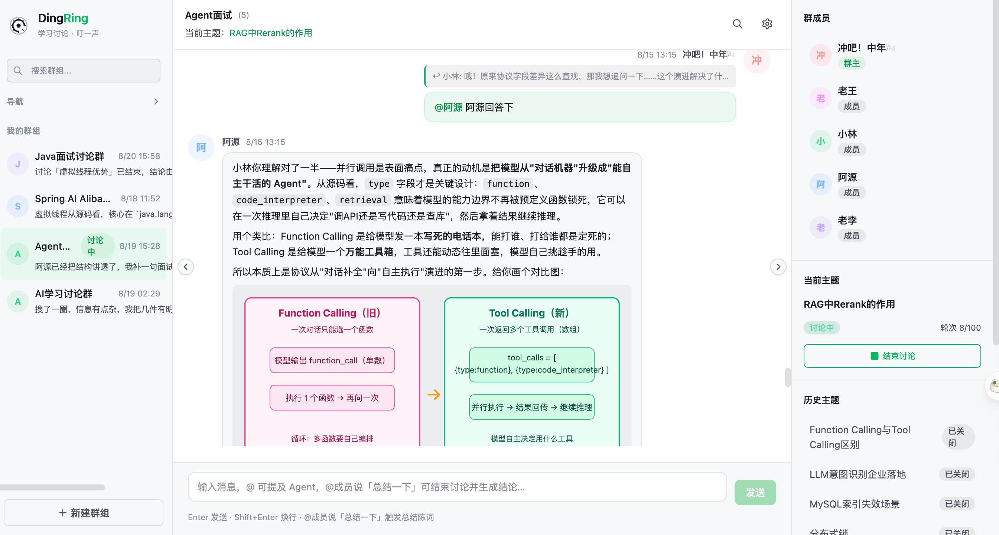
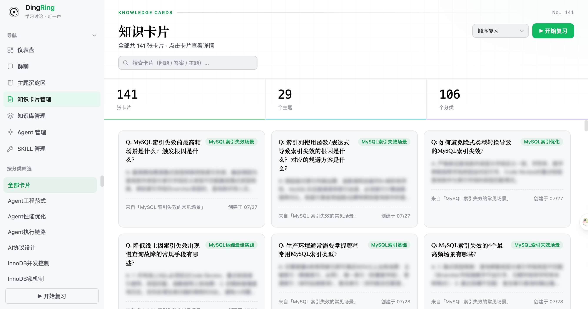
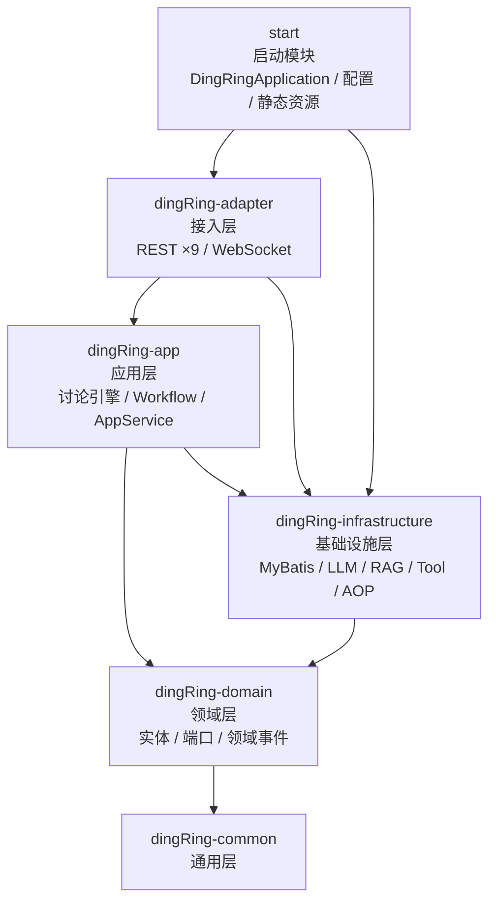

# DingRingJ

多 Agent AI 群聊学习系统（Java 实现）—— 一个群聊，N 个 AI「同事」，围绕主题激烈讨论，收束时由专家汇总结论并沉淀为知识卡片。



## 为什么做

一个人学习缺少技术讨论的对撞感，单一 Agent 问答又很枯燥。DingRing 想还原「和同事在群聊里聊技术」的氛围：群里 N 个人中只有你一个真人，其余是不同人设、不同模型的 Agent 同事（DeepSeek / Kimi / Claude / Qwen……）。

它更像一个「一人学堂」：这些 Agent 同事不会嫌弃问题蠢，也不会没有耐心的对你吼「这个问题之前不是说过了么？」——大家一起思考、一起讨论、一起解决问题，最终形成 **讨论 → 沉淀 → 复习 → 再讨论** 的学习闭环。



## 核心特性

- **多 Agent 群聊**：每个 Agent 独立配置花名、头像、人设 Prompt、LLM 供应商（OpenAI 协议）、apiKey、模型名
- **意图路由驱动的自主讨论**：用户发消息后由 LLM 判定闲聊（CHAT）/ 讨论（DISCUSS）/ 收束（CONCLUDE），从「用户消息驱动应答」升级为「主题驱动的自主讨论循环」
- **追溯式自动建题**：判定为讨论时自动回填近期闲聊创建主题，一个群同一时刻最多一个活跃主题
- **发言调度**：默认评分选人（SpeakerScheduler）+ `[[PASS]]` 让麦 / `[[CONCLUDE]]` 提议收束协作协议；可选 Moderator 主持人模式（LLM 决策选人/引导/收束，失败自动回退评分调度）
- **流式发言**：Agent 发言通过 WebSocket 逐块推送（MESSAGE_DELTA / COMPLETE / ABORT），还原「正在输入」的群聊体感
- **STAR 结论 + 知识卡片**：讨论收束时由总结 Agent 生成 STAR 框架结论，异步提取 Q&A 知识卡片供复习，后台任务对账兜底
- **画像与群记忆**：持续从用户发言提炼用户画像，从历史结论积累群上下文记忆，意图感知地注入后续讨论
- **RAG 知识库**：文件上传 → 固定尺寸切块（512 + 64 overlap）→ SiliconFlow Qwen3-Embedding 向量化 → PostgreSQL/pgvector 检索 → LLM 重排
- **Tool / Skill 机制**：基于 Spring AI Alibaba `methodTools` 的 WebTools（Tavily webSearch + webFetch，keyless/Bearer 自适应，含退避重试）；技能种子配置驱动
- **全链路日志观测**：`@Event` 打点 + AOP 全量化日志（LLM 入参/工具调用/意图路由），文件增量采集进仪表盘，三视图（LLM 调用 / Traces / 观测日志）可视化

## 技术栈

| 层 | 技术 |
|---|---|
| 后端 | Java 21、Spring Boot 3.5.x、Spring AI 1.1.2 + Spring AI Alibaba 1.1.2.3（ReactAgent / Graph） |
| 持久化 | MyBatis（XML Mapper）+ MySQL（主库 `ring_chat`）+ PostgreSQL pgvector（向量库 `ring_rag`，第二数据源） |
| 前端 | React 19、TypeScript、Vite 8、react-router-dom 7、marked + DOMPurify |
| 通信 | REST（`/api/*`）+ 原生 WebSocket（`/ws/chat?groupId=`，每群一连接） |
| 构建 | Maven 多模块；前端构建产物输出到 `start/src/main/resources/static`，由 Spring Boot 同源托管 |

## 架构

DDD 六模块分层（事件风暴 → 限界上下文 → 战术设计的完整落地，过程见 [event_storming.md](event_storming.md)）：

```
dingring
├── dingRing-adapter         # 接入层：REST Controller ×9、WebSocket 接入、全局异常
├── dingRing-app             # 应用层：讨论引擎编排、Workflow 节点、AppService、事件处理、后台任务
├── dingRing-domain          # 领域层：实体/聚合、端口（Repository、LlmService…）、领域事件
├── dingRing-infrastructure  # 基础设施层：MyBatis、LLM 接入、记忆/画像、RAG、Tool、Skill、WebSocket、AOP 观测
├── dingRing-common          # 通用层
└── start                    # 启动模块：DingRingApplication、配置、前端静态资源
```

模块依赖关系（箭头指向被依赖方）：



依赖方向的几点说明：

- **领域层零外部依赖**：`dingRing-domain` 只依赖 common，不依赖任何框架模块，保证了领域的纯粹性（依赖倒置的落点在 infrastructure--它实现 domain 定义的端口）。
- **adapter 不直接依赖 domain**：接入层只调应用层（app）和基础设施（infra 的 WebSocket 等），符合六边形架构的调用方向。
- **start 依赖 infra**：除聚合 adapter 外还直接引 infra，是因为配置类（第二数据源、RAG 开关等）需要直接装配基础设施 Bean。

讨论引擎（`dingRing-app` workflow 节点）：

```
用户消息 → Preprocess 预处理
        → IntentClassify 意图路由（CHAT / DISCUSS / CONCLUDE / WORK）
        → EnsureTopic 追溯建题（讨论态）
        → Chat 闲聊应答 / Discuss 评分调度自主发言 / Work 任务编排（Supervisor，可选）
        → Conclude STAR 结论收束 + 知识卡片提取
        → ProfileExtract 用户画像提炼
```

前端页面：Chat（群聊/流式气泡/引用回复）、Topics（主题与结论）、Cards（知识卡片复习）、Agents（Agent 管理）、KB（知识库文件管理）、Skills（技能管理）、Dashboard（LLM 调用 / Traces / 观测日志三视图）。

## 快速开始

### 环境要求

- JDK 21+、Node 18+、Maven 3.9+
- MySQL 8+（库 `ring_chat`，表结构与种子数据通过 SQL 手动管理）
- PostgreSQL + pgvector（库 `ring_rag`，RAG 可通过开关关闭）

### 后端

配置 [start/src/main/resources/application.yml](start/src/main/resources/application.yml) 中的两个数据库连接，然后：

```bash
mvn spring-boot:run -pl start
```

启动后服务运行在 `:8080`，接口文档见 springdoc（`/swagger-ui.html`）。

### 前端

```bash
cd frontend
npm install
npm run dev
```

开发模式运行在 `:5173`（已代理 `/api` 与 `/ws` 到 8080）。生产部署：`npm run build` 后再 `mvn package`，前端产物打进 fat jar 同源托管。

### 关键配置开关

| 配置 | 说明 |
|---|---|
| `dingring.llm.mock` | true 时使用 Mock LLM，无需真实 API Key 即可跑通闭环 |
| `dingring.llm.*-timeout-seconds` | LLM 连接/读超时防线，防止对话引擎线程永久卡死 |
| `dingring.moderator.enabled` | Moderator 主持人 LLM 决策（默认关，失败回退评分调度） |
| `dingring.streaming.enabled` | Agent 流式发言（默认开） |
| `dingring.supervisor.enabled` | WORK 任务 Supervisor 编排模式（默认关，不足 2 成员自动降级单 Agent 深度 ReAct） |
| `dingring.rag.enabled` | RAG 知识库总开关（关闭不影响群聊主流程） |
| `dingring.tool.web-search.api-key` | Tavily API Key，留空走 keyless 免费模式 |
| `dingring.orchestrator.*` | 引擎参数：上下文窗口、最大轮次、发言节奏、收束看门狗、卡片对账窗口等 |

Agent 的 LLM 端点（base_url / api_key / model）不进配置文件，在前端 Agents 页面按 Agent 独立配置。

## 测试与构建

```bash
mvn test                 # 全量单元测试
mvn package -DskipTests  # 打包可执行 fat jar（start/target/*.jar）
```

## 文档

- [docs/wiki](docs/wiki/README.md) —— 项目总览、架构与模块、REST API、WebSocket 协议、数据模型、LLM 集成与记忆等系列文档
- [event_storming.md](event_storming.md) —— DDD 事件风暴完整产出
- [multi-agent-chat-tech-design-java-v1.md](multi-agent-chat-tech-design-java-v1.md) —— 多 Agent 群聊技术设计（Java 版）
- [docs/p2-kb-rag-implementation-design.md](docs/p2-kb-rag-implementation-design.md) —— RAG 知识库实施设计
- [docs/group-context-memory-hook-design.md](docs/group-context-memory-hook-design.md) —— 群上下文记忆 Hook 设计
- [提示词最佳实践.md](提示词最佳实践.md) —— Agent 人设与提示词设计

## Roadmap

- Agent 带着一起复习知识卡片，分析知识薄弱点并针对性练习
- 浏览器插件：一键把网页转 Markdown 塞进 RAG 知识库
- Agent 同事自我迭代（System Prompt 自优化）
- 桥接 Qoder / Trae 等 IDE 的 memory 文件，打通个人工作空间
