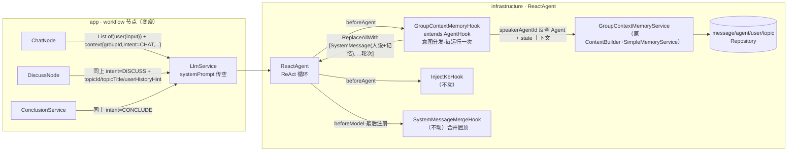

# 群上下文记忆统一注入（GroupContextMemoryHook）重构设计

> 版本：1.2 ｜ 日期：2026-08-18 ｜ 前置：Phase A-F 已完成（SAA Hook 机制 / InjectKbHook 意图门控 / Supervisor 编排）
> 变更：v1.1 收束清单规则修正（KEY 原文 + VIEWPOINT null 回退）；v1.2 注入型 Hook 统一 AgentHook（Profile/GroupRoster 随迁）
> 状态：待 review

## 1. 背景与问题

当前 Agent 发言的上下文组装分散在两处，职责交叉且行为过时：

| 位置 | 现状 | 问题 |
|---|---|---|
| `ContextBuilder`（app 层，3 个调用方） | 静态人设 prompt + 消息窗口：闲聊拼 200 条全量窗口；讨论拼「观点摘要 + 进度引导 + 近期 8 条」；收束拼「观点清单 + 全量窗口」 | ① 闲聊 200 条窗口 token 浪费严重；② 讨论观点段对 `viewpoint=null` 的消息**回退原文**，与「无摘要即无价值」的新规则矛盾；③ app 层依赖 infrastructure 的 `PromptTemplateLoader`，层次颠倒 |
| `MemoryInjectionHook`（infrastructure，ModelHook） | 不分意图，只要 state 有 `groupId` 就注入「同群已关闭话题的结论」 | ① 闲聊/讨论/工作全场景注入错内容；② ModelHook 在 ReAct 工具循环内**每次模型调用都重复查库、重复注入**（InjectKbHook 的 javadoc 已明确记录此坑） |

本次重构将 ContextBuilder 的全部逻辑与群记忆注入合并为**一个按意图分流的上下文组装点**，实现「模型所见上下文」的单点负责。

## 2. 已确认的设计决策

| 决策点 | 结论 | 理由 |
|---|---|---|
| 闲聊记忆 | **最近 5~10 条**（可配置，默认 10），由 Hook 注入；ContextBuilder 的 200 条窗口删除 | 闲聊无需长程记忆，token 收益数量级 |
| 讨论记忆 | **只注入当前主题下 `feature.viewpoint` 非空的消息摘要**；`viewpoint=null` 直接丢弃（不回退原文） | 无摘要说明消息无观点价值，回退原文反而放大噪音 |
| ContextBuilder 去向 | **整个类删除**，逻辑全部迁入新 Hook + Service | 单点组装，永久消除双头注入 |
| 新组件命名 | `GroupContextMemoryHook`（infrastructure）/ `GroupContextMemoryService`（domain 接口 + infra 实现） | 命名与「群上下文记忆」职责强相关 |
| Hook 基类 | **ModelHook → AgentHook**（beforeAgent） | 与 InjectKbHook 同理：整个 ReAct 运行注入一次、贯穿全程，消除逐模型调用重复查库注入 |
| 组织形态 | **瘦 Hook + 胖 Service** | Hook 只做 state 读写与意图分发；六块组装逻辑（人设模板/闲聊记忆/观点摘要/进度引导/轮次构建/花名解析）进 Service，可测性与原 ContextBuilderTest 同级 |
| 轮次注入方式 | Hook 用 `ReplaceAllWith` 整体写 messages（含 USER/ASSISTANT 轮次） | SystemMessageMergeHook 已验证该机制；保留角色结构（Agent 自己的历史为 ASSISTANT 轮） |
| 当前输入兜底 | 节点始终传 `List.of(ChatTurn.user(input))` 作为初始 messages | ReactAgent 对空 messages 报错；Hook 异常时模型仍有本轮 USER 轮可回应 |
| 收束场景观点清单 | **维持现状**：KEY 用原文，VIEWPOINT 用摘要、摘要未就绪（null）时回退原文 | 收束是话题最终产出，完整性优先于降噪；且用户消息恒标 KEY、从不摘要（viewpoint 恒 null），一刀切丢弃会把用户发言清出主要输入；回退原文同时兜住摘要时滞/失败 |
| Hook 基类选型 | **注入型 Hook 统一 AgentHook**：ProfileInjectionHook / GroupRosterHook 随本次一并从 ModelHook 切换 | 与 InjectKbHook / GroupContextMemoryHook 同构（内容一次运行内不变，ModelHook 逐模型调用重复查库+重复追加）；归一化型 SystemMessageMergeHook 必须保持 ModelHook（每模型调用前的最后防线），工具拦截型 WorkProgressBroadcastHook 不动 |
| 落地节奏 | **两个 commit**：① 行为等价搬家 ② 行为变更 | 三条发言链路（闲聊/讨论/收束）一次全动，分步可独立回滚 |

## 3. 目标架构



职责划分：

- **节点**：选 Agent、组织 state 上下文、调 LlmService、入库广播。不再组装任何 prompt/记忆内容。
- **GroupContextMemoryHook**：读 state → 反查发言 Agent → 按 intent 分发给 Service → 把结果写回 state（messages 整表替换 + 系统提示词）。
- **GroupContextMemoryService**：全部组装逻辑，按意图三个方法。
- **不动的组件**：InjectKbHook（topic/kb 双源）、ProfileInjectionHook、GroupRosterHook、SystemMessageMergeHook（仍最后注册）、WorkNode（自建工作任务 prompt，不经本链路）。

## 4. 详细设计

### 4.1 GroupContextMemoryService（domain 接口）

```java
public interface GroupContextMemoryService {

    /** 闲聊上下文：人设+chat-base 模板 + 最近 N 条闲聊记忆段；无轮次（当前输入由节点兜底传入） */
    AgentPromptContext buildChatContext(Agent speaker, Long groupId);

    /** 讨论上下文：人设+chat-base+协作协议+进度引导+userHistoryHint + 观点摘要段（viewpoint 非空）+ 近期 N 条原文轮次 */
    AgentPromptContext buildDiscussContext(Agent speaker, Long groupId, Long topicId,
                                           String userHistoryHint);

    /** 收束上下文：收束人设+conclude 模板 + 观点清单（viewpoint 非空）+ 全量窗口轮次 */
    AgentPromptContext buildConclusionContext(Agent concluder, Long topicId, String topicTitle);

    /** 组装结果：完整系统提示词 + 对话轮次（与原 ContextBuilder.LlmContext 同构，迁入 domain） */
    record AgentPromptContext(String systemPrompt, List<ChatTurn> turns) {}
}
```

实现要点（infrastructure `GroupContextMemoryServiceImpl`，取代 `SimpleMemoryService`，原类与 `MemoryService` 接口删除）：

- **闲聊记忆段**：`findRecentChatByGroupId(groupId, limit + 1)` 取时间升序后**去掉最后一条**（即当前输入，避免与节点兜底 USER 轮重复），格式 `花名: 内容` 每行一条，段标题「群最近聊天记录（供参考）：」。
- **讨论观点摘要段**：复用 `findViewpointsByTopicId(topicId, viewpointLimit)`，Java 侧过滤 `viewpoint` 非空非 blank；KEY 消息（无摘要）与摘要未异步生成完的消息均被丢弃，**不回退原文**。
- **收束观点清单段**（仅 CONCLUDE）：**维持现状规则**--KEY 消息用原文（用户消息恒 KEY、从不摘要，原文即观点零损耗）；VIEWPOINT 消息用摘要，`viewpoint=null`（摘要未就绪/失败）回退原文。理由：收束是话题最终产出，一句话摘要会丢失发言中的 mermaid/svg 图表等细节，完整性优先于降噪；全量原文窗口（turns）虽仍是兜底通道，但清单才是模型注意力的主要落点。
- **可选增强（待定）**：摘要模板（message-viewpoint）要求 LLM 对含图表/代码块的消息标注「(含图)」，收束清单遇该标注回退原文，使结论可稳定引用图表。
- **进度引导**：`buildDiscussionProgressGuide` 原样迁入（repository 计数不变）。
- **轮次构建**：`toTurns` 原样迁入（speaker 自己的历史为 ASSISTANT 轮、连续 USER 合并）；花名解析在 impl 内实现（AGENT 查 AgentRepository / USER 查 UserRepository / SYSTEM 显示「系统」，规则同 MessageAssembler，约 10 行，app 层无法反向复用故就近复制）。
- **模板渲染**：`PromptTemplateLoader`（chat-base / collaboration-protocol / conclude）随迁，层次由「app→infra」扭转为「infra→infra」。
- **讨论近期窗口**：`findRecentByTopicId(topicId, discussRecentWindow)`，**不合并**闲聊消息（原 `mergeChatContext` 随 `build()` 一起删除，仅服务于已废弃的讨论态 build 路径）。

### 4.2 GroupContextMemoryHook（infrastructure）

```java
@Component
public class GroupContextMemoryHook extends AgentHook {
    // 依赖：GroupContextMemoryService + AgentRepository（speakerAgentId 反查）

    @Override
    public CompletableFuture<Map<String, Object>> beforeAgent(OverAllState state, RunnableConfig config) {
        Long groupId = state.value(StateKeys.GROUP_ID) ...;      // 缺失 → 跳过（Worker clearContext 场景）
        String intent = state.value(StateKeys.INTENT, "");       // CHAT/DISCUSS/CONCLUDE 之外（WORK/缺失）→ 跳过
        Long speakerAgentId = ...;                                // 缺失 → 跳过
        Long topicId = state.value(StateKeys.TOPIC_ID) ...;       // DISCUSS/CONCLUDE 必需，缺失 → 跳过并 WARN

        AgentPromptContext ctx = switch (intent) {
            case "CHAT"     -> svc.buildChatContext(agent, groupId);
            case "DISCUSS"  -> svc.buildDiscussContext(agent, groupId, topicId, userHistoryHint);
            case "CONCLUDE" -> svc.buildConclusionContext(agent, topicId, topicTitle);
            default         -> null;                               // WORK / 未知 → 不注入
        };
        if (ctx == null || ctx.systemPrompt().isBlank()) return Map.of();

        // messages 整表替换：[SystemMessage(完整系统提示词), ...ctx.turns()]
        // 初始的 [UserMessage(当前输入)] 被 turns 覆盖（讨论/收束的窗口轮次本就含当前输入）
        List<Message> messages = new ArrayList<>();
        messages.add(new SystemMessage(ctx.systemPrompt()));
        ctx.turns().forEach(t -> messages.add(toMessage(t)));
        return Map.of("messages", ReplaceAllWith.of(messages));
    }
}
```

要点：

- **BASE_SYSTEM_PROMPT_KEY 不再使用**：节点 systemPrompt 传空，人设由本 Hook 的 SystemMessage 承载；SystemMessageMergeHook 会把本 Hook 与 InjectKbHook 的 SystemMessage 按列表顺序合并为一条置顶（本 Hook 注册在前 → 人设+记忆在前，kb 段在后，与现状顺序一致）。
- **注册顺序不变**：`SaaLlmFactory.build` / `SupervisorAgentFactory` 中该 Hook 仍注册在注入 Hook 首位、SystemMessageMergeHook 仍最后。ReplaceAllWith 必须先于 InjectKbHook 的 append 执行，顺序是硬约束。
- **getName()** 返回 `group-context-memory`；日志 eventCode 沿用 `HOOK_MEMORY`。

### 4.3 节点侧改动

三个调用方统一为「传空 prompt + 单条兜底轮 + context map」：

```java
// ChatNode.speakOnce（示例，DiscussNode/ConclusionService 同构）
LlmService.AgentResult result = llmService.chat(
        agent, "",                              // systemPrompt 传空，由 Hook 组装
        List.of(ChatTurn.user(input)),          // 兜底 USER 轮（Hook 的 turns 覆盖之）
        LlmService.ToolSet.CHAT, context);
```

**ReactAgent state 上下文契约**（Hook 消费的 key，全部由节点 context map 写入）：

| key | 来源 | 消费场景 |
|---|---|---|
| `groupId` / `intent` / `speakerAgentId` / `topicId` | ChatNode / DiscussNode / ConclusionService（均已写入） | 全部分流 |
| `topicTitle`（StateKeys.TOPIC_TITLE） | DiscussNode / ConclusionService（已写入） | CONCLUDE 模板参数 |
| `userHistoryHint`（StateKeys.USER_HISTORY_HINT） | **DiscussNode 需新增写入**（现为方法参数透传，未进 context） | DISCUSS 人设段 |

WorkNode 不改（INTENT=WORK，Hook 跳过）；Supervisor/Worker 不改（Worker clearContext 后无 groupId 自然跳过；Supervisor intent=WORK 跳过）。

### 4.4 三场景最终 messages 列表（模型实际所见）

| 场景 | beforeAgent 后的 messages | MergeHook 合并后 |
|---|---|---|
| CHAT | `[SystemMessage(人设+chat-base+最近10条记录), UserMessage(当前输入)]` | `[SystemMessage(上述+kb段(CHAT跳过=无)), UserMessage(当前输入)]` |
| DISCUSS | `[SystemMessage(人设+协作协议+观点摘要+进度引导+userHistoryHint), ...近期8条轮次(含当前输入)]` | `[SystemMessage(上述+kb段), ...轮次]` |
| CONCLUDE | `[SystemMessage(收束人设+conclude模板+观点清单), ...全量窗口轮次(含当前输入)]` | `[SystemMessage(上述+topic相似结论段), ...轮次]` |

### 4.5 协作标记工具迁移

`ContextBuilder` 的静态成员（`CONCLUDE_MARKER` / `PASS_MARKER` / `ASK_USER_MARKER` / `stripConcludeMarker` / `stripMarkers`）被 ChatNode / DiscussNode / ConclusionService / StreamMarkerGuard 引用，迁至 `dingring-common` 的 `PromptConstants`（改静态导入调用点，行为不变）。

### 4.6 配置项

| 配置 | 处置 |
|---|---|
| `dingring.memory.chat-recent-limit`（新增，默认 10，建议 5~10） | 闲聊记忆条数 |
| `dingring.orchestrator.context-window`（默认 200） | 随迁 Service，仅收束全量窗口使用 |
| `dingring.orchestrator.viewpoint-limit`（默认 20） | 随迁 Service |
| `dingring.orchestrator.discuss-recent-window`（默认 8） | 随迁 Service |
| `dingring.orchestrator.chat-context-window`（默认 20） | **删除**（mergeChatContext 随 build() 废弃） |

## 5. 关键机制与顺序保证

1. **AgentHook 时序**：beforeAgent 在图启动前执行一次，注入的 messages 贯穿全部 ReAct 模型调用；对比 ModelHook 逐调用触发，每次运行从 N 次查库降为 1 次。
2. **ReplaceAllWith**：SystemMessageMergeHook（beforeModel）已验证 hook 可整表替换 messages；本设计在 beforeAgent 阶段使用同一机制，落地第一步先用单测验证 SAA 对该组合的支持（见 §8 验收），不成立则降级方案：讨论/收束近期窗口降为 SystemMessage 文本段（丢失角色结构，闲聊/观点摘要规则不受影响）。
3. **Hook 顺序**：本 Hook 必须先于 InjectKbHook（append）执行、SystemMessageMergeHook 必须最后（现注册顺序即满足，`SaaLlmFactory.build` 的注释同步更新）。
4. **空内容防御**：任一分支查库为空 → 该段省略；全部为空 → 返回空 Map 不动 messages（节点兜底轮仍在）。
5. **摘要时滞**：VIEWPOINT 摘要异步生成（MessageSummaryHandler），话题早期观点段可能为空或偏少——这是「null 即丢弃」规则的既定代价，进度引导仍按 repository 计数推进，不依赖摘要完成度。
6. **Hook 基类按职责三分**（本次确立的选型原则）：
   - **注入型**（GroupContextMemory / InjectKb / Profile / GroupRoster）-> AgentHook：内容一次运行内不变，每运行注入一次；ModelHook 会在 ReAct 循环内逐模型调用重复查库、重复追加 SystemMessage（现靠 MergeHook 合并兜底，state 冗余与查库浪费仍存在）
   - **归一化型**（SystemMessageMergeHook）-> ModelHook：须在每次模型调用前的最近时刻执行、幂等；beforeAgent 一次执行会漏掉中途（含 SAA 内置行为）产生的 SystemMessage
   - **工具拦截型**（WorkProgressBroadcastHook）-> 基类无关：extends ModelHook 仅为借注册机制挂 ToolInterceptor，未覆写 beforeModel，无行为差异
   - 顺序安全性：所有 beforeAgent 注入天然先于 MergeHook 的 beforeModel，现有注册顺序约束不受影响

## 6. 不改动的部分

- InjectKbHook（kb/topic 双源意图门控）、SystemMessageMergeHook（仅基类原则确认，代码不动）
- WorkProgressBroadcastHook、WorkNode / SupervisorAgentFactory 的 WORK 编排链路
- 意图分类（IntentClassifyNode）、消息摘要（MessageSummaryHandler）、建题（EnsureTopicNode）
- `LlmService` 接口签名（systemPrompt/turns 参数保留，Agent 发言路径传空；意图分类等无工具路径不受影响）

## 7. 测试方案

| 测试 | 内容 |
|---|---|
| `GroupContextMemoryServiceTest`（新，承接 ContextBuilderTest 用例） | 三方法各自：正常组装、空库省略段、**讨论观点段 viewpoint=null 丢弃 / 收束清单 null 回退原文（差异化规则）**、闲聊记忆排除当前输入、轮次角色/合并 |
| `GroupContextMemoryHookTest`（重写 MemoryInjectionHookTest） | 意图分发矩阵（CHAT/DISCUSS/CONCLUDE/WORK/缺失/Worker 清空态）、ReplaceAllWith 写入结构、topicId/speakerAgentId 缺失跳过 |
| `SaaLlmFactoryTest` / `ReactAgentFactoryRegressionTest` | 构造器引用同步更新 |
| `ProfileInjectionHookTest` / `GroupRosterHookTest` | 切 AgentHook 后调用点由 `beforeModel` 改 `beforeAgent`，断言不变 |
| `ContextBuilderTest` / `SimpleMemoryServiceTest` | 删除，用例迁移至上述新测试 |
| 回归 | 三条链路各跑一轮真实消息（闲聊建群首条、讨论多轮、话题收束），比对日志中最终 messages 结构 |

## 8. 实施步骤（两个 commit）

**Commit 1：行为等价搬家**
- 新建 `GroupContextMemoryService` + Impl（逻辑原样迁自 ContextBuilder/SimpleMemoryService：闲聊仍 200 条窗口、观点 null 仍回退原文）
- 新建 `GroupContextMemoryHook`（AgentHook + 意图分发），`MemoryInjectionHook`/`MemoryService`/`SimpleMemoryService` 删除
- 三节点改传空 prompt + 兜底轮；DiscussNode 补写 `userHistoryHint`；协作标记迁 PromptConstants；`ContextBuilder` 删除
- ProfileInjectionHook / GroupRosterHook 切换 AgentHook（改基类 + `beforeModel` 改名 `beforeAgent`，逻辑零变化，消除逐模型调用查库/追加）
- 验收：`ReplaceAllWith` 组合单测通过；三链路日志的最终 messages 与重构前等价（除注入时机从逐调用变为每运行一次）
- 回滚：整体 revert，ContextBuilder 在 git 历史可恢复

**Commit 2：行为变更**
- 闲聊：200 条窗口 → 最近 `chat-recent-limit` 条记忆段 + 排除当前输入
- 讨论：观点段 `viewpoint=null` 丢弃（删除回退原文）；收束清单维持现状规则，不参与本次行为变更
- 删除 `chat-context-window` 配置
- 验收：新规则单测 + 三链路回归（闲聊 token 显著下降、讨论早期观点段为空属预期）

## 9. 风险与回滚

| 风险 | 概率 | 缓解 |
|---|---|---|
| SAA beforeAgent 阶段 ReplaceAllWith 行为不符预期 | 低 | Commit 1 首个单测验证；降级方案见 §5.2 |
| 三链路一次切换引入回归 | 中 | 两 commit 分离；Commit 1 有等价性比对验收；各自可独立 revert |
| 观点摘要时滞导致讨论早期上下文变薄 | 中 | 既定取舍（进度引导不依赖摘要）；收束清单因 null 回退原文不受影响 |
| 花名解析逻辑在 infra 重复实现 | 低 | 规则简单且稳定（10 行），注释标注与 MessageAssembler 同源同步 |
| Hook 成为新的隐性单点 | 中 | 瘦 Hook + 胖 Service，逻辑可测性不降；后续新增意图在 Service 加方法即可 |
