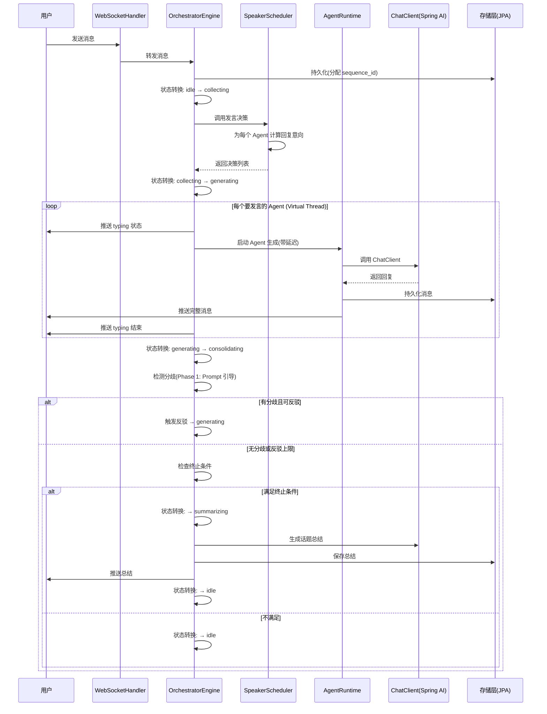

# 多Agent技术讨论群聊产品 - Java 技术方案文档

> 版本：v1.0-java | 日期：2026-07-14 | 作者：技术架构师
> 对应 Python 版：multi-agent-chat-tech-design-v1.md
> 本文档将 Python/FastAPI 技术方案完整迁移为 Java/Spring Boot 实现版本。
> 核心原则：**模块边界不变，数据模型不变，API 协议不变；仅替换运行时与技术栈。**

---

## 一、决策汇总

### 1.1 核心决策表（Java 版调整项）

> 仅列出相对 Python 版有调整的决策项，其余与 Python 版一致。

| # | 决策点 | Python 版选择 | Java 版选择 | 调整理由 |
|---|--------|--------------|------------|---------|
| 2 | 后端技术栈 | Python (FastAPI) → Java (Spring AI) | **Java (Spring Boot 3 + Spring AI)** 直接实现 | 跳过 Python MVP，直接 Java |
| 5 | Agent Runtime | asyncio 协程，单进程 | **Virtual Thread（Java 21+）** | LLM 调用是 IO 密集型，Virtual Thread 天然适配 |
| 7 | 实时通信 | WebSocket + asyncio.Queue 进程内总线 | **Spring WebSocket + `ApplicationEventPublisher`** | Spring 原生事件机制替代 asyncio.Queue |
| 9 | A2A 协议 | 语义层保留，传输层用 asyncio.Queue | **语义层保留，传输层用 Spring `ApplicationEvent`** | 同上 |
| 22 | 向量检索 | Phase 1 启用 sqlite-vss | **Spring AI `VectorStore`（pgvector 实现）** | Spring AI 统一向量存储抽象 |
| 25 | Java 迁移 | MVP 验证后迁移 ~8 周 | **本方案即 Java 版，无需迁移** | — |

### 1.2 与 Python 版的一致性说明

| 维度 | 是否变更 | 说明 |
|------|---------|------|
| 数据库 Schema | ❌ 不变 | 13 张表 + 2 张向量表，PostgreSQL + pgvector |
| REST API 路径 | ❌ 不变 | `/api/v1/*` 路由完全兼容 |
| WebSocket 协议 | ❌ 不变 | 信封格式、事件类型完全兼容 |
| 编排引擎 5 状态机 | ❌ 不变 | `idle→collecting→generating→consolidating→summarizing` |
| 7 策略体系 | ❌ 不变 | 发言决策/顺序调度/延迟模拟/反驳/终止/上下文/话题流转 |
| 上下文 6 层分层 | ❌ 不变 | 11.5K token 预算一致 |
| 记忆四层作用域 | ❌ 不变 | global/agent/chat/topic |
| 前端 | ❌ 不变 | React + TypeScript + Zustand |

---

## 二、系统架构

### 2.1 整体架构图（Java 版）

```
┌─────────────────────────────────────────────────────────┐
│                      前端层（React）                       │
│  群聊UI │ Agent配置 │ 话题管理 │ 知识卡片 │ Onboarding │
│  状态管理：Zustand │ WebSocket 客户端 │ REST API 调用     │
└─────────────────────────────────────────────────────────┘
                              │
                    WebSocket + REST API
                              │
┌─────────────────────────────────────────────────────────┐
│                接入层（Spring Boot 3）                    │
│  @RestController │ WebSocketHandler │ Filter（CORS/日志）  │
└─────────────────────────────────────────────────────────┘
                              │
┌─────────────────────────────────────────────────────────┐
│                  编排层（核心）                           │
│  OrchestratorEngine │ StateMachine │ SpeakerScheduler   │
│  TopicManager │ Terminator │ RebuttalController          │
│  ContextBuilder │ Summarizer                            │
└─────────────────────────────────────────────────────────┘
                              │
┌─────────────────────────────────────────────────────────┐
│                Agent Runtime 层                          │
│  AgentRuntime (Virtual Thread) │ PersonaLoader           │
│  人设加载 │ 上下文管理 │ 推断层[P2]                       │
└─────────────────────────────────────────────────────────┘
                              │
┌─────────────────────────────────────────────────────────┐
│                LLM 抽象层（Spring AI）                    │
│  ChatClient │ GLM │ DeepSeek │ Kimi │ Claude │ OpenAI   │
│  降级路由 │ 成本统计                                       │
└─────────────────────────────────────────────────────────┘
                              │
┌─────────────────────────────────────────────────────────┐
│          A2A 协议层 + Skill 系统 + Tool 系统               │
│  ApplicationEvent │ SkillRegistry │ ToolConcurrencyCtrl  │
└─────────────────────────────────────────────────────────┘
                              │
┌─────────────────────────────────────────────────────────┐
│                存储抽象层（可插拔）                        │
│  JpaRepository │ VectorStore │ ApplicationEvent │ Cache  │
│  PostgreSQL(默认) │ pgvector │ 进程内事件 │ Caffeine      │
│  SQLite(可选,通过@ConditionalOnProperty切换)              │
└─────────────────────────────────────────────────────────┘
```

### 2.2 核心数据流



### 2.3 模块依赖关系

```
com.dingring.api (接入层)
  ├── 依赖 com.dingring.orchestrator (编排层)
  ├── 依赖 com.dingring.storage (存储层)
  └── 依赖 com.dingring.model (数据模型)

com.dingring.orchestrator (编排层)
  ├── 依赖 com.dingring.agent (Agent Runtime)
  ├── 依赖 com.dingring.llm (LLM 抽象)
  ├── 依赖 com.dingring.a2a (A2A 协议)
  ├── 依赖 com.dingring.storage (存储层)
  └── 依赖 com.dingring.model (数据模型)

com.dingring.agent (Agent Runtime)
  ├── 依赖 com.dingring.llm (LLM 抽象)
  ├── 依赖 com.dingring.storage (存储层，向量检索)
  └── 依赖 com.dingring.model (数据模型)

com.dingring.llm (LLM 抽象)
  └── 依赖 com.dingring.model (数据模型)

com.dingring.storage (存储层)
  └── 依赖 com.dingring.model (数据模型)
```

**依赖原则**（与 Python 版一致）：
- 单向依赖，无循环
- 模块间通过接口交互，不依赖具体实现
- `model` 包是最底层，被所有模块依赖
- `storage` 通过 `@ConditionalOnProperty` 实现可插拔

---

## 三、技术选型

### 3.1 技术栈总览（Java 版）

| 层 | 技术选型 | 版本 | 说明 |
|----|---------|------|------|
| 后端框架 | **Spring Boot** | 3.3+ | Java 生态标杆，自动配置 |
| 后端语言 | **Java** | 21 (LTS) | Virtual Thread 支持 |
| LLM 集成 | **Spring AI** | 1.0+ | 统一 ChatClient 抽象 |
| ORM | **Spring Data JPA** | (Spring Boot 内置) | 基于 Hibernate |
| 数据验证 | **Jakarta Validation** | 3.0 | `@Valid`、`@NotNull` 等 |
| WebSocket | **Spring WebSocket** | (Spring Boot 内置) | 原生 WebSocket 支持 |
| HTTP 客户端 | **Spring AI 内置** / WebClient | — | 响应式 HTTP |
| 数据库迁移 | **Flyway** | 10+ | 版本化 SQL 迁移 |
| 数据库 | PostgreSQL | 16+ | 默认存储，支持 jsonb + pgvector |
| 向量检索 | **Spring AI VectorStore** | 1.0+ | pgvector 实现 |
| 日志 | **SLF4J + Logback** | — | 结构化 JSON |
| 可观测性 | **Micrometer + Actuator** | — | 指标采集 |
| 配置 | **Spring `@ConfigurationProperties`** | — | YAML → 强类型绑定 |
| API 文档 | **SpringDoc OpenAPI** | 2+ | 替代 FastAPI 自动文档 |
| 缓存 | **Caffeine** | 3+ | 进程内高性能缓存 |
| 异步框架 | **Virtual Thread** | Java 21 | 替代 asyncio |
| 构建工具 | **Maven** | 3.9+ | 依赖管理 |
| 部署 | Docker + docker-compose | — | 一键部署 |

### 3.2 LLM Provider 选型（与 Python 版一致）

| Provider | 用途 | 模型 | Spring AI 实现 | 特点 |
|----------|------|------|---------------|------|
| GLM | 全栈 Agent、发言决策 | glm-5.2 | `OpenAiChatModel`（兼容接口） | 中文强、推理好 |
| DeepSeek | 摘要、降级 | deepseek-chat | `OpenAiChatModel`（兼容接口） | 最便宜 |
| Kimi | 前端专家 Agent | moonshot-v1-8k | `OpenAiChatModel`（兼容接口） | 长上下文 |
| Claude | 架构师 Agent、总结 | claude-3-5-sonnet | `AnthropicChatModel` | 推理强 |
| OpenAI 兼容 | 本地模型 | Ollama / vLLM | `OpenAiChatModel` | 本地部署 |

> **关键点**：GLM、DeepSeek、Kimi 均提供 OpenAI 兼容 API，Spring AI 的 `OpenAiChatModel` 通过配置不同 `base-url` 即可对接，无需各家单独适配。

### 3.3 可选技术栈（用户自选）

| 组件 | 默认 | 可选 | Spring 实现方式 |
|------|------|------|---------------|
| 关系数据库 | PostgreSQL | SQLite | `@ConditionalOnProperty` 切换 DataSource + JPA 方言 |
| 向量检索 | pgvector | Chroma / Qdrant | Spring AI `VectorStore` 多实现 |
| 消息总线 | `ApplicationEvent` | Redis Stream | `@ConditionalOnProperty` 切换事件总线实现 |
| 缓存 | Caffeine | Redis | `@ConditionalOnProperty` 切换 CacheManager |
| 文件存储 | 本地文件系统 | S3 / MinIO | 接口抽象 + 适配器 |

### 3.4 核心技术映射表

| 技术点 | Python 实现 | Java 实现 | 说明 |
|--------|-----------|----------|------|
| 异步并发 | `asyncio.Task` / `asyncio.gather` | **Virtual Thread** + `ExecutorService` | Java 21 稳定特性 |
| WebSocket | `starlette.WebSocket` | `WebSocketHandler` / `@ServerEndpoint` | Spring 原生 |
| LLM 调用 | `httpx` + 各家 SDK | **Spring AI `ChatClient`** | 统一抽象 |
| 状态机 | 自实现 `StateContext` | 自实现 `EnumStateMachine`（轻量） | 5 状态无需 Spring StateMachine |
| 配置加载 | Pydantic Settings | `@ConfigurationProperties` | 强类型绑定 |
| 数据验证 | Pydantic | Jakarta Validation (`@Valid`) | 标准 JSR-380 |
| ORM | 自实现 Repository | Spring Data JPA | `JpaRepository` 接口 |
| 依赖注入 | FastAPI `Depends` | Spring `@Autowired` / 构造器注入 | IoC 容器 |
| 日志 | Python `logging` | SLF4J + Logback | 结构化 JSON |
| 向量检索 | pgvector 原生 SQL | Spring AI `VectorStore` | 统一抽象 |
| 消息总线 | `asyncio.Queue` | `ApplicationEventPublisher` | Spring 事件机制 |
| 数据库迁移 | Alembic | **Flyway** | 版本化 SQL |
| 缓存 | 进程内 LRU | **Caffeine** | 高性能本地缓存 |

---

## 四、项目结构

### 4.0 建模思想（与 Python 版一致）

项目结构融合 3 种架构思想：

**1. 分层架构（Layered Architecture）**
```
接入层（api）→ 业务层（orchestrator + agent）→ 基础设施层（storage + llm）
```

**2. 领域驱动设计的限界上下文（Bounded Context）**
每个包 = 一个限界上下文，内高内聚，间低耦合。

**3. 六边形架构的端口适配器（Hexagonal Architecture）**
`storage` 和 `llm` 采用端口+适配器模式：
- 接口定义 = 端口（`StorageProvider`、`ChatModel`）
- 具体实现 = 适配器（`PostgresRelationalStore`、`OpenAiChatModel`）
- 核心业务逻辑不依赖具体实现，实现可替换

### 4.1 目录结构

```
dingring/
├── backend/                              # Java 后端
│   ├── src/main/java/com/dingring/
│   │   ├── DingRingApplication.java      # Spring Boot 启动类
│   │   │
│   │   ├── config/                       # 配置层
│   │   │   ├── AppConfig.java            # @ConfigurationProperties 主配置
│   │   │   ├── LlmConfig.java            # LLM Provider Bean 注册
│   │   │   ├── WebSocketConfig.java      # WebSocket 配置
│   │   │   ├── JpaConfig.java            # JPA + 数据源配置
│   │   │   ├── VectorStoreConfig.java    # Spring AI VectorStore 配置
│   │   │   └── VirtualThreadConfig.java  # Virtual Thread Executor 配置
│   │   │
│   │   ├── api/                          # 接入层
│   │   │   ├── rest/                     # REST 控制器
│   │   │   │   ├── ChatController.java   # 群聊 CRUD
│   │   │   │   ├── TopicController.java  # 话题管理
│   │   │   │   ├── AgentController.java  # Agent 配置
│   │   │   │   ├── MessageController.java# 历史消息
│   │   │   │   ├── SkillController.java  # Skill 管理 [P2]
│   │   │   │   ├── ConfigController.java # 用户配置
│   │   │   │   └── StatsController.java  # 统计看板
│   │   │   ├── websocket/                # WebSocket
│   │   │   │   ├── ChatWebSocketHandler.java  # WebSocket 端点
│   │   │   │   ├── WsMessage.java        # WS 消息信封
│   │   │   │   └── WsSessionManager.java # 会话管理
│   │   │   └── filter/                   # 过滤器
│   │   │       ├── CorsFilter.java       # CORS
│   │   │       └── LoggingFilter.java    # 请求日志
│   │   │
│   │   ├── orchestrator/                 # 编排层（核心）
│   │   │   ├── OrchestratorEngine.java   # 编排引擎主循环
│   │   │   ├── OrchestratorManager.java  # 每群聊一个引擎实例的管理器
│   │   │   ├── StateMachine.java         # 5 状态机（自实现）
│   │   │   ├── SpeakerScheduler.java     # 发言决策器 + 顺序调度
│   │   │   ├── TopicManager.java         # 话题管理
│   │   │   ├── Terminator.java           # 终止判定器
│   │   │   ├── RebuttalController.java   # 反驳控制器
│   │   │   ├── ContextBuilder.java       # 上下文构建器
│   │   │   ├── Summarizer.java           # 摘要生成器
│   │   │   └── a2a/                      # A2A 协议
│   │   │       ├── A2aMessage.java       # 消息类型定义
│   │   │       └── A2aEvent.java         # Spring ApplicationEvent 封装
│   │   │
│   │   ├── agent/                        # Agent Runtime 层
│   │   │   ├── AgentRuntime.java         # Agent 生命周期（Virtual Thread）
│   │   │   ├── PersonaLoader.java        # 人设加载 + Prompt 模板组装
│   │   │   └── InferenceLayer.java       # 推断层 [P2]
│   │   │
│   │   ├── llm/                          # LLM 抽象层（Spring AI）
│   │   │   ├── LlmRouter.java            # 降级路由（A→B→C）
│   │   │   ├── CostTracker.java          # Token 计费统计
│   │   │   └── ChatMessageMapper.java    # 领域 Message → Spring AI Message
│   │   │   # GLM/DeepSeek/Kimi/Claude 实现由 Spring AI 自动注册
│   │   │   # 仅需在 LlmConfig 中配置 @Bean
│   │   │
│   │   ├── skill/                        # Skill 系统 [P2]
│   │   │   ├── SkillRegistry.java        # Skill 注册表
│   │   │   ├── SkillLoader.java          # Skill 加载（SPI）
│   │   │   └── skills/                   # 内置 Skill 实现
│   │   │       ├── GrillMeSkill.java
│   │   │       ├── TimeBoxedSkill.java
│   │   │       └── DevilAdvocateSkill.java
│   │   │
│   │   ├── tool/                         # Tool 系统 [P2]
│   │   │   ├── Tool.java                 # Tool 抽象接口
│   │   │   ├── WebSearchTool.java
│   │   │   ├── CodeRunnerTool.java       # 子进程隔离执行
│   │   │   └── ToolConcurrencyController.java  # 并发控制
│   │   │
│   │   ├── storage/                      # 存储抽象层
│   │   │   ├── repository/               # JPA Repository（端口）
│   │   │   │   ├── ChatRepository.java
│   │   │   │   ├── TopicRepository.java
│   │   │   │   ├── MessageRepository.java
│   │   │   │   ├── AgentRepository.java
│   │   │   │   ├── SummaryRepository.java
│   │   │   │   ├── MemoryRepository.java
│   │   │   │   ├── CostRecordRepository.java
│   │   │   │   └── ConfigRepository.java
│   │   │   ├── vector/                   # 向量存储（Spring AI）
│   │   │   │   └── TopicVectorStore.java # 包装 Spring AI VectorStore
│   │   │   └── SequenceIdGenerator.java  # sequence_id 生成
│   │   │
│   │   ├── memory/                       # 记忆系统
│   │   │   ├── MemoryService.java        # 记忆服务（四层作用域）
│   │   │   └── MemoryRetriever.java      # 向量检索 + 时间衰减
│   │   │
│   │   ├── observability/                # 可观测性
│   │   │   ├── StructuredLogger.java     # 结构化日志（JSON）
│   │   │   ├── CostMonitor.java          # 成本监控
│   │   │   └── DegradationManager.java   # 优雅降级
│   │   │
│   │   └── model/                        # 数据模型
│   │       ├── entity/                   # JPA Entity
│   │       │   ├── ChatEntity.java
│   │       │   ├── TopicEntity.java
│   │       │   ├── MessageEntity.java
│   │       │   ├── AgentEntity.java
│   │       │   ├── ChatAgentEntity.java
│   │       │   ├── SummaryEntity.java
│   │       │   ├── SkillEntity.java
│   │       │   ├── ChatSkillEntity.java
│   │       │   ├── ToolEntity.java
│   │       │   ├── ChatToolEntity.java
│   │       │   ├── MemoryEntity.java
│   │       │   ├── CostRecordEntity.java
│   │       │   ├── ConfigEntity.java
│   │       │   └── LogEntity.java
│   │       ├── dto/                      # 数据传输对象
│   │       │   ├── ChatDto.java
│   │       │   ├── MessageDto.java
│   │       │   ├── AgentDto.java
│   │       │   ├── TopicDto.java
│   │       │   └── SummaryDto.java
│   │       ├── enums/                    # 枚举
│   │       │   ├── State.java            # 编排状态
│   │       │   ├── SpeakingIntent.java   # 发言意向
│   │       │   ├── A2aType.java          # A2A 消息类型
│   │       │   ├── MessageSenderType.java
│   │       │   └── TerminationReason.java
│   │       └── event/                    # 事件
│   │           ├── SpeakingDecision.java
│   │           └── StateContext.java
│   │
│   ├── src/main/resources/
│   │   ├── application.yml               # 主配置
│   │   ├── application-dev.yml           # 开发环境
│   │   ├── application-prod.yml          # 生产环境
│   │   ├── agents/                       # Agent 人设配置
│   │   │   ├── kimi.yml
│   │   │   ├── deepseek.yml
│   │   │   └── claude.yml
│   │   ├── skills/                       # Skill 配置 [P2]
│   │   └── db/migration/                 # Flyway 迁移脚本
│   │       ├── V1__init_schema.sql
│   │       ├── V2__seed_agents.sql
│   │       └── V3__create_vector_tables.sql
│   │
│   ├── src/test/java/                    # 测试
│   ├── Dockerfile
│   └── pom.xml
│
├── frontend/                             # React 前端（不变）
│   └── ...
│
├── docker-compose.yml
└── README.md
```

### 4.2 Maven 依赖（pom.xml 核心部分）

```xml
<project>
    <parent>
        <groupId>org.springframework.boot</groupId>
        <artifactId>spring-boot-starter-parent</artifactId>
        <version>3.3.0</version>
    </parent>

    <properties>
        <java.version>21</java.version>
        <spring-ai.version>1.0.0</spring-ai.version>
    </properties>

    <dependencies>
        <!-- Spring Boot 核心 -->
        <dependency>
            <groupId>org.springframework.boot</groupId>
            <artifactId>spring-boot-starter-web</artifactId>
        </dependency>
        <dependency>
            <groupId>org.springframework.boot</groupId>
            <artifactId>spring-boot-starter-websocket</artifactId>
        </dependency>
        <dependency>
            <groupId>org.springframework.boot</groupId>
            <artifactId>spring-boot-starter-data-jpa</artifactId>
        </dependency>
        <dependency>
            <groupId>org.springframework.boot</groupId>
            <artifactId>spring-boot-starter-validation</artifactId>
        </dependency>
        <dependency>
            <groupId>org.springframework.boot</groupId>
            <artifactId>spring-boot-starter-actuator</artifactId>
        </dependency>

        <!-- Spring AI -->
        <dependency>
            <groupId>org.springframework.ai</groupId>
            <artifactId>spring-ai-openai-spring-boot-starter</artifactId>
            <version>${spring-ai.version}</version>
        </dependency>
        <dependency>
            <groupId>org.springframework.ai</groupId>
            <artifactId>spring-ai-anthropic-spring-boot-starter</artifactId>
            <version>${spring-ai.version}</version>
        </dependency>
        <dependency>
            <groupId>org.springframework.ai</groupId>
            <artifactId>spring-ai-pgvector-store-spring-boot-starter</artifactId>
            <version>${spring-ai.version}</version>
        </dependency>

        <!-- 数据库 -->
        <dependency>
            <groupId>org.postgresql</groupId>
            <artifactId>postgresql</artifactId>
        </dependency>
        <dependency>
            <groupId>org.flywaydb</groupId>
            <artifactId>flyway-core</artifactId>
        </dependency>

        <!-- 缓存 -->
        <dependency>
            <groupId>com.github.ben-manes.caffeine</groupId>
            <artifactId>caffeine</artifactId>
        </dependency>

        <!-- 工具库 -->
        <dependency>
            <groupId>com.fasterxml.jackson.core</groupId>
            <artifactId>jackson-databind</artifactId>
        </dependency>
        <dependency>
            <groupId>com.fasterxml.jackson.datatype</groupId>
            <artifactId>jackson-datatype-jsr310</artifactId>
        </dependency>

        <!-- API 文档 -->
        <dependency>
            <groupId>org.springdoc</groupId>
            <artifactId>springdoc-openapi-starter-webmvc-ui</artifactId>
            <version>2.5.0</version>
        </dependency>

        <!-- 日志 JSON 格式化 -->
        <dependency>
            <groupId>net.logstash.logback</groupId>
            <artifactId>logstash-logback-encoder</artifactId>
            <version>7.4</version>
        </dependency>

        <!-- 测试 -->
        <dependency>
            <groupId>org.springframework.boot</groupId>
            <artifactId>spring-boot-starter-test</artifactId>
            <scope>test</scope>
        </dependency>
        <dependency>
            <groupId>org.testcontainers</groupId>
            <artifactId>postgresql</artifactId>
            <scope>test</scope>
        </dependency>
    </dependencies>
</project>
```

---

## 五、数据库设计

### 5.1 数据库 Schema 说明

> 数据库 Schema 与 Python 版**完全一致**（13 张业务表 + 2 张向量表），此处不再重复表结构定义。
> 详见 Python 版第五章：[multi-agent-chat-tech-design-v1.md](file:///Users/Zhuanz/IdeaProjects/DingRingJ/multi-agent-chat-tech-design-v1.md) 第 5.2 节。

### 5.2 JPA Entity 映射示例

以下展示核心 Entity 的 Java 映射，其余 Entity 遵循相同模式。

#### 5.2.1 MessageEntity

```java
package com.dingring.model.entity;

import jakarta.persistence.*;
import java.time.LocalDateTime;

/**
 * 消息实体 —— 所有聊天消息统一存储
 * 对应 Python 版 messages 表
 */
@Entity
@Table(name = "messages", indexes = {
    @Index(name = "idx_messages_seq", columnList = "chat_id, sequence_id", unique = true),
    @Index(name = "idx_messages_topic", columnList = "topic_id"),
    @Index(name = "idx_messages_sender", columnList = "sender_id")
})
public class MessageEntity {

    @Id
    @GeneratedValue(strategy = GenerationType.IDENTITY)
    private Long id;

    @Column(name = "chat_id", nullable = false)
    private Long chatId;

    @Column(name = "topic_id", nullable = false)
    private Long topicId;

    @Column(name = "sequence_id", nullable = false)
    private Integer sequenceId;

    @Column(name = "sender_id", nullable = false)
    private String senderId;

    @Enumerated(EnumType.STRING)
    @Column(name = "sender_type", nullable = false)
    private MessageSenderType senderType;

    @Column(nullable = false, length = 10000)
    private String content;

    @Column(name = "message_type", nullable = false)
    private String messageType = "text";

    @Column(name = "reply_to")
    private Long replyTo;

    @Column(name = "reply_sender")
    private String replySender;

    @Column(name = "reply_snippet")
    private String replySnippet;

    /** JSON 数组字符串，如 '["agent_kimi"]' */
    @Column(columnDefinition = "TEXT")
    private String mentions;

    @Enumerated(EnumType.STRING)
    @Column(name = "a2a_type")
    private A2aType a2aType;

    @Column(name = "a2a_to")
    private String a2aTo;

    @Column(name = "is_private", nullable = false)
    private Boolean isPrivate = false;

    @Column(name = "private_to")
    private String privateTo;

    @Column(columnDefinition = "TEXT")
    private String metadata;

    @Column(name = "send_time", nullable = false, updatable = false)
    private LocalDateTime sendTime = LocalDateTime.now();

    // 省略 getter/setter，实际使用 Lombok @Data 或 record
}
```

#### 5.2.2 AgentEntity

```java
package com.dingring.model.entity;

import jakarta.persistence.*;
import java.time.LocalDateTime;

/**
 * Agent 配置实体
 * 对应 Python 版 agents 表
 */
@Entity
@Table(name = "agents")
public class AgentEntity {

    @Id
    private String id;  // 如 "agent_kimi"，业务主键

    @Column(nullable = false)
    private String name;

    private String avatar;

    @Column(nullable = false)
    private String title;

    @Column(nullable = false)
    private String experience;

    /** JSON 数组字符串 */
    @Column(nullable = false)
    private String expertise;

    @Column(nullable = false)
    private String personality;

    @Column(name = "max_length", nullable = false)
    private Integer maxLength = 200;

    @Column(name = "llm_provider", nullable = false)
    private String llmProvider;

    @Column(name = "fallback_provider")
    private String fallbackProvider;

    @Column(name = "delay_profile", nullable = false)
    private String delayProfile = "normal";

    @Column(columnDefinition = "TEXT")
    private String fewShots;  // JSON 数组

    @Column(name = "is_builtin", nullable = false)
    private Boolean isBuiltin = false;

    @Column(nullable = false)
    private String status = "offline";

    @Column(name = "created_at", nullable = false, updatable = false)
    private LocalDateTime createdAt = LocalDateTime.now();

    @Column(name = "updated_at", nullable = false)
    private LocalDateTime updatedAt = LocalDateTime.now();
}
```

### 5.3 Flyway 迁移脚本

```sql
-- src/main/resources/db/migration/V1__init_schema.sql

-- 启用 pgvector 扩展
CREATE EXTENSION IF NOT EXISTS vector;

-- 1. chats（群聊）
CREATE TABLE chats (
    id                   SERIAL PRIMARY KEY,
    tenant_id            TEXT NOT NULL DEFAULT 'default',
    chat_type            TEXT NOT NULL DEFAULT 'group',
    name                 TEXT NOT NULL DEFAULT '技术讨论群',
    owner_id             TEXT NOT NULL DEFAULT 'default',
    status               TEXT NOT NULL DEFAULT 'active',
    max_rounds_per_topic INTEGER NOT NULL DEFAULT 10,
    cost_budget_yuan     REAL NOT NULL DEFAULT 5.0,
    topic_count          INTEGER NOT NULL DEFAULT 0,
    active_topic_id      INTEGER,
    onboarding_completed BOOLEAN NOT NULL DEFAULT FALSE,
    created_at           TIMESTAMPTZ NOT NULL DEFAULT NOW(),
    updated_at           TIMESTAMPTZ NOT NULL DEFAULT NOW(),
    last_active_at       TIMESTAMPTZ NOT NULL DEFAULT NOW(),
    archived_at          TIMESTAMPTZ
);

-- 2. topics（话题）
CREATE TABLE topics (
    id                SERIAL PRIMARY KEY,
    chat_id           INTEGER NOT NULL REFERENCES chats(id) ON DELETE CASCADE,
    title             TEXT NOT NULL,
    title_source      TEXT NOT NULL DEFAULT 'auto',
    status            TEXT NOT NULL DEFAULT 'created',
    message_count     INTEGER NOT NULL DEFAULT 0,
    round_count       INTEGER NOT NULL DEFAULT 0,
    summary_id        INTEGER,
    related_topic_ids TEXT,
    created_at        TIMESTAMPTZ NOT NULL DEFAULT NOW(),
    updated_at        TIMESTAMPTZ NOT NULL DEFAULT NOW(),
    summarized_at     TIMESTAMPTZ,
    archived_at       TIMESTAMPTZ
);
CREATE INDEX idx_topics_chat_id ON topics(chat_id);
CREATE INDEX idx_topics_status ON topics(status);

-- 3. messages（消息）
CREATE TABLE messages (
    id            SERIAL PRIMARY KEY,
    chat_id       INTEGER NOT NULL REFERENCES chats(id) ON DELETE CASCADE,
    topic_id      INTEGER NOT NULL REFERENCES topics(id) ON DELETE CASCADE,
    sequence_id   INTEGER NOT NULL,
    sender_id     TEXT NOT NULL,
    sender_type   TEXT NOT NULL,
    content       TEXT NOT NULL,
    message_type  TEXT NOT NULL DEFAULT 'text',
    reply_to      INTEGER REFERENCES messages(id),
    reply_sender  TEXT,
    reply_snippet TEXT,
    mentions      TEXT,
    a2a_type      TEXT,
    a2a_to        TEXT,
    is_private    BOOLEAN NOT NULL DEFAULT FALSE,
    private_to    TEXT,
    metadata      TEXT,
    send_time     TIMESTAMPTZ NOT NULL DEFAULT NOW()
);
CREATE UNIQUE INDEX idx_messages_seq ON messages(chat_id, sequence_id);
CREATE INDEX idx_messages_topic ON messages(topic_id);
CREATE INDEX idx_messages_sender ON messages(sender_id);

-- 4-13: agents, chat_agents, summaries, skills, chat_skills,
--       tools, chat_tools, memories, cost_records, config, logs
-- （与 Python 版完全一致，此处省略）

-- 向量表
CREATE TABLE topic_vectors (
    id         SERIAL PRIMARY KEY,
    topic_id   INTEGER NOT NULL REFERENCES topics(id) ON DELETE CASCADE,
    embedding  vector(1536) NOT NULL,
    created_at TIMESTAMPTZ NOT NULL DEFAULT NOW()
);
CREATE INDEX idx_topic_vectors_embedding ON topic_vectors
    USING ivfflat (embedding vector_cosine_ops) WITH (lists = 100);
CREATE INDEX idx_topic_vectors_topic ON topic_vectors(topic_id);

CREATE TABLE memory_vectors (
    id         SERIAL PRIMARY KEY,
    memory_id  INTEGER NOT NULL REFERENCES memories(id) ON DELETE CASCADE,
    embedding  vector(1536) NOT NULL,
    created_at TIMESTAMPTZ NOT NULL DEFAULT NOW()
);
CREATE INDEX idx_memory_vectors_embedding ON memory_vectors
    USING ivfflat (embedding vector_cosine_ops) WITH (lists = 100);
CREATE INDEX idx_memory_vectors_memory ON memory_vectors(memory_id);
```

### 5.4 sequence_id 生成方案（Java 版）

```java
package com.dingring.storage;

import org.springframework.stereotype.Component;
import org.springframework.transaction.annotation.Transactional;

/**
 * 消息序号生成器
 * 
 * 方案：事务内 SELECT MAX(sequence_id) + 1
 * PostgreSQL READ COMMITTED 隔离级别下，事务内 MAX+1 是安全的。
 * 
 * 为什么不用 PostgreSQL Sequence？
 * 单用户场景数据量小，MAX+1 足够。高并发场景可改为：
 *   CREATE SEQUENCE message_seq_{chat_id};
 *   SELECT nextval('message_seq_{chat_id}');
 */
@Component
public class SequenceIdGenerator {

    private final MessageRepository messageRepository;

    public SequenceIdGenerator(MessageRepository messageRepository) {
        this.messageRepository = messageRepository;
    }

    /**
     * 原子获取下一个 sequence_id
     * @Transactional 保证事务隔离
     */
    @Transactional
    public int nextSequenceId(Long chatId) {
        Integer maxSeq = messageRepository.findMaxSequenceIdByChatId(chatId);
        return (maxSeq == null ? 0 : maxSeq) + 1;
    }
}
```

```java
// MessageRepository.java
package com.dingring.storage.repository;

import com.dingring.model.entity.MessageEntity;
import org.springframework.data.jpa.repository.JpaRepository;
import org.springframework.data.jpa.repository.Query;
import org.springframework.data.repository.query.Param;

public interface MessageRepository extends JpaRepository<MessageEntity, Long> {

    @Query("SELECT MAX(m.sequenceId) FROM MessageEntity m WHERE m.chatId = :chatId")
    Integer findMaxSequenceIdByChatId(@Param("chatId") Long chatId);
}
```

### 5.5 级联删除策略（与 Python 版一致）

| 操作 | 级联影响 |
|------|---------|
| 删除 chat | 级联删除 topics、messages、chat_agents、chat_skills、chat_tools、memories、cost_records |
| 删除 topic | 级联删除 messages、summaries、memories（topic 级） |
| 删除 agent | 仅标记 `is_active=FALSE`，保留历史消息 |

---

## 六、API 设计

### 6.1 REST API（与 Python 版完全兼容）

```
/api/v1/
├── chats/                           # 群聊 CRUD
│   ├── POST   /                     # 创建群聊
│   ├── GET    /                     # 列出我的群聊
│   ├── GET    /{chatId}             # 群聊详情
│   ├── PATCH  /{chatId}             # 更新群聊
│   ├── DELETE /{chatId}             # 归档群聊
│   │
│   ├── GET    /{chatId}/topics/     # 话题列表
│   ├── POST   /{chatId}/topics/     # 创建话题（/new）
│   ├── GET    /{chatId}/topics/{topicId}/  # 话题详情+总结
│   │
│   ├── GET    /{chatId}/messages/   # 历史消息（分页）
│   │
│   └── GET    /{chatId}/agents/     # 群聊内Agent列表
│
├── agents/                          # Agent 配置
│   ├── GET    /                     # 可用Agent列表
│   ├── GET    /{agentId}            # Agent人设详情
│   └── POST   /                     # 自定义Agent
│
├── skills/                          # Skill 管理 [P2]
│   ├── GET    /                     # 可用Skill列表
│   └── POST   /{skillId}/toggle     # 启用/禁用
│
├── config/                          # 用户配置
│   ├── GET    /                     # 获取配置
│   └── PUT    /                     # 更新配置
│
└── stats/                           # 统计看板
    └── GET    /                     # Token消耗、成本、讨论数
```

### 6.2 REST Controller 示例

```java
package com.dingring.api.rest;

import com.dingring.model.dto.*;
import com.dingring.orchestrator.OrchestratorManager;
import jakarta.validation.Valid;
import org.springframework.http.ResponseEntity;
import org.springframework.web.bind.annotation.*;

import java.util.List;

/**
 * 群聊 REST 控制器
 * 对应 Python 版 api/rest.py 中的群聊路由
 */
@RestController
@RequestMapping("/api/v1/chats")
public class ChatController {

    private final ChatRepository chatRepository;
    private final OrchestratorManager orchestratorManager;

    public ChatController(ChatRepository chatRepository,
                          OrchestratorManager orchestratorManager) {
        this.chatRepository = chatRepository;
        this.orchestratorManager = orchestratorManager;
    }

    /** 创建群聊 */
    @PostMapping
    public ResponseEntity<ChatDto> createChat(@Valid @RequestBody CreateChatRequest request) {
        ChatEntity chat = new ChatEntity();
        chat.setName(request.getName());
        chat = chatRepository.save(chat);

        // 为新群聊创建编排引擎实例
        orchestratorManager.createEngine(chat.getId());

        return ResponseEntity.ok(ChatDto.from(chat));
    }

    /** 列出群聊 */
    @GetMapping
    public ResponseEntity<List<ChatDto>> listChats() {
        List<ChatDto> chats = chatRepository.findByStatusOrderByLastActiveAtDesc("active")
            .stream()
            .map(ChatDto::from)
            .toList();
        return ResponseEntity.ok(chats);
    }

    /** 历史消息分页 */
    @GetMapping("/{chatId}/messages")
    public ResponseEntity<MessagePageDto> getMessages(
            @PathVariable Long chatId,
            @RequestParam(defaultValue = "50") int limit,
            @RequestParam(required = false) Integer beforeSeq) {

        List<MessageEntity> messages = (beforeSeq == null)
            ? messageRepository.findRecentByChatId(chatId, limit)
            : messageRepository.findByChatIdAndSequenceIdLessThan(chatId, beforeSeq, limit);

        int maxSeq = messages.stream()
            .mapToInt(MessageEntity::getSequenceId)
            .max().orElse(0);

        return ResponseEntity.ok(new MessagePageDto(messages, maxSeq));
    }
}
```

### 6.3 WebSocket 协议（与 Python 版完全兼容）

**连接**：`ws://localhost:8000/ws/{chatId}`

**通用信封格式**：

```java
package com.dingring.api.websocket;

/**
 * WebSocket 消息信封
 * 与 Python 版 TypeScript 接口完全一致
 */
public record WsMessage(
    WsEventType type,      // 事件类型
    Object payload,        // 具体数据
    long timestamp,        // 时间戳（毫秒）
    Integer seq            // 服务端推送的 sequence_id（仅下行）
) {
    public enum WsEventType {
        // 上行
        USER_MESSAGE, COMMAND, SKILL_TOGGLE,
        // 下行
        AGENT_MESSAGE, SYSTEM_MESSAGE, TYPING,
        TOPIC_CHANGE, SUMMARY, AGENT_STATUS, ERROR
    }
}
```

**上行/下行事件定义**与 Python 版一致，详见原文档 6.2 节。

### 6.4 WebSocket Handler 实现

```java
package com.dingring.api.websocket;

import com.dingring.orchestrator.OrchestratorManager;
import com.fasterxml.jackson.databind.ObjectMapper;
import org.springframework.stereotype.Component;
import org.springframework.web.socket.*;
import org.springframework.web.socket.handler.TextWebSocketHandler;

import java.io.IOException;
import java.util.Map;
import java.util.Set;
import java.util.concurrent.ConcurrentHashMap;

/**
 * WebSocket 端点处理器
 * 对应 Python 版 api/websocket.py
 *
 * 职责：
 * 1. 管理群聊 → WebSocket 会话映射
 * 2. 接收前端消息，转发给编排引擎
 * 3. 编排引擎通过 WsSessionManager 推送消息给前端
 */
@Component
public class ChatWebSocketHandler extends TextWebSocketHandler {

    private final ObjectMapper objectMapper;
    private final OrchestratorManager orchestratorManager;
    private final WsSessionManager sessionManager;

    public ChatWebSocketHandler(ObjectMapper objectMapper,
                                 OrchestratorManager orchestratorManager,
                                 WsSessionManager sessionManager) {
        this.objectMapper = objectMapper;
        this.orchestratorManager = orchestratorManager;
        this.sessionManager = sessionManager;
    }

    @Override
    public void afterConnectionEstablished(WebSocketSession session) {
        Long chatId = extractChatId(session);
        sessionManager.register(chatId, session);
    }

    @Override
    protected void handleTextMessage(WebSocketSession session, TextMessage message) throws Exception {
        Long chatId = extractChatId(session);
        WsMessage wsMsg = objectMapper.readValue(message.getPayload(), WsMessage.class);

        // 转发给编排引擎处理
        var engine = orchestratorManager.getEngine(chatId);
        if (engine == null) {
            sendError(session, "orchestrator_not_found", "群聊引擎未初始化");
            return;
        }

        switch (wsMsg.type()) {
            case USER_MESSAGE -> engine.handleUserMessage(wsMsg.payload());
            case COMMAND -> engine.handleCommand(wsMsg.payload());
            case SKILL_TOGGLE -> engine.handleSkillToggle(wsMsg.payload());
            default -> sendError(session, "unknown_event", "未知事件类型: " + wsMsg.type());
        }
    }

    @Override
    public void afterConnectionClosed(WebSocketSession session, CloseStatus status) {
        Long chatId = extractChatId(session);
        sessionManager.unregister(chatId, session);
    }

    private Long extractChatId(WebSocketSession session) {
        // 从 URI 提取 /ws/{chatId} 中的 chatId
        String path = session.getUri().getPath();
        return Long.parseLong(path.substring(path.lastIndexOf('/') + 1));
    }

    private void sendError(WebSocketSession session, String code, String msg) throws IOException {
        WsMessage error = new WsMessage(
            WsMessage.WsEventType.ERROR,
            Map.of("code", code, "message", msg),
            System.currentTimeMillis(), null
        );
        session.sendMessage(new TextMessage(objectMapper.writeValueAsString(error)));
    }
}
```

```java
package com.dingring.api.websocket;

import org.springframework.stereotype.Component;
import org.springframework.web.socket.WebSocketSession;

import java.util.Set;
import java.util.concurrent.ConcurrentHashMap;

/**
 * WebSocket 会话管理器
 * 维护群聊 → 活跃会话集合的映射
 */
@Component
public class WsSessionManager {

    // chatId → 该群聊所有活跃 WebSocket 会话
    private final Map<Long, Set<WebSocketSession>> sessions = new ConcurrentHashMap<>();

    public void register(Long chatId, WebSocketSession session) {
        sessions.computeIfAbsent(chatId, k -> ConcurrentHashMap.newKeySet()).add(session);
    }

    public void unregister(Long chatId, WebSocketSession session) {
        Set<WebSocketSession> set = sessions.get(chatId);
        if (set != null) {
            set.remove(session);
            if (set.isEmpty()) {
                sessions.remove(chatId);
            }
        }
    }

    /** 获取某群聊的所有活跃会话（用于推送消息） */
    public Set<WebSocketSession> getSessions(Long chatId) {
        return sessions.getOrDefault(chatId, Set.of());
    }
}
```

### 6.5 历史消息加载策略（与 Python 版一致）

**方案：REST 初始加载 + WebSocket 增量**

1. 进入群聊时，REST 请求 `GET /api/v1/chats/{chatId}/messages?limit=50`
2. 返回最近 50 条消息 + 最大 `sequence_id`
3. WebSocket 连接时发送 `last_seq={最大sequenceId}`
4. 后端推送 `sequence_id > last_seq` 的增量消息
5. 衔接间隙有消息丢失，前端用 REST 补拉

---

## 七、编排引擎设计

### 7.1 状态机定义（与 Python 版一致）

```
idle ──► collecting ──► generating ──► consolidating ──► summarizing ──► idle
                                  │                         │
                                  └──► (无分歧) ────────────┘
                                       直接 summarizing
```

| 状态 | 职责 | 进入条件 | 退出条件 | 超时处理 |
|------|------|---------|---------|---------|
| **IDLE** | 等待用户输入 | 系统启动 / 话题总结完成 | 收到用户消息 → COLLECTING | 无 |
| **COLLECTING** | 发言决策 | 从 IDLE 收到消息 | 决策完成 → GENERATING | 5s → 直接 GENERATING |
| **GENERATING** | Agent 并发生成 | COLLECTING 完成 | 所有 Agent 完成/失败 | 30s/Agent → 跳过 |
| **CONSOLIDATING** | 整合回复，检测分歧 | 所有 Agent 完成 | 无分歧 → SUMMARIZING；有分歧 → GENERATING | 10s → SUMMARIZING |
| **SUMMARIZING** | 生成话题总结 | CONSOLIDATING 完成 / 用户 `/summary` / 终止触发 | 总结完成 → IDLE | 20s → 模板兜底 |

### 7.2 状态机枚举实现

```java
package com.dingring.model.enums;

/**
 * 编排引擎状态枚举
 * 
 * 为什么不用 Spring StateMachine？
 * 5 个状态的流转逻辑简单且固定，自实现更轻量、更可控。
 * Spring StateMachine 适用于复杂嵌套状态、并行状态等场景，此处引入会增加不必要的复杂度。
 */
public enum State {
    IDLE,
    COLLECTING,
    GENERATING,
    CONSOLIDATING,
    SUMMARIZING
}
```

### 7.3 事件抢占规则（无中断版，与 Python 版一致）

| 当前状态 \ 收到事件 | 用户发消息 | Agent 完成 | Agent 超时 | `/summary` | `/new` |
|---|---|---|---|---|---|
| **IDLE** | → COLLECTING | 忽略 | N/A | N/A | 创建新话题 |
| **COLLECTING** | 排队合并 | 忽略 | N/A | → SUMMARIZING | 先 SUMMARIZING |
| **GENERATING** | **排队等待** | 检查是否全部完成 | 跳过该 Agent | 等当前完 → SUMMARIZING | 等当前完 → SUMMARIZING → 新话题 |
| **CONSOLIDATING** | 排队 | 检查分歧 | N/A | → SUMMARIZING | → SUMMARIZING → 新话题 |
| **SUMMARIZING** | 排队（下一轮首条） | 忽略 | N/A | 忽略 | 忽略 |

### 7.4 编排引擎 7 策略（与 Python 版一致）

> 策略内容与 Python 版完全一致，详见原文档 7.3 节。以下仅展示 Java 实现差异。

#### 策略 1-5 核心逻辑不变，策略 6 见第八章，策略 7 见 TopicManager。

### 7.5 编排引擎核心实现

```java
package com.dingring.orchestrator;

import com.dingring.agent.AgentRuntime;
import com.dingring.llm.LlmRouter;
import com.dingring.model.entity.MessageEntity;
import com.dingring.model.enums.*;
import com.dingring.model.event.SpeakingDecision;
import com.dingring.model.event.StateContext;
import com.dingring.memory.MemoryService;
import com.dingring.storage.SequenceIdGenerator;
import com.dingring.storage.repository.MessageRepository;
import com.dingring.api.websocket.WsSessionManager;
import org.slf4j.Logger;
import org.slf4j.LoggerFactory;

import java.time.Duration;
import java.util.*;
import java.util.concurrent.*;
import java.util.concurrent.atomic.AtomicReference;

/**
 * 编排引擎主循环 —— 每个群聊一个实例
 *
 * 对应 Python 版 orchestrator/engine.py 的 OrchestratorEngine 类
 *
 * 核心设计：
 * - 状态机：自实现 5 状态枚举流转
 * - 并发模型：Virtual Thread（Java 21），替代 Python asyncio.gather
 * - 线程安全：AtomicReference 持有当前状态，CopyOnWriteArrayList 管理完成/失败列表
 * - 消息推送：通过 WsSessionManager 广播给前端
 *
 * 为什么用 Virtual Thread 而不是 CompletableFuture？
 * 1. Virtual Thread 代码风格更接近 Python asyncio，迁移直觉
 * 2. 每个 Agent 生成是独立 IO 密集任务，Virtual Thread 轻量高效
 * 3. StructuredTaskScope（预览特性）可进一步简化，此处用稳定 API
 */
public class OrchestratorEngine {

    private static final Logger log = LoggerFactory.getLogger(OrchestratorEngine.class);

    private final Long chatId;
    private final MessageRepository messageRepository;
    private final SequenceIdGenerator sequenceIdGenerator;
    private final LlmRouter llmRouter;
    private final MemoryService memoryService;
    private final WsSessionManager wsSessionManager;

    // 编排组件
    private final SpeakerScheduler speakerScheduler;
    private final Terminator terminator;
    private final RebuttalController rebuttalController;
    private final ContextBuilder contextBuilder;
    private final Summarizer summarizer;

    // 运行时状态（每个群聊实例独立）
    private final AtomicReference<State> currentState = new AtomicReference<>(State.IDLE);
    private final StateContext context;
    private final Map<String, AgentRuntime> agentRuntimes = new ConcurrentHashMap<>();

    // Virtual Thread Executor（每个引擎实例独立，生命周期与群聊一致）
    private final ExecutorService virtualThreadExecutor =
        Executors.newVirtualThreadPerTaskExecutor();

    public OrchestratorEngine(Long chatId,
                               MessageRepository messageRepository,
                               SequenceIdGenerator sequenceIdGenerator,
                               LlmRouter llmRouter,
                               MemoryService memoryService,
                               WsSessionManager wsSessionManager,
                               SpeakerScheduler speakerScheduler,
                               Terminator terminator,
                               RebuttalController rebuttalController,
                               ContextBuilder contextBuilder,
                               Summarizer summarizer) {
        this.chatId = chatId;
        this.messageRepository = messageRepository;
        this.sequenceIdGenerator = sequenceIdGenerator;
        this.llmRouter = llmRouter;
        this.memoryService = memoryService;
        this.wsSessionManager = wsSessionManager;
        this.speakerScheduler = speakerScheduler;
        this.terminator = terminator;
        this.rebuttalController = rebuttalController;
        this.contextBuilder = contextBuilder;
        this.summarizer = summarizer;
        this.context = new StateContext(chatId);
    }

    /**
     * 处理用户消息（WebSocket 入口）
     *
     * 对应 Python 版 handle_user_message()
     * 根据 current_state 决定处理方式：
     * - IDLE：立即处理，进入 COLLECTING
     * - 其他状态：排队等待下一轮
     */
    public synchronized void handleUserMessage(Map<String, Object> payload) {
        String content = (String) payload.get("content");
        Long replyTo = (Long) payload.get("reply_to");
        List<String> mentions = (List<String>) payload.get("mentions");

        MessageEntity message = buildUserMessage(content, replyTo, mentions);

        if (currentState.get() == State.IDLE) {
            persistMessage(message);
            transitionToCollecting(message);
        } else {
            // 排队等待下一轮
            context.getPendingUserMessages().add(content);
            log.info("chat={} message queued, current_state={}", chatId, currentState.get());
        }
    }

    /**
     * 进入 COLLECTING：发言决策
     *
     * 对应 Python 版 _transition_to_collecting()
     */
    private void transitionToCollecting(MessageEntity triggerMessage) {
        currentState.set(State.COLLECTING);
        log.info("chat={} state: IDLE → COLLECTING", chatId);

        // 合并排队的消息
        if (!context.getPendingUserMessages().isEmpty()) {
            String merged = String.join("\n", context.getPendingUserMessages());
            triggerMessage.setContent(triggerMessage.getContent() + "\n" + merged);
            context.getPendingUserMessages().clear();
        }

        // 发言决策
        List<SpeakingDecision> decisions = speakerScheduler.decide(
            agentRuntimes, triggerMessage, context
        );

        // 过滤 + 排序 + 限制最多 3 个
        List<SpeakingDecision> speaking = decisions.stream()
            .filter(d -> d.getIntent() != SpeakingIntent.SKIP)
            .sorted(Comparator.comparingInt(SpeakingDecision::getPriority))
            .limit(3)  // 每轮最多 3 个 Agent 发言
            .toList();

        if (speaking.isEmpty()) {
            sendSystemMessage("大家似乎都没什么要说的，要换个话题还是总结？");
            currentState.set(State.IDLE);
            return;
        }

        context.setSpeakingAgents(speaking);
        context.getCompletedAgents().clear();
        context.getFailedAgents().clear();

        transitionToGenerating();
    }

    /**
     * 进入 GENERATING：Agent 并发生成
     *
     * 对应 Python 版 _transition_to_generating()
     * 关键差异：asyncio.gather → Virtual Thread Executor
     */
    private void transitionToGenerating() {
        currentState.set(State.GENERATING);
        log.info("chat={} state: COLLECTING → GENERATING, agents={}",
            chatId, context.getSpeakingAgents().size());

        // 为每个 Agent 提交一个 Virtual Thread 任务
        List<Future<?>> futures = new ArrayList<>();
        for (SpeakingDecision decision : context.getSpeakingAgents()) {
            long delay = speakerScheduler.calculateDelay(decision);
            futures.add(virtualThreadExecutor.submit(() -> generateWithDelay(decision, delay)));
        }

        // 等待全部完成（不中断，等全部完成）
        for (Future<?> future : futures) {
            try {
                future.get();  // 阻塞等待单个完成
            } catch (InterruptedException e) {
                Thread.currentThread().interrupt();
                log.error("chat={} generate interrupted", chatId, e);
            } catch (ExecutionException e) {
                // 异常已在 generateWithDelay 内处理，此处仅记录
                log.warn("chat={} agent generate failed: {}", chatId, e.getCause().getMessage());
            }
        }

        transitionToConsolidating();
    }

    /**
     * 延迟后启动单个 Agent 生成
     *
     * 对应 Python 版 _generate_with_delay()
     * 关键差异：asyncio.sleep → Thread.sleep（Virtual Thread 上不阻塞平台线程）
     *          asyncio.wait_for → Future.get(timeout)
     */
    private void generateWithDelay(SpeakingDecision decision, long delayMs) {
        try {
            // 模拟"思考延迟"——Virtual Thread 上 sleep 不阻塞 OS 线程
            if (delayMs > 0) {
                Thread.sleep(delayMs);
            }

            // 推送 typing 状态
            broadcastWs(Map.of("type", "typing", "agent_id", decision.getAgentId(), "is_typing", true));

            // 构建上下文
            List<ChatMessage> messages = contextBuilder.build(
                decision.getAgent(), decision.getTriggerMessage(), context
            );

            // 调用 LLM（带 30s 超时）
            Future<String> llmFuture = virtualThreadExecutor.submit(
                () -> llmRouter.generate(decision.getAgent(), messages)
            );

            String content;
            try {
                content = llmFuture.get(30, TimeUnit.SECONDS);
            } catch (TimeoutException e) {
                llmFuture.cancel(true);
                context.getFailedAgents().add(decision.getAgentId());
                sendSystemMessage(decision.getAgentName() + " 思考超时，先跳过");
                log.warn("event=agent_generate_timeout agent_id={} timeout=30s",
                    decision.getAgentId());
                return;
            }

            // 构建消息并持久化
            int seqId = sequenceIdGenerator.nextSequenceId(chatId);
            MessageEntity agentMessage = new MessageEntity();
            agentMessage.setChatId(chatId);
            agentMessage.setTopicId(context.getTopicId());
            agentMessage.setSequenceId(seqId);
            agentMessage.setSenderId(decision.getAgentId());
            agentMessage.setSenderType(MessageSenderType.AGENT);
            agentMessage.setContent(content);
            agentMessage.setA2aType(A2aType.BROADCAST);

            messageRepository.save(agentMessage);

            // 推送给前端
            broadcastWs(Map.of("type", "agent_message", "message", agentMessage));
            context.getCompletedAgents().add(decision.getAgentId());

        } catch (InterruptedException e) {
            Thread.currentThread().interrupt();
            context.getFailedAgents().add(decision.getAgentId());
        } catch (Exception e) {
            context.getFailedAgents().add(decision.getAgentId());
            sendSystemMessage(decision.getAgentName() + " 遇到了问题");
            log.error("event=agent_generate_failed agent_id={} error={}",
                decision.getAgentId(), e.getMessage(), e);
        } finally {
            broadcastWs(Map.of("type", "typing", "agent_id", decision.getAgentId(), "is_typing", false));
        }
    }

    /**
     * 进入 CONSOLIDATING：检测分歧
     *
     * 对应 Python 版 _transition_to_consolidating()
     */
    private void transitionToConsolidating() {
        currentState.set(State.CONSOLIDATING);
        log.info("chat={} state: GENERATING → CONSOLIDATING", chatId);

        // Phase 1: 靠 Prompt 引导 Agent 自主反驳，无需推断层
        // Phase 2: 加入推断层分析 stance

        checkTermination();
    }

    /**
     * 检查话题终止条件
     */
    private void checkTermination() {
        context.incrementRoundCount();

        Terminator.TerminationResult result = terminator.check(context);

        if (result.shouldTerminate()) {
            transitionToSummarizing(result.reason());
        } else if (!context.getPendingUserMessages().isEmpty()) {
            // 有排队消息 → 下一轮
            MessageEntity next = buildUserMessage(context.getPendingUserMessages().remove(0), null, null);
            transitionToCollecting(next);
        } else {
            currentState.set(State.IDLE);
            log.info("chat={} state: → IDLE (round {})", chatId, context.getRoundCount());
        }
    }

    /**
     * 进入 SUMMARIZING：生成话题总结
     */
    private void transitionToSummarizing(TerminationReason reason) {
        currentState.set(State.SUMMARIZING);
        log.info("chat={} state: → SUMMARIZING, reason={}", chatId, reason);

        try {
            // 带超时执行摘要生成（20s）
            Future<SummaryDto> future = virtualThreadExecutor.submit(
                () -> summarizer.summarizeTopic(context.getTopicId(), "final")
            );
            SummaryDto summary = future.get(20, TimeUnit.SECONDS);

            broadcastWs(Map.of("type", "summary", "topic_id", context.getTopicId(), "summary", summary));

        } catch (TimeoutException e) {
            log.warn("chat={} summary timeout, using template fallback", chatId);
            SummaryDto fallback = summarizer.templateFallback(context.getTopicId());
            broadcastWs(Map.of("type", "summary", "topic_id", context.getTopicId(), "summary", fallback));

        } catch (Exception e) {
            log.error("event=summary_failed chat={} topic={} error={}",
                chatId, context.getTopicId(), e.getMessage(), e);
        }

        currentState.set(State.IDLE);
        log.info("chat={} state: SUMMARIZING → IDLE", chatId);
    }

    // ===== 工具方法 =====

    private void persistMessage(MessageEntity message) {
        messageRepository.save(message);
    }

    private MessageEntity buildUserMessage(String content, Long replyTo, List<String> mentions) {
        int seqId = sequenceIdGenerator.nextSequenceId(chatId);
        MessageEntity msg = new MessageEntity();
        msg.setChatId(chatId);
        msg.setTopicId(context.getTopicId());
        msg.setSequenceId(seqId);
        msg.setSenderId("user_001");
        msg.setSenderType(MessageSenderType.USER);
        msg.setContent(content);
        msg.setReplyTo(replyTo);
        return msg;
    }

    private void sendSystemMessage(String content) {
        int seqId = sequenceIdGenerator.nextSequenceId(chatId);
        MessageEntity sysMsg = new MessageEntity();
        sysMsg.setChatId(chatId);
        sysMsg.setTopicId(context.getTopicId());
        sysMsg.setSequenceId(seqId);
        sysMsg.setSenderId("system");
        sysMsg.setSenderType(MessageSenderType.SYSTEM);
        sysMsg.setContent(content);
        messageRepository.save(sysMsg);
        broadcastWs(Map.of("type", "system_message", "content", content));
    }

    private void broadcastWs(Map<String, Object> payload) {
        wsSessionManager.getSessions(chatId).forEach(session -> {
            try {
                // 实际通过 ObjectMapper 序列化为 WsMessage JSON
                // 此处简化展示
            } catch (Exception e) {
                log.warn("ws broadcast failed: {}", e.getMessage());
            }
        });
    }
}
```

### 7.6 编排引擎管理器

```java
package com.dingring.orchestrator;

import org.springframework.stereotype.Component;

import java.util.Map;
import java.util.concurrent.ConcurrentHashMap;

/**
 * 编排引擎管理器
 * 每个群聊一个 OrchestratorEngine 实例
 *
 * 对应 Python 版的引擎注册/获取逻辑
 */
@Component
public class OrchestratorManager {

    private final Map<Long, OrchestratorEngine> engines = new ConcurrentHashMap<>();

    private final OrchestratorEngineFactory engineFactory;

    public OrchestratorManager(OrchestratorEngineFactory engineFactory) {
        this.engineFactory = engineFactory;
    }

    public OrchestratorEngine createEngine(Long chatId) {
        return engines.computeIfAbsent(chatId, engineFactory::create);
    }

    public OrchestratorEngine getEngine(Long chatId) {
        return engines.get(chatId);
    }

    public void removeEngine(Long chatId) {
        OrchestratorEngine engine = engines.remove(chatId);
        if (engine != null) {
            engine.shutdown();  // 关闭 Virtual Thread Executor
        }
    }
}
```

### 7.7 Virtual Thread 配置

```java
package com.dingring.config;

import org.springframework.boot.autoconfigure.task.TaskExecutionAutoConfiguration;
import org.springframework.context.annotation.Bean;
import org.springframework.context.annotation.Configuration;
import org.springframework.core.task.AsyncTaskExecutor;
import org.springframework.core.task.support.TaskExecutorAdapter;
import org.springframework.scheduling.annotation.EnableAsync;

import java.util.concurrent.Executors;

/**
 * Virtual Thread 配置
 *
 * 关键决策：全局启用 Virtual Thread 作为 Spring 异步任务执行器
 * - 替代 Python asyncio 的并发模型
 * - 每个 Agent 生成任务跑在独立 Virtual Thread 上
 * - IO 密集型场景（LLM 调用、数据库）不阻塞平台线程
 *
 * 为什么选择 Virtual Thread 而不是 Reactor/WebFlux？
 * 1. 代码风格更接近 Python asyncio，迁移成本低
 * 2. Virtual Thread 在 Java 21 已稳定（非预览）
 * 3. 不需要全栈响应式改造（WebFlux 要求全链路响应式）
 * 4. LLM 调用本质是阻塞 IO，Virtual Thread 是最佳适配
 */
@Configuration
@EnableAsync
public class VirtualThreadConfig {

    @Bean(TaskExecutionAutoConfiguration.APPLICATION_TASK_EXECUTOR_BEAN_NAME)
    public AsyncTaskExecutor applicationTaskExecutor() {
        return new TaskExecutorAdapter(Executors.newVirtualThreadPerTaskExecutor());
    }
}
```

---

## 八、上下文管理设计

### 8.1 分层上下文预算（与 Python 版一致）

| 层 | 内容 | Token 预算 | 说明 |
|----|------|----------|------|
| System Prompt | 人设 + 行为规则 + Skill 注入 | 1,500 | 相对固定 |
| Few-shot 示例 | 2-3 条该 Agent 的典型发言 | 500 | 独立一层便于缓存 |
| 记忆层 | global + agent + chat + topic 四层记忆 | 1,500 | 向量检索 |
| 近期原文 | 最近 5-10 条消息 | 4,000 | 含引用上下文 |
| 私聊摘要 | 该 Agent 参与的私聊摘要 | 800 | 按需加载 |
| Tool 结果 | 最近 Tool 调用结果 | 1,200 | 按需加载 |
| 预留回复 | Agent 生成回复空间 | 2,000 | — |
| **总计** | | **11,500** | 适配 128K 模型的 10% |

### 8.2 上下文构建器实现

```java
package com.dingring.orchestrator;

import com.dingring.llm.ChatMessageMapper;
import com.dingring.memory.MemoryService;
import com.dingring.model.entity.*;
import com.dingring.model.event.StateContext;
import com.dingring.storage.repository.*;
import org.springframework.ai.chat.messages.*;
import org.springframework.stereotype.Component;

import java.util.ArrayList;
import java.util.List;
import java.util.stream.Collectors;

/**
 * 上下文构建器
 *
 * 对应 Python 版 orchestrator/context_builder.py 的 ContextBuilder 类
 *
 * 职责：为每个 Agent 组装完整的 LLM 调用上下文（6 层分层）
 * 关键：使用 Spring AI 的 Message 类型体系（SystemMessage / UserMessage / AssistantMessage）
 */
@Component
public class ContextBuilder {

    private final MessageRepository messageRepository;
    private final TopicRepository topicRepository;
    private final MemoryService memoryService;
    private final SkillRepository skillRepository;  // [P2]

    public ContextBuilder(MessageRepository messageRepository,
                          TopicRepository topicRepository,
                          MemoryService memoryService,
                          SkillRepository skillRepository) {
        this.messageRepository = messageRepository;
        this.topicRepository = topicRepository;
        this.memoryService = memoryService;
        this.skillRepository = skillRepository;
    }

    /**
     * 组装完整上下文
     * 返回 Spring AI 的 Message 列表，可直接传给 ChatClient
     */
    public List<Message> build(AgentEntity agent, MessageEntity triggerMessage, StateContext context) {
        List<Message> messages = new ArrayList<>();

        // Layer 1: System Prompt
        messages.add(new SystemMessage(buildSystemPrompt(agent, context)));

        // Layer 2: Few-shot 示例
        messages.addAll(buildFewShots(agent));

        // Layer 3: 记忆层
        String memories = buildMemories(agent, triggerMessage, context);
        if (!memories.isBlank()) {
            messages.add(new SystemMessage("【你的记忆】\n" + memories));
        }

        // Layer 4: 近期原文
        messages.addAll(buildRecentMessages(agent, triggerMessage, context));

        // Layer 5: 私聊摘要
        String privateSummary = buildPrivateSummary(agent, context);
        if (!privateSummary.isBlank()) {
            messages.add(new SystemMessage("【私聊动态】\n" + privateSummary));
        }

        // Layer 6: Tool 结果
        String toolResults = buildToolResults(context);
        if (!toolResults.isBlank()) {
            messages.add(new SystemMessage("【工具调用结果】\n" + toolResults));
        }

        return messages;
    }

    /**
     * 构建 System Prompt
     *
     * 对应 Python 版 _build_system_prompt()
     * 含人设漂移防护：每 5 轮追加锚定
     */
    private String buildSystemPrompt(AgentEntity agent, StateContext context) {
        String prompt = """
            你是%s，%s，%s。
            你的专长是：%s。
            你的性格：%s。

            【行为规则】
            - 只从你的专长角度发言，超出专长范围简短承认并引导给更合适的同事
            - 被质疑时，先确认对方理解是否正确，再反驳
            - 不要和同事说一样的话，如果你同意就说"同意并补充"
            - 发言控制在%d字以内
            - 如果没有有价值的补充，可以选择不回复
            - 如果同事的观点你有不同意见，请直接指出并说明理由

            【Skill 注入】
            %s
            """.formatted(
                agent.getName(), agent.getTitle(), agent.getExperience(),
                agent.getExpertise(), agent.getPersonality(),
                agent.getMaxLength(),
                injectSkills(context.getChatId())
            );

        // 人设漂移防护：每 5 轮追加锚定
        if (context.getRoundCount() > 0 && context.getRoundCount() % 5 == 0) {
            prompt += "\n【提醒】你是" + agent.getName() + "，保持你的专长和说话风格。";
        }

        return prompt;
    }

    /**
     * 构建记忆层（四层作用域）
     *
     * 对应 Python 版 _build_memories()
     * 四层：global → agent → chat → topic（含关联话题）
     */
    private String buildMemories(AgentEntity agent, MessageEntity triggerMessage, StateContext context) {
        float[] embedding = memoryService.embed(triggerMessage.getContent());
        List<String> sections = new ArrayList<>();

        // Layer 1: global 记忆（top 3）
        List<MemoryEntity> globalMems = memoryService.search(
            "global", embedding, null, null, 3
        );
        if (!globalMems.isEmpty()) {
            sections.add("【全局知识】" + globalMems.stream()
                .map(m -> "- " + m.getContent())
                .collect(Collectors.joining("\n")));
        }

        // Layer 2: agent 个人记忆（top 5）
        List<MemoryEntity> agentMems = memoryService.search(
            "agent", embedding, null, agent.getId(), 5
        );
        if (!agentMems.isEmpty()) {
            sections.add("【你的个人记忆】" + agentMems.stream()
                .map(m -> "- " + m.getContent())
                .collect(Collectors.joining("\n")));
        }

        // Layer 3: chat 级记忆（top 3）
        List<MemoryEntity> chatMems = memoryService.search(
            "chat", embedding, String.valueOf(context.getChatId()), null, 3
        );
        if (!chatMems.isEmpty()) {
            sections.add("【本群历史】" + chatMems.stream()
                .map(m -> "- " + m.getContent())
                .collect(Collectors.joining("\n")));
        }

        // Layer 4: topic 级记忆（top 5，含关联话题）
        List<MemoryEntity> topicMems = new ArrayList<>(memoryService.search(
            "topic", embedding, String.valueOf(context.getTopicId()), null, 5
        ));

        // 加载关联话题的记忆
        TopicEntity topic = topicRepository.findById(context.getTopicId()).orElse(null);
        if (topic != null && topic.getRelatedTopicIds() != null) {
            for (Long relatedId : parseRelatedIds(topic.getRelatedTopicIds())) {
                topicMems.addAll(memoryService.search(
                    "topic", embedding, String.valueOf(relatedId), null, 3
                ));
            }
        }

        if (!topicMems.isEmpty()) {
            sections.add("【话题记忆】" + topicMems.stream()
                .map(m -> "- " + m.getContent())
                .collect(Collectors.joining("\n")));
        }

        return String.join("\n\n", sections);
    }

    /**
     * 构建近期原文消息
     * 将数据库中的 MessageEntity 转换为 Spring AI 的 Message 序列
     */
    private List<Message> buildRecentMessages(AgentEntity agent, MessageEntity triggerMessage,
                                               StateContext context) {
        // 获取最近 5-10 条消息
        List<MessageEntity> recent = messageRepository.findRecentByTopic(
            context.getTopicId(), 10
        );

        List<Message> messages = new ArrayList<>();
        for (MessageEntity msg : recent) {
            switch (msg.getSenderType()) {
                case USER -> messages.add(new UserMessage(msg.getContent()));
                case AGENT -> {
                    if (msg.getSenderId().equals(agent.getId())) {
                        messages.add(new AssistantMessage(msg.getContent()));
                    } else {
                        // 其他 Agent 的发言作为上下文
                        messages.add(new UserMessage(
                            msg.getSenderId() + ": " + msg.getContent()
                        ));
                    }
                }
                case SYSTEM -> {} // 系统消息不进上下文
            }
        }
        return messages;
    }

    // 省略 buildFewShots / buildPrivateSummary / buildToolResults / injectSkills
    // 逻辑与 Python 版一致，此处仅展示核心结构
}
```

### 8.3 摘要生成器实现

```java
package com.dingring.orchestrator;

import com.dingring.llm.LlmRouter;
import com.dingring.model.dto.SummaryDto;
import com.dingring.model.entity.*;
import com.dingring.storage.repository.*;
import org.slf4j.Logger;
import org.slf4j.LoggerFactory;
import org.springframework.ai.chat.messages.Message;
import org.springframework.ai.chat.messages.UserMessage;
import org.springframework.stereotype.Component;

import java.util.List;
import java.util.stream.Collectors;

/**
 * 摘要生成器
 *
 * 对应 Python 版 orchestrator/summarizer.py 的 Summarizer 类
 *
 * 职责：
 * 1. 生成话题总结（结构化 JSON）
 * 2. 质量校验（实体保留率 > 85%）
 * 3. 写入记忆系统
 *
 * 使用 DeepSeek 模型（成本最低）
 */
@Component
public class Summarizer {

    private static final Logger log = LoggerFactory.getLogger(Summarizer.class);
    private static final double QUALITY_THRESHOLD = 0.85;

    private final LlmRouter llmRouter;
    private final MessageRepository messageRepository;
    private final SummaryRepository summaryRepository;
    private final MemoryService memoryService;

    public Summarizer(LlmRouter llmRouter,
                      MessageRepository messageRepository,
                      SummaryRepository summaryRepository,
                      MemoryService memoryService) {
        this.llmRouter = llmRouter;
        this.messageRepository = messageRepository;
        this.summaryRepository = summaryRepository;
        this.memoryService = memoryService;
    }

    /**
     * 生成话题总结
     */
    public SummaryDto summarizeTopic(Long topicId, String summaryType) {
        // 1. 获取话题所有消息
        List<MessageEntity> messages = messageRepository.findByTopicIdOrderBySequenceId(topicId);

        // 2. 构建摘要 Prompt
        String prompt = buildSummaryPrompt(messages);

        // 3. 调用 DeepSeek 生成（便宜）
        List<Message> llmMessages = List.of(new UserMessage(prompt));
        String response = llmRouter.generateRaw("deepseek", llmMessages, 0.3);

        // 4. 解析结构化总结
        SummaryDto summary = parseSummary(response, topicId, summaryType);

        // 5. 质量校验（实体保留率 > 85%）
        validateSummaryQuality(summary, messages);

        // 6. 持久化
        SummaryEntity entity = toEntity(summary);
        summaryRepository.save(entity);

        // 7. 写入记忆系统
        writeToMemory(summary);

        return summary;
    }

    /**
     * 构建摘要 Prompt（含质量保留指令）
     */
    private String buildSummaryPrompt(List<MessageEntity> messages) {
        String conversation = messages.stream()
            .map(m -> m.getSenderId() + ": " + m.getContent())
            .collect(Collectors.joining("\n"));

        return """
            请对以下技术讨论生成结构化总结。

            【讨论内容】
            %s

            【输出要求】
            严格按以下 JSON 格式输出：
            {
              "conclusions": "核心结论（达成的共识、推荐方案）",
              "disagreements": "关键分歧（有争议的点、不同观点）",
              "assumptions": "待验证假设",
              "action_items": "行动建议"
            }

            【质量要求】
            1. 代码片段不压缩：保留所有代码块原文
            2. 技术术语保留：库名、版本、API名、参数名强制保留
            3. 数字保留：所有具体数字（延迟ms、QPS、成本¥）保留原文
            4. 引用关系保留：标注"XX说的XX"
            5. 完整性：原文中所有技术实体必须出现在总结中
            """.formatted(conversation);
    }

    /**
     * 摘要质量校验
     */
    private void validateSummaryQuality(SummaryDto summary, List<MessageEntity> messages) {
        var originalEntities = extractEntities(messages);
        var summaryEntities = extractEntities(List.of(summary));

        int retained = 0;
        for (String e : originalEntities) {
            if (summaryEntities.contains(e)) retained++;
        }

        double retentionRate = originalEntities.isEmpty() ? 1.0
            : (double) retained / originalEntities.size();

        if (retentionRate < QUALITY_THRESHOLD) {
            log.warn("event=summary_quality_low topic_id={} retention_rate={}",
                summary.getTopicId(), retentionRate);
            // 重试逻辑（最多 2 次）
            // ...
        }
    }

    /** 模板兜底（摘要生成超时时使用） */
    public SummaryDto templateFallback(Long topicId) {
        List<MessageEntity> messages = messageRepository.findByTopicIdOrderBySequenceId(topicId);
        return SummaryDto.template(topicId, messages);
    }

    // 省略 parseSummary / extractEntities / writeToMemory / toEntity
}
```

### 8.4 记忆检索机制

```java
package com.dingring.memory;

import com.dingring.model.entity.MemoryEntity;
import com.dingring.storage.repository.MemoryRepository;
import org.springframework.ai.vectorstore.VectorStore;
import org.springframework.ai.vectorstore.SearchRequest;
import org.springframework.stereotype.Service;

import java.time.Duration;
import java.time.LocalDateTime;
import java.util.*;

/**
 * 记忆检索器：向量检索 + 时间衰减
 *
 * 对应 Python 版 memory/retriever.py 的 MemoryRetriever 类
 *
 * 关键差异：
 * - Python 版直接调用 pgvector SQL
 * - Java 版通过 Spring AI VectorStore 抽象，实现可插拔
 * - 时间衰减算法一致：exp(-days / 30)，30天半衰期
 */
@Service
public class MemoryRetriever {

    private final VectorStore vectorStore;
    private final MemoryRepository memoryRepository;

    public MemoryRetriever(VectorStore vectorStore, MemoryRepository memoryRepository) {
        this.vectorStore = vectorStore;
        this.memoryRepository = memoryRepository;
    }

    /**
     * 检索记忆
     *
     * @param scope     作用域：global / agent / chat / topic
     * @param embedding 触发消息的向量
     * @param scopeId   作用域ID（chat/topic 时为对应ID）
     * @param ownerId   归属ID（agent 时为 agent_id）
     * @param limit     返回数量
     */
    public List<MemoryEntity> search(String scope, float[] embedding, String scopeId,
                                      String ownerId, int limit) {
        // 1. 向量检索 top N*2（多取一倍用于时间衰减后筛选）
        List<MemoryEntity> candidates = vectorStoreSearch(scope, embedding, scopeId, ownerId, limit * 2);

        // 2. 时间衰减加权
        LocalDateTime now = LocalDateTime.now();
        for (MemoryEntity mem : candidates) {
            long days = Duration.between(mem.getCreatedAt(), now).toDays();
            double timeDecay = Math.exp(-days / 30.0);  // 30天半衰期
            mem.setRelevanceScore(mem.getRelevanceScore() * timeDecay);
        }

        // 3. 按最终得分排序，取 top N
        return candidates.stream()
            .sorted(Comparator.comparingDouble(MemoryEntity::getRelevanceScore).reversed())
            .limit(limit)
            .toList();
    }

    /**
     * 通过 Spring AI VectorStore 执行向量检索
     */
    private List<MemoryEntity> vectorStoreSearch(String scope, float[] embedding,
                                                  String scopeId, String ownerId, int limit) {
        // 构建 filter 表达式
        String filterExpr = "scope == '" + scope + "'";
        if (scopeId != null) {
            filterExpr += " && scope_id == '" + scopeId + "'";
        }
        if (ownerId != null) {
            filterExpr += " && owner_id == '" + ownerId + "'";
        }

        SearchRequest request = SearchRequest.query(toDoubleArray(embedding))
            .withTopK(limit)
            .withFilterExpression(filterExpr);

        return vectorStore.similaritySearch(request).stream()
            .map(doc -> memoryRepository.findById(Long.parseLong(doc.getId())).orElse(null))
            .filter(Objects::nonNull)
            .toList();
    }

    private double[] toDoubleArray(float[] arr) {
        double[] result = new double[arr.length];
        for (int i = 0; i < arr.length; i++) {
            result[i] = arr[i];
        }
        return result;
    }
}
```

---

## 九、Agent 人设与 Prompt 工程

### 9.1 人设实现方案（与 Python 版一致）

**方案：System Prompt + Few-shot 示例**

| 组件 | 作用 | Token |
|------|------|-------|
| System Prompt | 身份定义 + 行为规则 + Skill 注入 | 1,500 |
| Few-shot 示例 | 2-3 条典型发言，锚定风格 | 500 |

### 9.2 Agent 配置文件（YAML，与 Python 版通用）

```yaml
# src/main/resources/agents/kimi.yml

id: "agent_kimi"
name: "Kimi"
avatar: "/avatars/kimi.png"
title: "前端专家"
experience: "3年前端开发经验"
expertise: ["React", "Vue", "性能优化", "浏览器", "CSS"]
personality: "务实，喜欢举例子，说话简洁"
max_length: 200
llm_provider: "kimi"
fallback_provider: "deepseek"
delay_profile: "quick"
is_builtin: true
few_shots:
  - user: "WebSocket和SSE怎么选？"
    response: "从浏览器兼容性看，SSE更简单，但WebSocket支持双向通信。如果你的看板只需要服务端推送，SSE就够了，实现成本也低。"
  - user: "React和Vue哪个好？"
    response: "看场景。React生态大、灵活，适合复杂应用；Vue上手快、约定强，适合中小项目。你项目规模多大？"
```

### 9.3 人设加载器

```java
package com.dingring.agent;

import com.dingring.model.entity.AgentEntity;
import com.fasterxml.jackson.databind.ObjectMapper;
import com.fasterxml.jackson.dataformat.yaml.YAMLMapper;
import org.springframework.core.io.Resource;
import org.springframework.core.io.support.PathMatchingResourcePatternResolver;
import org.springframework.stereotype.Component;

import java.io.InputStream;
import java.util.ArrayList;
import java.util.List;

/**
 * 人设加载器
 *
 * 对应 Python 版 agent/persona.py 的 PersonaLoader
 *
 * 职责：
 * 1. 从 classpath:agents/*.yaml 加载内置 Agent 人设
 * 2. 解析为 AgentEntity 持久化到数据库
 * 3. 加载 Few-shot 示例
 */
@Component
public class PersonaLoader {

    private final ObjectMapper yamlMapper = new YAMLMapper();
    private final AgentRepository agentRepository;

    public PersonaLoader(AgentRepository agentRepository) {
        this.agentRepository = agentRepository;
    }

    /**
     * 启动时加载内置 Agent 人设
     */
    public void loadBuiltinAgents() throws Exception {
        var resolver = new PathMatchingResourcePatternResolver();
        Resource[] resources = resolver.getResources("classpath:agents/*.yml");

        for (Resource resource : resources) {
            try (InputStream is = resource.getInputStream()) {
                AgentEntity agent = yamlMapper.readValue(is, AgentEntity.class);
                agent.setIsBuiltin(true);

                // upsert：存在则更新，不存在则插入
                agentRepository.save(agent);
            }
        }
    }

    /**
     * 加载 Few-shot 示例
     * 解析 YAML 中的 few_shots 字段为 List<FewShot>
     */
    public List<FewShot> loadFewShots(AgentEntity agent) {
        if (agent.getFewShots() == null || agent.getFewShots().isBlank()) {
            return List.of();
        }
        try {
            return yamlMapper.readValue(agent.getFewShots(),
                yamlMapper.getTypeFactory().constructCollectionType(List.class, FewShot.class));
        } catch (Exception e) {
            return List.of();
        }
    }

    public record FewShot(String user, String response) {}
}
```

### 9.4 人设漂移防护（与 Python 版一致）

每 5 轮在 System Prompt 末尾追加锚定（已在 [ContextBuilder.buildSystemPrompt](file:///Users/Zhuanz/IdeaProjects/DingRingJ/multi-agent-chat-tech-design-java-v1.md) 中实现）：

```
【提醒】你是{agent.name}，保持你的专长和说话风格。
```

---

## 十、LLM 抽象层设计（Spring AI）

### 10.1 架构概览

```
┌──────────────────────────────────────────────┐
│              LlmRouter（降级路由）              │
│   generate(agent, messages)                  │
│   逻辑：主 Provider → fallback → 降级         │
└──────────────┬───────────────────────────────┘
               │ 依赖
┌──────────────▼───────────────────────────────┐
│         Spring AI ChatClient 抽象              │
│   ChatClient.prompt().messages().call()       │
└──────────────┬───────────────────────────────┘
               │ 选择
┌──────┬───────┼───────┬────────┬──────────────┐
│ GLM  │DeepSeek│ Kimi  │ Claude │ OpenAI 兼容  │
│(OAI) │(OAI)  │(OAI)  │(Anthropic)│(OAI)      │
└──────┴───────┴───────┴────────┴──────────────┘
```

> **关键**：GLM、DeepSeek、Kimi 均提供 OpenAI 兼容 API，Spring AI 的 `OpenAiChatModel` 只需配置不同 `base-url`。

### 10.2 LLM 配置类

```java
package com.dingring.config;

import org.springframework.ai.chat.model.ChatModel;
import org.springframework.ai.openai.OpenAiChatModel;
import org.springframework.ai.openai.OpenAiChatOptions;
import org.springframework.ai.openai.api.OpenAiApi;
import org.springframework.ai.anthropic.AnthropicChatModel;
import org.springframework.beans.factory.annotation.Value;
import org.springframework.boot.autoconfigure.condition.ConditionalOnProperty;
import org.springframework.context.annotation.Bean;
import org.springframework.context.annotation.Configuration;

import java.util.HashMap;
import java.util.Map;

/**
 * LLM Provider Bean 注册
 *
 * 对应 Python 版 llm/ 目录下的各个 Provider 实现
 *
 * 关键设计：
 * - GLM / DeepSeek / Kimi → 均使用 OpenAiChatModel（兼容接口），仅 base-url 不同
 * - Claude → 使用 AnthropicChatModel（Anthropic 原生 API）
 * - 通过 @ConditionalOnProperty 实现：用户在配置文件中启用/禁用 Provider
 * - 所有 ChatModel 以 Bean name 注册到 Map，供 LlmRouter 按名称查找
 */
@Configuration
public class LlmConfig {

    // ===== GLM =====
    @Bean
    @ConditionalOnProperty(name = "llm.providers.glm.enabled", havingValue = "true")
    public ChatModel glmChatModel(
            @Value("${llm.providers.glm.api-key}") String apiKey,
            @Value("${llm.providers.glm.base-url}") String baseUrl,
            @Value("${llm.providers.glm.model}") String model) {
        OpenAiApi api = new OpenAiApi(baseUrl, apiKey);
        return new OpenAiChatModel(api, OpenAiChatOptions.builder().withModel(model).build());
    }

    // ===== DeepSeek（OpenAI 兼容）=====
    @Bean
    @ConditionalOnProperty(name = "llm.providers.deepseek.enabled", havingValue = "true")
    public ChatModel deepseekChatModel(
            @Value("${llm.providers.deepseek.api-key}") String apiKey,
            @Value("${llm.providers.deepseek.base-url}") String baseUrl,
            @Value("${llm.providers.deepseek.model}") String model) {
        OpenAiApi api = new OpenAiApi(baseUrl, apiKey);
        return new OpenAiChatModel(api, OpenAiChatOptions.builder().withModel(model).build());
    }

    // ===== Kimi（OpenAI 兼容）=====
    @Bean
    @ConditionalOnProperty(name = "llm.providers.kimi.enabled", havingValue = "true")
    public ChatModel kimiChatModel(
            @Value("${llm.providers.kimi.api-key}") String apiKey,
            @Value("${llm.providers.kimi.base-url}") String baseUrl,
            @Value("${llm.providers.kimi.model}") String model) {
        OpenAiApi api = new OpenAiApi(baseUrl, apiKey);
        return new OpenAiChatModel(api, OpenAiChatOptions.builder().withModel(model).build());
    }

    // ===== Claude（Anthropic 原生）=====
    @Bean
    @ConditionalOnProperty(name = "llm.providers.claude.enabled", havingValue = "true")
    public ChatModel claudeChatModel(
            @Value("${llm.providers.claude.api-key}") String apiKey,
            @Value("${llm.providers.claude.model}") String model) {
        return new AnthropicChatModel(apiKey, model);
    }

    /**
     * 将所有 ChatModel 注册为 Map<providerName, ChatModel>
     * 供 LlmRouter 按名称查找
     */
    @Bean
    public Map<String, ChatModel> chatModelMap(Map<String, ChatModel> models) {
        // Spring 自动注入所有 ChatModel Bean，key 为 Bean name
        return new HashMap<>(models);
    }
}
```

### 10.3 LLM 路由器（降级 + 成本统计）

```java
package com.dingring.llm;

import com.dingring.model.entity.AgentEntity;
import com.dingring.observability.CostTracker;
import org.slf4j.Logger;
import org.slf4j.LoggerFactory;
import org.springframework.ai.chat.messages.Message;
import org.springframework.ai.chat.model.ChatModel;
import org.springframework.ai.chat.model.ChatResponse;
import org.springframework.ai.chat.prompt.Prompt;
import org.springframework.stereotype.Service;

import java.util.*;

/**
 * LLM 路由器：降级路由 + 成本统计
 *
 * 对应 Python 版 llm/router.py 的 LLMRouter 类 + llm/cost_tracker.py
 *
 * 核心逻辑：
 * 1. 根据 Agent 配置构建降级链：主 Provider → fallback → ...
 * 2. 按顺序尝试，首个成功即返回
 * 3. 全部失败抛 AllProvidersFailedException
 * 4. 每次调用记录 Token 消耗和成本
 */
@Service
public class LlmRouter {

    private static final Logger log = LoggerFactory.getLogger(LlmRouter.class);

    private final Map<String, ChatModel> chatModelMap;
    private final CostTracker costTracker;

    public LlmRouter(Map<String, ChatModel> chatModelMap, CostTracker costTracker) {
        this.chatModelMap = chatModelMap;
        this.costTracker = costTracker;
    }

    /**
     * 生成回复（带降级链）
     */
    public String generate(AgentEntity agent, List<Message> messages) {
        List<String> providers = buildFallbackChain(agent);
        Exception lastError = null;

        for (String provider : providers) {
            try {
                ChatModel model = chatModelMap.get(provider + "ChatModel");
                if (model == null) {
                    log.warn("provider {} not registered, skipping", provider);
                    continue;
                }

                // 调用 Spring AI ChatModel
                Prompt prompt = new Prompt(messages);
                ChatResponse response = model.call(prompt);
                String content = response.getResult().getOutput().getContent();

                // 记录成本
                costTracker.recordCost(agent, provider, response);

                return content;

            } catch (Exception e) {
                log.warn("event=llm_provider_failed provider={} error={} fallback=true",
                    provider, e.getMessage());
                lastError = e;
            }
        }

        throw new AllProvidersFailedException("所有 LLM Provider 均不可用", lastError);
    }

    /**
     * 直接指定 Provider 调用（用于摘要生成等场景）
     */
    public String generateRaw(String provider, List<Message> messages, double temperature) {
        ChatModel model = chatModelMap.get(provider + "ChatModel");
        if (model == null) {
            throw new IllegalArgumentException("Provider not found: " + provider);
        }

        Prompt prompt = new Prompt(messages);
        ChatResponse response = model.call(prompt);
        return response.getResult().getOutput().getContent();
    }

    /**
     * 构建降级链
     * agent.llmProvider → agent.fallbackProvider → 全局默认降级
     */
    private List<String> buildFallbackChain(AgentEntity agent) {
        List<String> chain = new ArrayList<>();
        chain.add(agent.getLlmProvider());

        if (agent.getFallbackProvider() != null) {
            chain.addAll(Arrays.asList(agent.getFallbackProvider().split(",")));
        }

        // 全局兜底：DeepSeek（最便宜）
        if (!chain.contains("deepseek")) {
            chain.add("deepseek");
        }

        return chain;
    }

    public static class AllProvidersFailedException extends RuntimeException {
        public AllProvidersFailedException(String message, Throwable cause) {
            super(message, cause);
        }
    }
}
```

### 10.4 成本追踪器

```java
package com.dingring.observability;

import com.dingring.model.entity.AgentEntity;
import com.dingring.model.entity.CostRecordEntity;
import com.dingring.storage.repository.CostRecordRepository;
import org.springframework.ai.chat.model.ChatResponse;
import org.springframework.stereotype.Component;

import java.time.LocalDateTime;

/**
 * 成本追踪器
 *
 * 对应 Python 版 llm/cost_tracker.py
 *
 * 职责：
 * 1. 每次 LLM 调用后记录 Token 消耗和成本
 * 2. 持久化到 cost_records 表
 * 3. 提供 topic / chat 级别成本查询
 */
@Component
public class CostTracker {

    // 各 Provider 定价（元/1K token）
    private static final Map<String, double[]> PRICING = Map.of(
        "glm",      new double[]{0.005, 0.005},   // input, output
        "deepseek", new double[]{0.001, 0.002},
        "kimi",     new double[]{0.012, 0.036},
        "claude",   new double[]{0.024, 0.072}
    );

    private final CostRecordRepository costRecordRepository;

    public CostTracker(CostRecordRepository costRecordRepository) {
        this.costRecordRepository = costRecordRepository;
    }

    public void recordCost(AgentEntity agent, String provider, ChatResponse response) {
        int inputTokens = response.getMetadata().getUsage().getPromptTokens();
        int outputTokens = response.getMetadata().getUsage().getCompletionTokens();

        double[] prices = PRICING.getOrDefault(provider, new double[]{0, 0});
        double cost = (inputTokens / 1000.0 * prices[0]) + (outputTokens / 1000.0 * prices[1]);

        CostRecordEntity record = new CostRecordEntity();
        record.setAgentId(agent.getId());
        record.setLlmProvider(provider);
        record.setInputTokens(inputTokens);
        record.setOutputTokens(outputTokens);
        record.setCostYuan(cost);
        record.setCreatedAt(LocalDateTime.now());

        costRecordRepository.save(record);
    }
}
```

---

## 十一、A2A 协议层

### 11.1 传输层实现（Spring ApplicationEvent）

```java
package com.dingring.orchestrator.a2a;

import com.dingring.model.enums.A2aType;
import org.springframework.context.ApplicationEvent;

/**
 * A2A 事件封装
 *
 * 对应 Python 版 orchestrator/a2a/bus.py
 *
 * 为什么用 ApplicationEvent 而不是 BlockingQueue？
 * 1. Spring 原生事件机制，无需额外队列管理
 * 2. 支持多监听器（多个 Agent 可同时接收 broadcast）
 * 3. 同步默认，可加 @Async 改为异步（配合 Virtual Thread）
 * 4. 与 Python 版 asyncio.Queue 语义一致：进程内消息总线
 */
public class A2aEvent extends ApplicationEvent {

    private final A2aType type;      // broadcast / whisper / challenge / align / yield
    private final String fromAgent;  // 发送方
    private final String toAgent;    // 接收方（broadcast 时为 null）
    private final String content;

    public A2aEvent(Object source, A2aType type, String fromAgent, String toAgent, String content) {
        super(source);
        this.type = type;
        this.fromAgent = fromAgent;
        this.toAgent = toAgent;
        this.content = content;
    }

    // getter 省略
}
```

```java
package com.dingring.orchestrator.a2a;

import org.springframework.context.ApplicationEventPublisher;
import org.springframework.stereotype.Component;

/**
 * A2A 消息总线
 * 基于 Spring ApplicationEventPublisher 实现进程内消息总线
 */
@Component
public class A2aBus {

    private final ApplicationEventPublisher eventPublisher;

    public A2aBus(ApplicationEventPublisher eventPublisher) {
        this.eventPublisher = eventPublisher;
    }

    public void broadcast(String fromAgent, String content) {
        eventPublisher.publishEvent(
            new A2aEvent(this, A2aType.BROADCAST, fromAgent, null, content)
        );
    }

    public void whisper(String fromAgent, String toAgent, String content) {
        eventPublisher.publishEvent(
            new A2aEvent(this, A2aType.WHISPER, fromAgent, toAgent, content)
        );
    }

    public void challenge(String fromAgent, String toAgent, String content) {
        eventPublisher.publishEvent(
            new A2aEvent(this, A2aType.CHALLENGE, fromAgent, toAgent, content)
        );
    }
}
```

---

## 十二、可观测性与错误处理

### 12.1 三层可观测性（与 Python 版结构一致）

```
Layer 1: 结构化日志（必须）
├── SLF4J + Logback + logstash-logback-encoder（JSON 格式）
├── 写入 logs 表（JPA） + 文件
└── 自动清理：INFO/WARN 7天，ERROR 30天

Layer 2: 关键事件追踪（必须）
├── 状态机转换、Agent 生成、LLM 调用
├── 写入 logs 表
└── 通过 StructuredLogger 统一记录

Layer 3: 简单看板（可选）
├── 前端展示 Token 消耗、成本、讨论数
├── 数据来自 cost_records + logs 表
└── Micrometer + Actuator 暴露 /actuator/metrics
```

### 12.2 结构化日志实现

```java
package com.dingring.observability;

import com.dingring.model.entity.LogEntity;
import com.dingring.storage.repository.LogRepository;
import org.slf4j.Logger;
import org.slf4j.LoggerFactory;
import org.slf4j.MDC;
import org.springframework.scheduling.annotation.Async;
import org.springframework.stereotype.Component;

import java.time.LocalDateTime;
import java.util.Map;

/**
 * 结构化日志器
 *
 * 对应 Python 版 observability/logger.py
 *
 * 设计：
 * 1. 同时写入文件（Logback JSON 格式）和数据库（logs 表）
 * 2. 数据库写入异步执行，不阻塞主流程
 * 3. 使用 SLF4J MDC 传递上下文（chat_id / topic_id / agent_id）
 */
@Component
public class StructuredLogger {

    private static final Logger log = LoggerFactory.getLogger(StructuredLogger.class);

    private final LogRepository logRepository;

    public StructuredLogger(LogRepository logRepository) {
        this.logRepository = logRepository;
    }

    /**
     * 记录事件（异步写数据库）
     */
    @Async  // 配合 VirtualThreadConfig，跑在 Virtual Thread 上
    public void log(String level, String event, Map<String, Object> extra) {
        // 1. 写日志文件（JSON 格式由 Logback 配置）
        MDC.put("event", event);
        MDC.put("chat_id", String.valueOf(extra.get("chat_id")));
        MDC.put("topic_id", String.valueOf(extra.get("topic_id")));
        MDC.put("agent_id", String.valueOf(extra.get("agent_id")));

        String message = (String) extra.getOrDefault("message", event);
        switch (level) {
            case "INFO" -> log.info(message);
            case "WARN" -> log.warn(message);
            case "ERROR" -> log.error(message, (Throwable) extra.get("exception"));
        }
        MDC.clear();

        // 2. 写数据库（logs 表）
        LogEntity entity = new LogEntity();
        entity.setTimestamp(LocalDateTime.now());
        entity.setLevel(level);
        entity.setEvent(event);
        entity.setChatId((Long) extra.get("chat_id"));
        entity.setTopicId((Long) extra.get("topic_id"));
        entity.setAgentId((String) extra.get("agent_id"));
        entity.setDurationMs((Integer) extra.get("duration_ms"));
        entity.setMessage(message);
        logRepository.save(entity);
    }
}
```

### 12.3 必须记录的关键事件（与 Python 版一致）

| 事件 | level | 记录字段 |
|------|-------|---------|
| `state_transition` | INFO | from_state, to_state, chat_id, topic_id |
| `speaking_decision` | INFO | agent_id, intent, priority, delay |
| `agent_generate_start` | INFO | agent_id, chat_id, topic_id |
| `agent_generate_complete` | INFO | agent_id, duration_ms, token_count |
| `agent_generate_timeout` | WARN | agent_id, timeout_seconds |
| `agent_generate_failed` | ERROR | agent_id, error_message |
| `llm_call` | INFO | provider, input_tokens, output_tokens, cost_yuan, duration_ms |
| `llm_provider_failed` | WARN | provider, error, fallback_used |
| `llm_provider_degraded` | WARN | agent_id, from_provider, to_provider |
| `context_built` | INFO | agent_id, total_tokens, layer_breakdown |
| `summary_generated` | INFO | topic_id, summary_type, quality_score |
| `summary_quality_low` | WARN | topic_id, retention_rate |
| `topic_terminated` | INFO | topic_id, reason, round_count, total_cost |
| `cost_warning` | WARN | chat_id, topic_id, current_cost, budget |
| `memory_search` | INFO | agent_id, scope, results_count, duration_ms |
| `system_error` | ERROR | error_message, stack_trace |

### 12.4 错误处理分级（与 Python 版一致）

| 错误级别 | 定义 | 处理策略 | 用户感知 |
|---------|------|---------|---------|
| **可恢复** | 单个 Agent 失败、单个 Tool 失败 | 降级/重试 | 该 Agent 跳过 |
| **部分降级** | LLM Provider 宕机、多个 Agent 失败 | 降级模式 | "XX 暂时离线，由 YY 代班" |
| **严重故障** | 数据库不可用、WebSocket 断开 | 停止接受新请求 | "系统暂时不可用" |
| **致命错误** | 数据损坏、存储满 | 停止服务 | "系统故障，请重启" |

### 12.5 降级策略（与 Python 版一致）

```
LLM Provider 降级
├── Claude 宕机 → GLM → DeepSeek → 报错"Agent 离线"
├── DeepSeek 宕机 → Kimi → 报错
└── 所有 Provider 不可用 → 单 Agent 模式 → 静态提示

功能降级
├── 向量检索不可用 → 关键词匹配
├── 摘要生成失败 → 模板兜底
├── Tool 调用失败 → "Tool 不可用"提示
└── 记忆系统不可用 → 无记忆模式

系统降级
├── 数据库写入失败 → Caffeine 缓存 + 重试队列
├── WebSocket 断开 → 客户端自动重连 + 增量拉取
└── 严重故障 → 优雅降级，保存当前状态
```

### 12.6 成本控制

```java
package com.dingring.observability;

import com.dingring.orchestrator.OrchestratorManager;
import com.dingring.storage.repository.CostRecordRepository;
import org.slf4j.Logger;
import org.slf4j.LoggerFactory;
import org.springframework.stereotype.Component;

/**
 * 成本监控器
 *
 * 对应 Python 版 observability/cost_monitor.py 的 CostMonitor 类
 */
@Component
public class CostMonitor {

    private static final Logger log = LoggerFactory.getLogger(CostMonitor.class);

    // 阈值（与 Python 版一致）
    private static final double WARN_THRESHOLD = 0.7;      // 70% 预警
    private static final double LIMIT_THRESHOLD = 0.9;     // 90% 限制（降低发言频率）
    private static final double FORCE_END_THRESHOLD = 1.0; // 100% 强制终止

    private final CostRecordRepository costRecordRepository;
    private final OrchestratorManager orchestratorManager;

    public CostMonitor(CostRecordRepository costRecordRepository,
                       OrchestratorManager orchestratorManager) {
        this.costRecordRepository = costRecordRepository;
        this.orchestratorManager = orchestratorManager;
    }

    /**
     * 检查成本并执行对应策略
     */
    public void checkAndAct(Long chatId, Long topicId, double budget) {
        double topicCost = costRecordRepository.sumCostByTopicId(topicId);
        double ratio = topicCost / budget;

        if (ratio >= FORCE_END_THRESHOLD) {
            // 100% 强制终止
            log.warn("event=cost_force_end chat={} topic={} cost={} budget={}",
                chatId, topicId, topicCost, budget);
            orchestratorManager.getEngine(chatId).forceSummarize(topicId, "cost_limit");

        } else if (ratio >= LIMIT_THRESHOLD) {
            // 90% 限制：每轮只 1 个 Agent
            log.warn("event=cost_limit chat={} topic={} ratio={}", chatId, topicId, ratio);
            orchestratorManager.getEngine(chatId).setMode("cost_saving");

        } else if (ratio >= WARN_THRESHOLD) {
            // 70% 预警
            log.warn("event=cost_warning chat={} topic={} cost={} budget={}",
                chatId, topicId, topicCost, budget);
        }
    }
}
```

---

## 十三、部署方案

### 13.1 application.yml 配置

```yaml
# src/main/resources/application.yml

server:
  port: 8000

spring:
  application:
    name: dingring

  # Virtual Thread 支持（Java 21）
  threads:
    virtual:
      enabled: true

  # 数据源
  datasource:
    url: ${DATABASE_URL:jdbc:postgresql://localhost:5432/dingring}
    username: ${PG_USER:dingring}
    password: ${PG_PASSWORD:dingring}
    hikari:
      maximum-pool-size: 10

  # JPA
  jpa:
    hibernate:
      ddl-auto: validate  # 由 Flyway 管理 Schema
    properties:
      hibernate:
        dialect: org.hibernate.dialect.PostgreSQLDialect

  # Flyway 迁移
  flyway:
    enabled: true
    locations: classpath:db/migration

  # Spring AI
  ai:
    openai:
      # GLM（通过 OpenAI 兼容接口）
      # 注意：Spring AI 支持多实例，通过不同 Bean name 区分
    vectorstore:
      pgvector:
        index-type: ivfflat
        distance-type: cosine_distance
        dimensions: 1536

# 自定义配置
llm:
  providers:
    glm:
      enabled: true
      api-key: ${GLM_API_KEY:}
      base-url: https://open.bigmodel.cn/api/paas/v4
      model: glm-5.2
    deepseek:
      enabled: true
      api-key: ${DEEPSEEK_API_KEY:}
      base-url: https://api.deepseek.com/v1
      model: deepseek-chat
    kimi:
      enabled: true
      api-key: ${KIMI_API_KEY:}
      base-url: https://api.moonshot.cn/v1
      model: moonshot-v1-8k
    claude:
      enabled: true
      api-key: ${CLAUDE_API_KEY:}
      model: claude-3-5-sonnet-20241022

# 编排引擎配置
orchestrator:
  max-rounds-per-topic: 10
  silence-timeout: 60
  silence-confirm-timeout: 30
  max-agents-per-round: 3
  rebuttal-limit-per-pair: 3
  rebuttal-limit-total: 5
  agent-timeout: 30
  summary-timeout: 20
  summary-model: deepseek
  summary-quality-threshold: 0.85

# 成本控制
cost:
  budget-per-topic: 5.0
  warn-threshold: 0.7
  limit-threshold: 0.9
  force-end-threshold: 1.0

# 日志
logging:
  level:
    com.dingring: INFO
  pattern:
    console: "%d{yyyy-MM-dd HH:mm:ss} [%thread] %-5level %logger{36} - %msg%n"
```

### 13.2 Logback 配置（JSON 结构化日志）

```xml
<!-- src/main/resources/logback-spring.xml -->
<configuration>
    <!-- 控制台输出（开发环境）-->
    <appender name="CONSOLE" class="ch.qos.logback.core.ConsoleAppender">
        <encoder class="net.logstash.logback.encoder.LogstashEncoder">
            <includeContext>false</includeContext>
            <includeMdc>true</includeMdc>
            <customFields>{"app":"dingring"}</customFields>
        </encoder>
    </appender>

    <!-- 文件输出（生产环境）-->
    <appender name="FILE" class="ch.qos.logback.core.rolling.RollingFileAppender">
        <file>${LOG_PATH:-logs}/dingring.log</file>
        <rollingPolicy class="ch.qos.logback.core.rolling.SizeAndTimeBasedRollingPolicy">
            <fileNamePattern>logs/dingring.%d{yyyy-MM-dd}.%i.log.gz</fileNamePattern>
            <maxFileSize>50MB</maxFileSize>
            <maxHistory>30</maxHistory>
            <totalSizeCap>5GB</totalSizeCap>
        </rollingPolicy>
        <encoder class="net.logstash.logback.encoder.LogstashEncoder"/>
    </appender>

    <root level="INFO">
        <appender-ref ref="CONSOLE"/>
        <appender-ref ref="FILE"/>
    </root>
</configuration>
```

### 13.3 Dockerfile

```dockerfile
# 多阶段构建：前端 + Java 后端打包到单镜像

# Stage 1: 前端构建
FROM node:20-alpine AS frontend-builder
WORKDIR /app/frontend
COPY frontend/package*.json ./
RUN npm ci
COPY frontend/ ./
RUN npm run build

# Stage 2: 后端构建
FROM maven:3.9-eclipse-temurin-21 AS backend-builder
WORKDIR /app
COPY backend/pom.xml ./
RUN mvn dependency:go-offline -B
COPY backend/src ./src
RUN mvn package -DskipTests -B

# Stage 3: 运行时镜像
FROM eclipse-temurin:21-jre-alpine
WORKDIR /app

# 安装 curl（用于 healthcheck）
RUN apk add --no-cache curl

# 复制后端 JAR
COPY --from=backend-builder /app/target/*.jar app.jar

# 复制前端静态资源
COPY --from=frontend-builder /app/frontend/dist /app/static

# 复制配置文件
COPY backend/src/main/resources/agents /app/agents

RUN mkdir -p /app/data /app/logs /app/config

EXPOSE 8000

ENV JAVA_OPTS="-Xms256m -Xmx512m -XX:+UseZGC"
ENV SPRING_PROFILES_ACTIVE=prod

HEALTHCHECK --interval=30s --timeout=10s --retries=3 \
    CMD curl -f http://localhost:8000/actuator/health || exit 1

ENTRYPOINT ["sh", "-c", "java $JAVA_OPTS -jar app.jar"]
```

### 13.4 docker-compose.yml

```yaml
version: '3.8'

services:
  app:
    build:
      context: .
      dockerfile: backend/Dockerfile
    ports:
      - "8000:8000"
    volumes:
      - ./backend/src/main/resources/agents:/app/agents
      - ./logs:/app/logs
    environment:
      - DATABASE_URL=jdbc:postgresql://postgres:5432/dingring
      - PG_USER=dingring
      - PG_PASSWORD=${PG_PASSWORD:-dingring}
      - GLM_API_KEY=${GLM_API_KEY}
      - DEEPSEEK_API_KEY=${DEEPSEEK_API_KEY}
      - KIMI_API_KEY=${KIMI_API_KEY}
      - CLAUDE_API_KEY=${CLAUDE_API_KEY}
      - SPRING_PROFILES_ACTIVE=prod
    depends_on:
      postgres:
        condition: service_healthy
    restart: unless-stopped
    healthcheck:
      test: ["CMD", "curl", "-f", "http://localhost:8000/actuator/health"]
      interval: 30s
      timeout: 10s
      retries: 3

  # 默认数据库
  postgres:
    image: pgvector/pgvector:pg16
    environment:
      - POSTGRES_DB=dingring
      - POSTGRES_USER=dingring
      - POSTGRES_PASSWORD=${PG_PASSWORD:-dingring}
    volumes:
      - ./data/postgres:/var/lib/postgresql/data
    ports:
      - "5432:5432"
    healthcheck:
      test: ["CMD-SHELL", "pg_isready -U dingring"]
      interval: 10s
      timeout: 5s
      retries: 5
    restart: unless-stopped

  # 可选：Redis
  redis:
    image: redis:7-alpine
    profiles: ["with-redis"]
    volumes:
      - ./data/redis:/data
    restart: unless-stopped

  # 可选：Nginx 反向代理
  nginx:
    image: nginx:alpine
    profiles: ["production"]
    ports:
      - "80:80"
      - "443:443"
    volumes:
      - ./nginx.conf:/etc/nginx/nginx.conf
      - ./ssl:/etc/nginx/ssl
    depends_on:
      - app
    restart: unless-stopped
```

---

## 十四、Python → Java 迁移对照速查表

> 本表用于开发过程中快速对照两种实现的关键差异。

### 14.1 异步并发对照

| Python (asyncio) | Java (Virtual Thread) | 说明 |
|---|---|---|
| `async def func()` | `void func()` (跑在 Virtual Thread 上) | Virtual Thread 上可直接阻塞 |
| `await asyncio.sleep(n)` | `Thread.sleep(n)` | Virtual Thread 上不阻塞平台线程 |
| `asyncio.gather(*tasks)` | `ExecutorService.submit()` + `future.get()` | 并发执行多个任务 |
| `asyncio.wait_for(coro, timeout)` | `future.get(timeout, unit)` | 超时控制 |
| `asyncio.Queue` | `LinkedBlockingQueue` / `ApplicationEventPublisher` | 进程内消息总线 |
| `asyncio.Task` | `Future` / Virtual Thread | 任务抽象 |

### 14.2 数据模型对照

| Python (Pydantic) | Java | 说明 |
|---|---|---|
| `class Message(BaseModel)` | `record MessageDto(...)` 或 `class MessageEntity` | DTO 用 record，Entity 用 class |
| `Field(default=...)` | 字段初始化默认值 | 直接赋值 |
| `@validator` | `@AssertTrue` / 自定义校验 | Jakarta Validation |
| `model_dump()` | `record` 自动生成或 `@Data` | 序列化 |
| `Optional[str]` | `String`（可为 null） | Java 引用类型默认可空 |

### 14.3 框架对照

| Python (FastAPI) | Java (Spring Boot) | 说明 |
|---|---|---|
| `@app.get("/path")` | `@GetMapping("/path")` | 路由声明 |
| `Depends(get_service)` | `@Autowired` / 构造器注入 | 依赖注入 |
| `WebSocket` endpoint | `WebSocketHandler` | WebSocket |
| `BackgroundTasks` | `@Async` + Virtual Thread | 后台任务 |
| `HTTPException` | `@ControllerAdvice` + `ResponseEntity` | 异常处理 |
| Pydantic Settings | `@ConfigurationProperties` | 配置绑定 |

### 14.4 Spring AI ChatClient 使用对照

| Python (httpx + SDK) | Java (Spring AI) | 说明 |
|---|---|---|
| `client.chat.completions.create(messages=...)` | `chatModel.call(new Prompt(messages))` | LLM 调用 |
| `response.choices[0].message.content` | `response.getResult().getOutput().getContent()` | 获取回复 |
| `response.usage.prompt_tokens` | `response.getMetadata().getUsage().getPromptTokens()` | Token 统计 |
| 各家 SDK 单独适配 | `OpenAiChatModel` 统一适配（兼容接口） | GLM/DeepSeek/Kimi 均兼容 |

---

## 十五、Phase 划分与交付计划

### Phase 1：核心验证

**目标**：验证"多 Agent 群聊讨论"的核心体验（Java 直接实现）。

**功能范围**：
- ✅ 项目骨架 + Spring Boot 配置 + Flyway 迁移
- ✅ JPA Entity + Repository（13 张表）
- ✅ Spring AI ChatClient 集成（GLM / DeepSeek / Kimi / Claude）
- ✅ 编排引擎（5 状态机 + 7 策略 + Virtual Thread）
- ✅ Agent Runtime + 人设加载（YAML → DB）
- ✅ 上下文管理（6 层分层 + 摘要触发）
- ✅ 记忆系统（四层作用域 + Spring AI VectorStore）
- ✅ WebSocket + REST API
- ✅ 可观测性（SLF4J 结构化日志 + 成本看板）
- ✅ Docker 一键部署
- ❌ Tool 系统（Phase 2）
- ❌ Skill 系统（Phase 2）
- ❌ Agent 私聊（Phase 2）
- ❌ 推断层（Phase 2）

**交付物**：可用的 Web 产品，用户可以创建群聊、和 Agent 讨论、查看总结。

### Phase 2：功能完善

- ✅ Tool 系统（Web Search、Code Runner）
- ✅ 基础 Skill 系统（grill-me、time-boxed、summary）
- ✅ Agent 私聊（透明模式）
- ✅ 推断层（confidence/stance 推断）
- ✅ 话题自动检测（关键词变化 + 间隔时间）
- ✅ 话题恢复（`/back`）
- ✅ 更多 Agent 人设（5-10 个）
- ✅ 知识卡片生成

### Phase 3：差异化

- ✅ Skill 市场（官方+社区）
- ✅ 自定义 Skill
- ✅ 思维导图生成
- ✅ 讨论记录分享
- ✅ 移动端 H5
- ✅ 话题自动归类
- ✅ 共享知识库（代码库文件上传）
- ✅ 多话题并行处理

---

## 十六、风险与应对（与 Python 版一致）

| 风险 | 影响 | 概率 | 应对策略 |
|------|------|------|---------|
| Agent 互相吹捧 | 讨论缺乏对抗性 | 高 | Prompt 引导反驳 + Phase 2 推断层 |
| 上下文窗口溢出 | 长对话 token 爆炸 | 中 | 6 层分层 + 摘要触发 + 11.5K 预算 |
| 成本超预期 | 单次讨论太贵 | 中 | 混合模型 + 轮次限制 + 成本监控 |
| LLM Provider 宕机 | 群聊瘫痪 | 中 | 降级链（A→B→C） |
| 人设漂移 | Agent 风格变淡 | 中 | Few-shot + 每 5 轮锚定 |
| 摘要质量低 | 丢失关键信息 | 中 | 实体保留率校验（>85%）+ 重试 |
| 反驳死循环 | Agent 无限争论 | 低 | 防死循环机制（每对 3 次，总计 5 次） |
| Virtual Thread 兼容性 | 部分库不支持 | 低 | Java 21 已稳定，主流库已适配 |
| Spring AI 版本变更 | API 不兼容 | 低 | 锁定版本，关注 release notes |

---

## 附录 A：成本估算（与 Python 版一致）

### 基准场景（3 Agent × 5 轮）

| 组件 | Token 数 | 模型 | 成本（¥） |
|------|---------|------|----------|
| 发言决策 (x3 x5轮) | 1,500 | DeepSeek | 0.005 |
| Kimi 回复 (x5轮) | 2,500 | Kimi | 0.120 |
| DeepSeek 回复 (x5轮) | 2,500 | DeepSeek | 0.015 |
| Claude 回复 (x5轮) | 2,500 | Claude | 0.240 |
| System Prompt (x3, 缓存) | 6,000 | — | 0.030 |
| 历史上下文 (x3 x5轮) | 30,000 | 各Agent | 0.360 |
| 摘要生成 (x1) | 1,000 | DeepSeek | 0.003 |
| 总结生成 | 2,000 | DeepSeek | 0.006 |
| **总计** | **~49,500** | | **¥0.78** |

**成本上限**：单话题 ¥5 → 强制总结。

---

## 附录 B：术语表（与 Python 版一致）

| 术语 | 说明 |
|------|------|
| Agent | AI 同事，群聊中的 AI 参与者 |
| 群聊/Group | 1 个用户 + N 个 Agent 的持久讨论空间 |
| 话题/Topic | 群聊内的讨论主题，一个群聊可有多个话题 |
| 编排引擎 | 控制 Agent 发言顺序和讨论流程的核心模块 |
| 状态机 | 编排引擎的 5 状态循环（idle→collecting→generating→consolidating→summarizing） |
| 发言决策器 | 判定每个 Agent 回复意向的模块 |
| A2A 协议 | Agent-to-Agent 通信协议（broadcast/whisper/challenge/align/yield） |
| Virtual Thread | Java 21 轻量级线程，替代 Python asyncio 协程 |
| Spring AI | Spring 官方 AI 集成框架，提供统一的 ChatClient 抽象 |
| ChatClient | Spring AI 的 LLM 调用抽象，屏蔽各家 API 差异 |
| VectorStore | Spring AI 的向量存储抽象，支持 pgvector 等多种实现 |
| 上下文窗口 | Agent 看到的消息集合，6 层分层管理 |
| 记忆系统 | 四层作用域（global/agent/chat/topic）的记忆存储 |
| Skill | 可安装的技能，改变 Agent 行为或讨论风格 [P2] |
| Tool | Agent 可调用的工具（搜索、代码执行等）[P2] |

---

> 本 Java 技术方案基于 Python 版（multi-agent-chat-tech-design-v1.md）完整迁移。
> 数据库 Schema、API 协议、编排策略、上下文管理等业务设计完全一致；
> 仅运行时技术栈从 Python/FastAPI/asyncio 替换为 Java/Spring Boot/Virtual Thread。
> 所有关键技术决策已确认。如需调整，请提出具体修改点。
