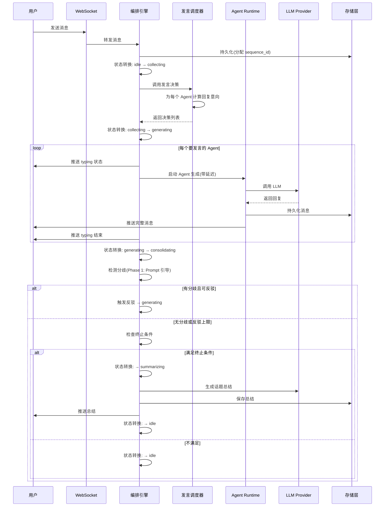

# 多Agent技术讨论群聊产品 - 技术方案文档

> 版本：v1.0 | 日期：2026-07-12 | 作者：技术架构师
> 对应 PRD：multi-agent-chat-prd-v6.md
> 本文档基于 grill-me 决策流程产出，所有关键技术决策已与产品方确认。

---

## 一、决策汇总

本章记录所有关键技术决策及其理由，作为后续开发的基准。

### 1.1 核心决策表

| # | 决策点 | 选择 | 理由 |
|---|--------|------|------|
| 1 | 部署形态 | C（单用户自部署，开源项目） | 快速 MVP，开源发布，无多租户复杂度 |
| 2 | 后端技术栈 | Python (FastAPI) → Java (Spring AI) | Python MVP 快速验证，Java 长期维护 |
| 3 | 前端技术栈 | React + TypeScript + Zustand | 生态成熟，IM 场景案例多，Zustand 轻量 |
| 4 | 存储层 | 可插拔架构，默认 PostgreSQL + pgvector | 企业级标配，Java 迁移友好，用户可选 SQLite |
| 5 | Agent Runtime | asyncio 协程，单进程 | LLM 调用是 IO 密集型，GIL 不是瓶颈 |
| 6 | LLM Provider | 统一抽象 + 成本统计 + 降级 + 可插拔 | 屏蔽 GLM/DeepSeek/Kimi/Claude 差异 |
| 7 | 实时通信 | WebSocket 双向 + asyncio.Queue 进程内总线 | 支持双向事件，非流式输出 |
| 8 | 输出方式 | 非流式 + typing 状态 + 一级引用 | 模拟钉钉交互，整条消息推送 |
| 9 | A2A 协议 | 保留语义层，传输层用 asyncio.Queue | 协议是产品语义，与传输解耦 |
| 10 | 中断机制 | 无（用户消息排队等待） | 简化 MVP，Phase 2 再加 |
| 11 | 编排引擎 | 5 状态机 + 7 策略体系 | 解决多 Agent 协调问题 |
| 12 | Agent 人设 | System Prompt + Few-shot，内置+可覆盖 | 风格稳定，开箱即用+灵活 |
| 13 | 项目结构 | 单体分层架构 | 单用户无需微服务，模块边界清晰 |
| 14 | API 设计 | REST + WebSocket，历史消息 REST+WS 增量 | 职责清晰，衔接简单 |
| 15 | 数据库 | 13 张表，自增主键，预留 tenant_id | 单用户简化，未来可扩展 |
| 16 | 反驳触发 | Phase 1 靠 Prompt 引导，Phase 2 加推断层 | MVP 简化，避免过度工程 |
| 17 | 每轮发言数 | 最多 3 个 Agent | 避免刷屏 |
| 18 | 上下文管理 | 6 层结构，11.5K token 预算 | 适配 128K 模型的 10% |
| 19 | 摘要模型 | DeepSeek | 成本最低，质量够用 |
| 20 | 静默检测 | 60s + 30s 二次确认 | 平衡体验与误触发 |
| 21 | 向量检索 | Phase 1 启用 sqlite-vss | 记忆检索是核心体验 |
| 22 | 摘要质量阈值 | 85% 实体保留率 | 平衡质量与成本 |
| 23 | 可观测性 | 三层（日志+事件+看板） | 轻量化，SQLite 同库 |
| 24 | 部署 | 单镜像，开发分离生产打包 | 一键部署最简 |
| 25 | Java 迁移 | MVP 验证后迁移，~8 周 | 避免过早投入 |

### 1.2 PRD 调整说明

基于单用户自部署的开源项目定位，对 PRD v6 做以下调整：

| PRD 原设计 | 调整后 | 原因 |
|-----------|--------|------|
| 并发群聊 1000+ | 单实例 3-5 个活跃群聊 | 单用户场景 |
| API Key 加密存储（AES-256） | 用户本地配置（.env / config.yaml） | 用户自己的 Key |
| ¥50/月成本上限提示升级 | 本地成本看板（可选） | 无 SaaS 计费 |
| 用户数据隔离、合规 | 天然隔离，单用户单实例 | 物理隔离 |
| Agent Runtime cgroups 限制 | 协程级资源管理 | 单用户无需强隔离 |
| 站内通知/Web Push | 简化，单用户场景通知价值低 | 用户就是部署者 |
| Onboarding 注册流程 | 简化为首次配置引导 | 无账号系统 |
| Redis Stream 消息总线 | asyncio.Queue 进程内总线 | 同进程无需跨进程队列 |
| 流式输出（token-by-token） | 非流式 + typing 状态 | 模拟钉钉交互 |
| 中断机制 | 无（排队等待） | 简化 MVP |
| 单一 SQLite 存储 | PostgreSQL + pgvector（默认） | Java 迁移友好，企业级标配 |

---

## 二、系统架构

### 2.1 整体架构图

```
┌─────────────────────────────────────────────────────────┐
│                      前端层（React）                       │
│  群聊UI │ Agent配置 │ 话题管理 │ 知识卡片 │ Onboarding │
│  状态管理：Zustand │ WebSocket 客户端 │ REST API 调用     │
└─────────────────────────────────────────────────────────┘
                              │
                    WebSocket + REST API
                              │
┌─────────────────────────────────────────────────────────┐
│                    接入层（FastAPI）                      │
│  REST 端点 │ WebSocket 端点 │ 中间件（CORS/日志）         │
└─────────────────────────────────────────────────────────┘
                              │
┌─────────────────────────────────────────────────────────┐
│                  编排层（核心）                           │
│  编排引擎 │ 状态机 │ 发言调度器 │ 话题管理器 │ 终止判定器  │
│  反驳控制器 │ 上下文构建器 │ 摘要生成器                    │
└─────────────────────────────────────────────────────────┘
                              │
┌─────────────────────────────────────────────────────────┐
│                  Agent Runtime 层                        │
│  Agent A (asyncio.Task) │ Agent B │ Agent C              │
│  人设加载 │ 上下文管理 │ 推断层[P1]                       │
└─────────────────────────────────────────────────────────┘
                              │
┌─────────────────────────────────────────────────────────┐
│                  LLM 抽象层                              │
│  LLMProvider 接口 │ DeepSeek │ Kimi │ Claude │ OpenAI    │
│  降级路由 │ 成本统计                                       │
└─────────────────────────────────────────────────────────┘
                              │
┌─────────────────────────────────────────────────────────┐
│              A2A 协议层 + Skill 系统 + Tool 系统           │
│  A2A 消息总线 │ Skill 注册表 │ Tool 并发控制               │
└─────────────────────────────────────────────────────────┘
                              │
┌─────────────────────────────────────────────────────────┐
│                  存储抽象层（可插拔）                      │
│  RelationalStore │ VectorStore │ MessageBus │ CacheStore │
│  PostgreSQL(默认) │ pgvector │ asyncio.Queue │ 内存缓存   │
│  SQLite(可选) │ sqlite-vss(可选) │ Redis(可选)             │
└─────────────────────────────────────────────────────────┘
```

### 2.2 核心数据流



### 2.3 模块依赖关系

```
api/ (接入层)
  ├── 依赖 orchestrator/ (编排层)
  ├── 依赖 storage/ (存储层)
  └── 依赖 models/ (数据模型)

orchestrator/ (编排层)
  ├── 依赖 agent/ (Agent Runtime)
  ├── 依赖 llm/ (LLM 抽象)
  ├── 依赖 a2a/ (A2A 协议)
  ├── 依赖 storage/ (存储层)
  └── 依赖 models/ (数据模型)

agent/ (Agent Runtime)
  ├── 依赖 llm/ (LLM 抽象)
  ├── 依赖 storage/ (存储层，向量检索)
  └── 依赖 models/ (数据模型)

llm/ (LLM 抽象)
  └── 依赖 models/ (数据模型)

storage/ (存储层)
  └── 依赖 models/ (数据模型)

skill/ (Skill 系统) [P1]
  └── 依赖 models/ (数据模型)

tool/ (Tool 系统) [P1]
  └── 依赖 models/ (数据模型)
```

**依赖原则**：
- 单向依赖，无循环
- 模块间通过接口交互，不依赖具体实现
- `models/` 是最底层，被所有模块依赖
- `storage/` 通过抽象接口被上层调用，具体实现可替换

---

## 三、技术选型

### 3.1 技术栈总览

| 层 | 技术选型 | 版本 | 说明 |
|----|---------|------|------|
| 前端框架 | React | 18+ | 生态成熟 |
| 前端语言 | TypeScript | 5+ | 类型安全 |
| 前端状态 | Zustand | 4+ | 轻量状态管理 |
| 前端构建 | Vite | 5+ | 快速构建 |
| 前端 UI | Tailwind CSS + 自定义组件 | 3+ | 原子化 CSS |
| 后端框架 | FastAPI | 0.110+ | 异步、自动文档 |
| 后端语言 | Python | 3.12+ | AI 生态 |
| 数据验证 | Pydantic | 2+ | 类型校验 |
| 数据库 | PostgreSQL | 16+ | 默认存储，支持 jsonb + pgvector |
| 向量检索 | pgvector | 0.7+ | PostgreSQL 扩展 |
| WebSocket | starlette | 内置 | FastAPI 自带 |
| HTTP 客户端 | httpx | 0.27+ | 异步 HTTP |
| 日志 | Python logging | 内置 | 结构化 JSON |
| 部署 | Docker + docker-compose | — | 一键部署 |

### 3.2 LLM Provider 选型

| Provider | 用途 | 模型 | 单价(输入/输出 ¥/1K) | 特点 |
|----------|------|------|---------------------|------|
| GLM | 全栈 Agent、发言决策 | glm-5.2 | 按官方定价 | 中文强、推理好 |
| DeepSeek | 摘要、降级 | deepseek-chat | 0.001/0.002 | 最便宜 |
| Kimi | 前端专家 Agent | moonshot-v1-8k | 0.012/0.036 | 长上下文 |
| Claude | 架构师 Agent、总结 | claude-3-5-sonnet | 0.024/0.072 | 推理强 |
| OpenAI 兼容 | 本地模型 | Ollama / vLLM | 0（本地） | 本地部署 |

### 3.3 可选技术栈（用户自选）

| 组件 | 默认 | 可选 | 触发条件 |
|------|------|------|---------|
| 关系数据库 | PostgreSQL | SQLite | 需要极简部署 |
| 向量检索 | pgvector | sqlite-vss / Chroma / Qdrant | 需要专业向量检索 |
| 消息总线 | asyncio.Queue | Redis Stream | 需要多进程 Agent |
| 缓存 | 进程内 LRU | Redis | 需要分布式缓存 |
| 文件存储 | 本地文件系统 | S3 / MinIO | 需要对象存储 |

---

## 四、项目结构

### 4.0 建模思想

项目结构融合 3 种架构思想：

**1. 分层架构（Layered Architecture）**
```
接入层（api/）→ 业务层（orchestrator/ + agent/）→ 基础设施层（storage/ + llm/）
```
上层依赖下层，下层不感知上层。

**2. 领域驱动设计的限界上下文（Bounded Context）**
每个目录 = 一个限界上下文，内高内聚，间低耦合：
- `orchestrator/` 只管"谁发言、什么时候发言"
- `agent/` 只管"Agent 怎么生成回复"
- `llm/` 只管"调用哪个模型"
- `storage/` 只管"数据怎么存"

**3. 六边形架构的端口适配器（Hexagonal Architecture）**
`storage/` 和 `llm/` 采用端口+适配器模式：
- `provider.py` = 端口（接口定义）
- `postgres/`、`sqlite/` = 适配器（具体实现）
- 核心业务逻辑不依赖具体实现，实现可替换

### 4.1 目录结构

```
dingring/
├── backend/                          # Python 后端
│   ├── app/
│   │   ├── main.py                   # FastAPI 入口
│   │   ├── config.py                 # 配置加载（YAML → Pydantic Settings）
│   │   │
│   │   ├── api/                      # 接入层
│   │   │   ├── websocket.py          # WebSocket 端点
│   │   │   ├── rest.py              # REST API（群聊CRUD、话题、Agent配置）
│   │   │   └── middleware.py         # CORS、日志
│   │   │
│   │   ├── orchestrator/             # 编排层（核心）
│   │   │   ├── engine.py             # 编排引擎主循环
│   │   │   ├── state_machine.py      # 状态机
│   │   │   ├── speaker_scheduler.py  # 发言决策器 + 顺序调度
│   │   │   ├── topic_manager.py      # 话题管理（切换/恢复/隔离）
│   │   │   ├── terminator.py         # 终止判定器
│   │   │   ├── rebuttal_controller.py # 反驳控制器（防死循环）
│   │   │   ├── context_builder.py    # 上下文构建器
│   │   │   ├── summarizer.py         # 摘要生成器（话题总结+上下文压缩+记忆写入）
│   │   │   └── a2a/                  # A2A 协议（编排引擎子模块）
│   │   │       ├── protocol.py       # 消息类型定义（broadcast/whisper/...）
│   │   │       └── bus.py            # 进程内消息总线（asyncio.Queue）
│   │   │
│   │   ├── agent/                    # Agent Runtime 层
│   │   │   ├── runtime.py            # Agent 生命周期（asyncio.Task 管理）
│   │   │   ├── persona.py            # 人设加载 + Prompt 模板组装
│   │   │   └── inference.py          # 推断层（stance/confidence 推断）[P1]
│   │   │
│   │   ├── llm/                      # LLM 抽象层
│   │   │   ├── provider.py           # LLMProvider 抽象接口
│   │   │   ├── glm.py                # GLM 实现
│   │   │   ├── deepseek.py           # DeepSeek 实现
│   │   │   ├── kimi.py               # Kimi 实现
│   │   │   ├── claude.py             # Claude 实现
│   │   │   ├── openai_compat.py      # OpenAI 兼容（Ollama / vLLM）
│   │   │   ├── router.py             # 降级路由（A→B→C）
│   │   │   └── cost_tracker.py       # Token 计费统计
│   │   │
│   │   ├── skill/                    # Skill 系统 [P1]
│   │   │   ├── registry.py           # Skill 注册表
│   │   │   ├── loader.py             # Skill 加载
│   │   │   └── skills/               # 内置 Skill 实现
│   │   │       ├── grill_me.py
│   │   │       ├── time_boxed.py
│   │   │       └── devil_advocate.py
│   │   │
│   │   ├── tool/                     # Tool 系统 [P1]
│   │   │   ├── base.py               # Tool 抽象接口
│   │   │   ├── web_search.py
│   │   │   ├── code_runner.py        # 子进程隔离执行
│   │   │   └── concurrency.py        # 并发控制器（按 max_concurrent 限流）
│   │   │
│   │   ├── storage/                  # 存储抽象层
│   │   │   ├── provider.py           # StorageProvider 接口
│   │   │   ├── postgres/             # 默认实现
│   │   │   │   ├── relational.py     # 元数据
│   │   │   │   ├── vector.py         # 向量检索（pgvector）
│   │   │   │   ├── message.py        # 消息持久化
│   │   │   │   ├── memory.py         # 记忆持久化
│   │   │   │   └── migration.py      # Schema 迁移（Alembic）
│   │   │   └── sqlite/               # 可选实现（极简部署）
│   │   │
│   │   ├── memory/                   # 记忆系统
│   │   │   ├── service.py            # 记忆服务（四层作用域）
│   │   │   └── retriever.py          # 向量检索 + 时间衰减
│   │   │
│   │   ├── observability/            # 可观测性
│   │   │   ├── logger.py             # 结构化日志
│   │   │   ├── cost_monitor.py       # 成本监控
│   │   │   └── degradation.py        # 优雅降级
│   │   │
│   │   └── models/                   # 数据模型（Pydantic）
│   │       ├── chat.py               # Chat/Group + Topic
│   │       ├── message.py            # Message（含 A2A 字段）
│   │       ├── agent.py              # Agent + Persona
│   │       ├── tool.py               # Tool
│   │       ├── skill.py              # Skill
│   │       └── memory.py             # Memory
│   │
│   ├── config/                       # 配置文件
│   │   ├── default.yaml              # 默认配置
│   │   ├── agents/                   # Agent 人设配置
│   │   │   ├── kimi.yaml
│   │   │   ├── deepseek.yaml
│   │   │   └── claude.yaml
│   │   └── skills/                   # Skill 配置
│   │
│   ├── migrations/                   # 数据库迁移脚本
│   ├── tests/                        # 测试
│   ├── Dockerfile
│   └── pyproject.toml
│
├── frontend/                         # React 前端
│   ├── src/
│   │   ├── components/
│   │   │   ├── Chat/                 # 群聊界面
│   │   │   │   ├── MessageList.tsx   # 消息列表（按sequence_id排序）
│   │   │   │   ├── MessageItem.tsx   # 单条消息（含引用块、A2A标记）
│   │   │   │   ├── InputBar.tsx      # 输入框（@、引用、命令）
│   │   │   │   └── TopicDivider.tsx  # 话题分隔线
│   │   │   ├── Agent/                # Agent 相关
│   │   │   │   ├── PersonaCard.tsx   # 人设卡片
│   │   │   │   └── TypingIndicator.tsx
│   │   │   ├── Topic/                # 话题相关
│   │   │   │   ├── SummaryCard.tsx   # 话题总结卡片
│   │   │   │   └── TopicList.tsx
│   │   │   ├── Onboarding/           # 引导流程
│   │   │   └── Dashboard/            # 统计看板
│   │   ├── hooks/                    # WebSocket hooks
│   │   ├── store/                    # 状态管理（Zustand）
│   │   └── api/                      # HTTP API 调用
│   ├── Dockerfile
│   └── package.json
│
├── docker-compose.yml                # 一键部署
└── README.md
```

---

## 五、数据库设计

### 5.1 ER 关系图

```
┌─────────────┐     ┌─────────────┐     ┌──────────────┐
│   chats     │◄───►│ chat_agents │◄───►│   agents     │
│  (群聊)      │     │ (群成员关系) │     │  (Agent配置) │
└──────┬──────┘     └─────────────┘     └──────────────┘
       │ 1:N
       ▼
┌─────────────┐
│   topics    │
│  (话题)      │
└──────┬──────┘
       │ 1:N
       ▼
┌─────────────┐◄──self──► (reply_to 自引用)
│  messages   │
│  (消息)      │
└─────────────┘

┌─────────────┐     ┌─────────────┐
│   skills    │◄───►│ chat_skills │
└─────────────┘     └─────────────┘
┌─────────────┐     ┌─────────────┐
│   tools     │◄───►│ chat_tools  │
└─────────────┘     └─────────────┘
┌─────────────┐
│  memories   │ (四层作用域: global/agent/chat/topic)
│  (记忆)      │
└─────────────┘
┌─────────────┐
│cost_records │
└─────────────┘
┌─────────────┐
│   config    │
└─────────────┘
┌─────────────┐
│   logs      │
└─────────────┘
```

### 5.2 完整表结构

#### 5.2.1 chats（群聊）

**用途**：记录持久群聊的元信息和配置

| 字段 | 类型 | 约束 | 含义 | 取值/说明 |
|------|------|------|------|-----------|
| `id` | INTEGER | PK, AUTOINCREMENT | 群聊唯一标识 | 自增主键 |
| `tenant_id` | TEXT | NOT NULL DEFAULT 'default' | 租户ID（预留） | Phase 1 固定 `'default'` |
| `chat_type` | TEXT | NOT NULL DEFAULT 'group' | 聊天类型 | `group`（群聊）/ `private`（Agent间私聊） |
| `name` | TEXT | NOT NULL DEFAULT '技术讨论群' | 群聊名称 | 最长 50 字符 |
| `owner_id` | TEXT | NOT NULL DEFAULT 'default' | 群主标识 | 单用户固定 `'default'` |
| `status` | TEXT | NOT NULL DEFAULT 'active' | 群聊状态 | `active` / `archived` |
| `max_rounds_per_topic` | INTEGER | NOT NULL DEFAULT 10 | 每话题最大轮次 | 范围 1-50 |
| `cost_budget_yuan` | REAL | NOT NULL DEFAULT 5.0 | 单话题成本上限（元） | 超过强制总结 |
| `topic_count` | INTEGER | NOT NULL DEFAULT 0 | 群聊累计话题数 | 冗余字段 |
| `active_topic_id` | INTEGER | NULL | 当前活跃话题ID | FK → topics.id |
| `onboarding_completed` | BOOLEAN | NOT NULL DEFAULT FALSE | 是否完成引导 | — |
| `created_at` | TEXT | NOT NULL DEFAULT now | 创建时间 | ISO8601 |
| `updated_at` | TEXT | NOT NULL DEFAULT now | 更新时间 | ISO8601 |
| `last_active_at` | TEXT | NOT NULL DEFAULT now | 最近活跃时间 | 用于 30 天自动归档 |
| `archived_at` | TEXT | NULL | 归档时间 | — |

**索引**：无额外索引（单用户数据量小）

#### 5.2.2 topics（话题）

**用途**：群聊下的子实体，一个群聊可有多个话题

| 字段 | 类型 | 约束 | 含义 | 取值/说明 |
|------|------|------|------|-----------|
| `id` | INTEGER | PK, AUTOINCREMENT | 话题唯一标识 | 自增主键 |
| `chat_id` | INTEGER | NOT NULL, FK → chats.id | 所属群聊 | 级联删除 |
| `title` | TEXT | NOT NULL | 话题标题 | LLM 生成或用户命名 |
| `title_source` | TEXT | NOT NULL DEFAULT 'auto' | 标题来源 | `auto`（LLM生成）/ `user`（用户命名）/ `reused`（复用历史） |
| `status` | TEXT | NOT NULL DEFAULT 'created' | 生命周期状态 | `created`/`active`/`paused`/`summarized`/`archived` |
| `message_count` | INTEGER | NOT NULL DEFAULT 0 | 消息数 | 冗余字段 |
| `round_count` | INTEGER | NOT NULL DEFAULT 0 | 讨论轮次 | 用户发+Agents回 = 1轮 |
| `summary_id` | INTEGER | NULL, FK → summaries.id | 关联总结ID | 最终总结 |
| `related_topic_ids` | TEXT | NULL | 关联历史话题 | JSON 数组：`[123, 456]` |
| `created_at` | TEXT | NOT NULL DEFAULT now | 创建时间 | — |
| `updated_at` | TEXT | NOT NULL DEFAULT now | 更新时间 | — |
| `summarized_at` | TEXT | NULL | 总结生成时间 | — |
| `archived_at` | TEXT | NULL | 归档时间 | — |

**索引**：
- `idx_topics_chat_id` ON (chat_id)
- `idx_topics_status` ON (status)

**状态流转**：
```
created → active → paused → summarized → archived
                ↑         ↓
                └─ /back ─┘
```

#### 5.2.3 messages（消息）

**用途**：所有聊天消息统一存储

| 字段 | 类型 | 约束 | 含义 | 取值/说明 |
|------|------|------|------|-----------|
| `id` | INTEGER | PK, AUTOINCREMENT | 消息唯一标识 | 自增主键 |
| `chat_id` | INTEGER | NOT NULL, FK → chats.id | 所属聊天 | 群聊或私聊会话 |
| `topic_id` | INTEGER | NOT NULL, FK → topics.id | 所属话题 | — |
| `sequence_id` | INTEGER | NOT NULL | 消息序号 | 同一 chat_id 内单调递增 |
| `sender_id` | TEXT | NOT NULL | 发送者标识 | `user_001` / `agent_kimi` / `system` |
| `sender_type` | TEXT | NOT NULL | 发送者类型 | `user` / `agent` / `system` |
| `content` | TEXT | NOT NULL | 消息内容 | 最长 10000 字符 |
| `message_type` | TEXT | NOT NULL DEFAULT 'text' | 消息类型 | `text`/`code`/`image`/`tool_call`/`tool_result`/`topic_divider` |
| `reply_to` | INTEGER | NULL, FK → messages.id | 引用消息ID | 支持一级引用 |
| `reply_sender` | TEXT | NULL | 被引用消息发送者 | 冗余字段，避免 JOIN |
| `reply_snippet` | TEXT | NULL | 被引用消息片段 | 冗余字段，前 100 字 |
| `mentions` | TEXT | NULL | @提及列表 | JSON 数组：`["agent_kimi"]` |
| `a2a_type` | TEXT | NULL | A2A 协议类型 | `broadcast`/`whisper`/`request`/`challenge`/`align`/`yield` |
| `a2a_to` | TEXT | NULL | A2A 目标 | broadcast 时为 NULL |
| `is_private` | BOOLEAN | NOT NULL DEFAULT FALSE | 是否私聊 | — |
| `private_to` | TEXT | NULL | 私聊接收方 | JSON 数组 |
| `metadata` | TEXT | NULL | 元数据 | JSON：considered/missed messages |
| `send_time` | TEXT | NOT NULL DEFAULT now | 发送时间 | ISO8601 |

**索引**：
- `idx_messages_seq` UNIQUE ON (chat_id, sequence_id) — 核心有序性保证
- `idx_messages_topic` ON (topic_id)
- `idx_messages_sender` ON (sender_id)

#### 5.2.4 agents（Agent 配置）

**用途**：存储所有可用 Agent 的人设和配置

| 字段 | 类型 | 约束 | 含义 | 取值/说明 |
|------|------|------|------|-----------|
| `id` | TEXT | PK | Agent标识 | 如 `agent_kimi` |
| `name` | TEXT | NOT NULL | 展示名 | 如 `Kimi` |
| `avatar` | TEXT | NULL | 头像URL | — |
| `title` | TEXT | NOT NULL | 职位 | 如 `前端专家` |
| `experience` | TEXT | NOT NULL | 经验描述 | 如 `3年前端开发经验` |
| `expertise` | TEXT | NOT NULL | 专长列表 | JSON 数组 |
| `personality` | TEXT | NOT NULL | 性格描述 | — |
| `max_length` | INTEGER | NOT NULL DEFAULT 200 | 回复最大字数 | 200-500 |
| `llm_provider` | TEXT | NOT NULL | 主用LLM | `kimi`/`deepseek`/`claude`/`openai_compat` |
| `fallback_provider` | TEXT | NULL | 降级Provider | 逗号分隔 |
| `delay_profile` | TEXT | NOT NULL DEFAULT 'normal' | 延迟风格 | `quick`/`normal`/`thoughtful` |
| `few_shots` | TEXT | NULL | Few-shot 示例 | JSON 数组 |
| `is_builtin` | BOOLEAN | NOT NULL DEFAULT FALSE | 是否内置 | — |
| `status` | TEXT | NOT NULL DEFAULT 'offline' | 运行时状态 | `online`/`offline`/`busy`/`degraded` |
| `created_at` | TEXT | NOT NULL DEFAULT now | 创建时间 | — |
| `updated_at` | TEXT | NOT NULL DEFAULT now | 更新时间 | — |

#### 5.2.5 chat_agents（群聊-Agent 关联）

| 字段 | 类型 | 约束 | 含义 |
|------|------|------|------|
| `chat_id` | INTEGER | NOT NULL, FK → chats.id | 群聊ID |
| `agent_id` | TEXT | NOT NULL, FK → agents.id | AgentID |
| `joined_at` | TEXT | NOT NULL DEFAULT now | 加入时间 |
| `left_at` | TEXT | NULL | 离开时间 |
| `is_active` | BOOLEAN | NOT NULL DEFAULT TRUE | 是否在群 |

**主键**：(chat_id, agent_id)

#### 5.2.6 summaries（话题总结）

**用途**：话题总结，支持 1:N（多次总结）

| 字段 | 类型 | 约束 | 含义 | 取值/说明 |
|------|------|------|------|-----------|
| `id` | INTEGER | PK, AUTOINCREMENT | 总结唯一标识 | — |
| `topic_id` | INTEGER | NOT NULL, FK → topics.id | 关联话题 | — |
| `summary_type` | TEXT | NOT NULL DEFAULT 'final' | 总结类型 | `interim`（阶段性）/ `final`（最终）/ `user_requested`（用户主动） |
| `conclusions` | TEXT | NOT NULL | 核心结论 | Markdown |
| `disagreements` | TEXT | NULL | 关键分歧 | Markdown |
| `assumptions` | TEXT | NULL | 待验证假设 | — |
| `action_items` | TEXT | NULL | 行动建议 | Markdown |
| `agent_stances` | TEXT | NULL | Agent立场 | JSON |
| `token_cost` | REAL | NULL | 话题总成本（元） | — |
| `created_at` | TEXT | NOT NULL DEFAULT now | 生成时间 | — |

**索引**：`idx_summaries_topic` ON (topic_id)

#### 5.2.7 skills（Skill 定义）

| 字段 | 类型 | 约束 | 含义 |
|------|------|------|------|
| `id` | TEXT | PK | Skill标识 |
| `name` | TEXT | NOT NULL | 展示名 |
| `description` | TEXT | NOT NULL | 描述 |
| `type` | TEXT | NOT NULL | 类别 |
| `layer` | TEXT | NOT NULL | 生效层级 |
| `prompt_template` | TEXT | NULL | Prompt 模板 |
| `config_schema` | TEXT | NULL | 配置项 Schema |
| `conflicts_with` | TEXT | NULL | 冲突列表 |
| `is_builtin` | BOOLEAN | NOT NULL DEFAULT FALSE | 是否内置 |

#### 5.2.8 chat_skills（群聊级 Skill 启用配置）

| 字段 | 类型 | 约束 | 含义 |
|------|------|------|------|
| `chat_id` | INTEGER | NOT NULL, FK | 群聊ID |
| `skill_id` | TEXT | NOT NULL, FK | SkillID |
| `enabled` | BOOLEAN | NOT NULL DEFAULT TRUE | 是否启用 |
| `config` | TEXT | NULL | 用户配置 |

**主键**：(chat_id, skill_id)

#### 5.2.9 tools（Tool 定义）[P1]

| 字段 | 类型 | 约束 | 含义 |
|------|------|------|------|
| `id` | TEXT | PK | Tool标识 |
| `name` | TEXT | NOT NULL | 展示名 |
| `description` | TEXT | NOT NULL | 描述 |
| `parameters_schema` | TEXT | NOT NULL | 参数 Schema |
| `max_concurrent` | INTEGER | NOT NULL DEFAULT 1 | 最大并发 |
| `cooldown_seconds` | INTEGER | NOT NULL DEFAULT 0 | 冷却时间 |
| `fallback_tool_id` | TEXT | NULL | 降级Tool |

#### 5.2.10 chat_tools（群聊级 Tool 启用配置）[P1]

| 字段 | 类型 | 约束 | 含义 |
|------|------|------|------|
| `chat_id` | INTEGER | NOT NULL, FK | 群聊ID |
| `tool_id` | TEXT | NOT NULL, FK | ToolID |
| `enabled` | BOOLEAN | NOT NULL DEFAULT TRUE | 是否启用 |

**主键**：(chat_id, tool_id)

#### 5.2.11 memories（记忆 - 四层作用域）

**用途**：全局化记忆系统，支持 global/agent/chat/topic 四层

| 字段 | 类型 | 约束 | 含义 | 取值/说明 |
|------|------|------|------|-----------|
| `id` | INTEGER | PK, AUTOINCREMENT | 记忆唯一标识 | — |
| `scope` | TEXT | NOT NULL | 作用域 | `global`/`agent`/`chat`/`topic` |
| `scope_id` | TEXT | NULL | 作用域ID | global/agent 时为 NULL；chat 时为 chat_id；topic 时为 topic_id |
| `owner_type` | TEXT | NOT NULL | 归属类型 | `system`/`agent`/`chat`/`topic` |
| `owner_id` | TEXT | NULL | 归属ID | agent 时为 agent_id |
| `memory_type` | TEXT | NOT NULL | 记忆类型 | `group_summary`/`agent_personal`/`topic_summary`/`topic_conclusion`/`topic_decisions` |
| `content` | TEXT | NOT NULL | 记忆内容 | Markdown |
| `tags` | TEXT | NULL | 标签 | JSON 数组 |
| `relevance_score` | REAL | NULL | 相关度 | 0.0-1.0 |
| `created_at` | TEXT | NOT NULL DEFAULT now | 创建时间 | — |
| `updated_at` | TEXT | NOT NULL DEFAULT now | 更新时间 | — |

**索引**：
- `idx_memories_scope` ON (scope, scope_id)
- `idx_memories_owner` ON (owner_type, owner_id)

**作用域模型**：
```
global（全局记忆）— 所有 Agent 共享
├── scope_id = NULL
├── 用户偏好、技术栈、常见问题
└── owner_id = NULL

agent（Agent 个人记忆）— 跨群聊
├── scope_id = NULL
├── owner_id = agent_kimi
└── Kimi 记得"用户上次在技术讨论群聊过 WebSocket"

chat（群聊级记忆）
├── scope_id = chat_id
└── 群聊内的公共记忆

topic（话题级记忆）
├── scope_id = topic_id
└── 特定话题的总结和结论
```

#### 5.2.12 cost_records（成本记录）

| 字段 | 类型 | 约束 | 含义 |
|------|------|------|------|
| `id` | INTEGER | PK, AUTOINCREMENT | 记录标识 |
| `chat_id` | INTEGER | NOT NULL, FK | 群聊ID |
| `topic_id` | INTEGER | NULL, FK | 话题ID |
| `agent_id` | TEXT | NULL | AgentID |
| `llm_provider` | TEXT | NOT NULL | LLM Provider |
| `input_tokens` | INTEGER | NOT NULL | 输入 token |
| `output_tokens` | INTEGER | NOT NULL | 输出 token |
| `cost_yuan` | REAL | NOT NULL | 成本（元） |
| `created_at` | TEXT | NOT NULL DEFAULT now | 记录时间 |

**索引**：
- `idx_cost_chat` ON (chat_id)
- `idx_cost_time` ON (created_at)

#### 5.2.13 config（全局配置 KV 表）

| 字段 | 类型 | 约束 | 含义 |
|------|------|------|------|
| `key` | TEXT | PK | 配置键 |
| `value` | TEXT | NOT NULL | 配置值（JSON） |
| `created_at` | TEXT | NOT NULL DEFAULT now | 创建时间 |
| `updated_at` | TEXT | NOT NULL DEFAULT now | 更新时间 |

**设计说明**：
- 静态配置（LLM Key、存储偏好）→ YAML 文件，启动时加载
- 动态配置（用户偏好、Skill 开关）→ config 表，运行时可改
- 改动后重启生效（Phase 1），Phase 2 可加 `POST /config/refresh` 热更新接口
- **不使用 Nacos**：单用户自部署场景下 Nacos 过重（独立 Java 服务 + 数据库），开源用户试用门槛高。Java 迁移后若需分布式配置再评估

#### 5.2.14 logs（结构化日志）

| 字段 | 类型 | 约束 | 含义 |
|------|------|------|------|
| `id` | INTEGER | PK, AUTOINCREMENT | 日志标识 |
| `timestamp` | TEXT | NOT NULL | 时间戳 |
| `level` | TEXT | NOT NULL | 级别 |
| `event` | TEXT | NOT NULL | 事件类型 |
| `chat_id` | INTEGER | NULL | 关联群聊 |
| `topic_id` | INTEGER | NULL | 关联话题 |
| `agent_id` | TEXT | NULL | 关联 Agent |
| `duration_ms` | INTEGER | NULL | 耗时 |
| `extra` | TEXT | NULL | 额外字段（JSON） |
| `message` | TEXT | NULL | 人类可读消息 |

**索引**：
- `idx_logs_time` ON (timestamp)
- `idx_logs_event` ON (event)
- `idx_logs_level` ON (level)

**自动清理策略**：
- INFO/WARN 日志保留 7 天
- ERROR 日志保留 30 天

#### 5.2.15 topic_vectors（话题向量表 - pgvector）

```sql
-- 启用 pgvector 扩展
CREATE EXTENSION IF NOT EXISTS vector;

CREATE TABLE topic_vectors (
    id          SERIAL PRIMARY KEY,
    topic_id    INTEGER NOT NULL REFERENCES topics(id) ON DELETE CASCADE,
    embedding   vector(1536) NOT NULL,    -- pgvector 类型
    created_at  TIMESTAMPTZ NOT NULL DEFAULT NOW()
);

-- ivfflat 索引，加速向量检索
CREATE INDEX idx_topic_vectors_embedding ON topic_vectors 
    USING ivfflat (embedding vector_cosine_ops) WITH (lists = 100);
CREATE INDEX idx_topic_vectors_topic ON topic_vectors(topic_id);
```

**用途**：话题相似度检索，支持"话题重复聊起"的记忆关联

#### 5.2.16 memory_vectors（记忆向量表 - pgvector）

```sql
CREATE TABLE memory_vectors (
    id          SERIAL PRIMARY KEY,
    memory_id   INTEGER NOT NULL REFERENCES memories(id) ON DELETE CASCADE,
    embedding   vector(1536) NOT NULL,
    created_at  TIMESTAMPTZ NOT NULL DEFAULT NOW()
);

CREATE INDEX idx_memory_vectors_embedding ON memory_vectors 
    USING ivfflat (embedding vector_cosine_ops) WITH (lists = 100);
CREATE INDEX idx_memory_vectors_memory ON memory_vectors(memory_id);
```

**用途**：记忆向量检索，支持 Agent 回忆相关历史

### 5.3 级联删除策略

| 操作 | 级联影响 |
|------|---------|
| 删除 chat | 级联删除 topics、messages、chat_agents、chat_skills、chat_tools、memories、cost_records |
| 删除 topic | 级联删除 messages、summaries、memories（topic 级） |
| 删除 agent | 仅标记 `is_active=FALSE`，保留历史消息 |

### 5.4 sequence_id 生成方案

```python
async def next_sequence_id(chat_id: int) -> int:
    """原子获取下一个 sequence_id（PostgreSQL）"""
    # 方案 1：用 MAX + 事务（简单，单用户场景足够）
    async with db.transaction():
        row = await db.fetch_one(
            "SELECT MAX(sequence_id) as max_seq FROM messages WHERE chat_id = $1",
            chat_id
        )
        return (row.max_seq or 0) + 1
    
    # 方案 2（可选，高并发场景）：用 PostgreSQL Sequence
    # CREATE SEQUENCE message_seq_{chat_id};
    # SELECT nextval('message_seq_{chat_id}');
```

PostgreSQL 事务隔离级别 READ COMMITTED 下，事务内 MAX+1 是安全的。

---

## 六、API 设计

### 6.1 REST API

```
/api/v1/
├── chats/                           # 群聊 CRUD
│   ├── POST   /                     # 创建群聊
│   ├── GET    /                     # 列出我的群聊
│   ├── GET    /{chat_id}            # 群聊详情
│   ├── PATCH  /{chat_id}            # 更新群聊
│   ├── DELETE /{chat_id}            # 归档群聊
│   │
│   ├── GET    /{chat_id}/topics/    # 话题列表
│   ├── POST   /{chat_id}/topics/    # 创建话题（/new）
│   ├── GET    /{chat_id}/topics/{topic_id}/  # 话题详情+总结
│   │
│   ├── GET    /{chat_id}/messages/  # 历史消息（分页）
│   │
│   └── GET    /{chat_id}/agents/    # 群聊内Agent列表
│
├── agents/                          # Agent 配置
│   ├── GET    /                     # 可用Agent列表
│   ├── GET    /{agent_id}           # Agent人设详情
│   └── POST   /                     # 自定义Agent
│
├── skills/                          # Skill 管理 [P1]
│   ├── GET    /                     # 可用Skill列表
│   └── POST   /{skill_id}/toggle    # 启用/禁用
│
├── config/                          # 用户配置
│   ├── GET    /                     # 获取配置
│   └── PUT    /                     # 更新配置
│
└── stats/                           # 统计看板
    └── GET    /                     # Token消耗、成本、讨论数
```

### 6.2 WebSocket 协议

**连接**：`ws://localhost:8000/ws/{chat_id}`

**通用信封格式**：

```typescript
interface WsMessage {
  type: WsEventType;       // 事件类型
  payload: any;            // 具体数据
  timestamp: number;       // 时间戳
  seq: number;             // 服务端推送的sequence_id（仅下行）
}
```

**上行事件（前端 → 后端）**：

| type | payload | 说明 |
|------|---------|------|
| `user_message` | `{content, reply_to?, mentions?}` | 用户发消息 |
| `command` | `{cmd: "summary"|"new"|"back"|"end", args?}` | 斜杠命令 |
| `skill_toggle` | `{skill_id, enabled, config?}` | Skill 开关 [P1] |

**下行事件（后端 → 前端）**：

| type | payload | 说明 |
|------|---------|------|
| `agent_message` | `{message: Message}` | Agent 完整回复 |
| `system_message` | `{content, sub_type}` | 系统消息 |
| `typing` | `{agent_id, is_typing}` | Agent 正在输入 |
| `topic_change` | `{topic_id, status, title}` | 话题状态变更 |
| `summary` | `{topic_id, summary: Summary}` | 话题总结生成 |
| `agent_status` | `{agent_id, status}` | Agent 状态变更 |
| `error` | `{code, message}` | 错误通知 |

### 6.3 历史消息加载策略

**方案：REST 初始加载 + WebSocket 增量**

1. 进入群聊时，REST 请求 `GET /chats/{chat_id}/messages?limit=50`
2. 返回最近 50 条消息 + 最大 `sequence_id`
3. WebSocket 连接时发送 `last_seq={最大sequence_id}`
4. 后端推送 `sequence_id > last_seq` 的增量消息
5. 衔接间隙有消息丢失，前端用 REST 补拉

---

## 七、编排引擎设计

### 7.1 状态机定义

```
idle ──► collecting ──► generating ──► consolidating ──► summarizing ──► idle
                                  │                         │
                                  └──► (无分歧) ────────────┘
                                       直接 summarizing
```

| 状态 | 职责 | 进入条件 | 退出条件 | 超时处理 |
|------|------|---------|---------|---------|
| **idle** | 等待用户输入 | 系统启动 / 话题总结完成 | 收到用户消息 → collecting | 无 |
| **collecting** | 发言决策 | 从 idle 收到消息 | 决策完成 → generating | 5s → 直接 generating |
| **generating** | Agent 并发生成 | collecting 完成 | 所有 Agent 完成/失败 | 30s/Agent → 跳过 |
| **consolidating** | 整合回复，检测分歧 | 所有 Agent 完成 | 无分歧 → summarizing；有分歧 → 触发反驳 → generating | 10s → summarizing |
| **summarizing** | 生成话题总结 | consolidating 完成 / 用户 `/summary` / 终止触发 | 总结完成 → idle | 20s → 模板兜底 |

### 7.2 事件抢占规则（无中断版）

| 当前状态 \ 收到事件 | 用户发消息 | Agent 完成 | Agent 超时 | `/summary` | `/new` |
|---|---|---|---|---|---|
| **idle** | → collecting | 忽略 | N/A | N/A | 创建新话题 |
| **collecting** | 排队合并 | 忽略 | N/A | → summarizing | 先 summarizing |
| **generating** | **排队等待** | 检查是否全部完成 | 跳过该 Agent | 等当前完 → summarizing | 等当前完 → summarizing → 新话题 |
| **consolidating** | 排队 | 检查分歧 | N/A | → summarizing | → summarizing → 新话题 |
| **summarizing** | 排队（下一轮首条） | 忽略 | N/A | 忽略 | 忽略 |

### 7.3 编排引擎 7 策略

#### 策略 1：发言决策

| 意向等级 | 触发条件 | 延迟 |
|---------|---------|------|
| **必须回复** | 被 @；用户直接提问其专长；被其他 Agent 质疑 | 立即（0-2s） |
| **建议回复** | 话题涉及其专长；前一条消息与其观点相关 | 2-5s |
| **可选回复** | 补充信息；提供不同视角 | 5-15s |
| **不回复** | 话题无关；其他 Agent 已充分回答 | — |

**每轮最多 3 个 Agent 发言**（按优先级取前 N）。

#### 策略 2：顺序调度

| 优先级规则 | 说明 |
|-----------|------|
| 1. 被 @ 的 Agent 优先 | 用户指定谁先说 |
| 2. 被质疑的 Agent 优先 | 必须给被质疑方辩护权 |
| 3. 专长匹配度高的优先 | 更相关的先说 |
| 4. 随机扰动 | 避免每次顺序一样 |

#### 策略 3：延迟模拟

```
delay = base_delay + thinking_delay + random_jitter
```

| Agent 人设 | base | thinking | jitter | 效果 |
|-----------|------|----------|--------|------|
| 热情实习生 | 1s | 2-5s | 0-3s | 秒回型 |
| 资深工程师 | 1s | 5-10s | 0-8s | 正常型 |
| 架构师 | 2s | 10-20s | 0-15s | 深思型 |

配套"正在输入"状态：延迟期间前端显示"Kimi 正在输入..."。

#### 策略 4：反驳触发（Phase 1 简化版）

**Phase 1 方案**：通过 Prompt 引导 Agent 自主反驳，不依赖推断层。

**Prompt 引导**：
```
【行为规则】
- 如果同事的观点你有不同意见，请直接指出并说明理由
- 被质疑时，先确认对方理解是否正确，再反驳
```

**防死循环机制**：
- 同一对 Agent 间反驳不超过 3 次
- 单话题总反驳不超过 5 次
- 超过上限 → 系统提示"两位观点已充分表达，是否需要总结？"

**Phase 2 升级**：加入推断层（stance/confidence 分类），精准控制反驳。

#### 策略 5：终止判定

| 触发条件 | 阈值 | Phase 1 |
|---------|------|---------|
| 轮次上限 | 默认 10 轮 | ✅ |
| 静默检测 | 60s + 30s 二次确认 | ✅ |
| 用户 `/summary` | 立即触发 | ✅ |
| 用户 `/new` | 触发旧话题总结 | ✅ |
| 成本上限 | 单话题 ¥5 | ✅ |
| 共识达成 | 所有 Agent stance=agree | ❌ Phase 2 |

**静默检测流程**：
```
60s 无新消息
    │
    ▼
系统提示"讨论似乎冷场了，要继续还是总结？"
    │
    ├── 用户回复 → 继续讨论
    └── 30s 仍无消息 → 触发总结
```

#### 策略 6：上下文管理

见第八章详细设计。

#### 策略 7：话题流转

| 场景 | 策略 |
|------|------|
| 用户发 `/new` | 当前话题 → summarized，创建新话题 |
| 自动检测话题切换 [P2] | 关键词变化 + 间隔 > 2min → 提示切换 |
| 用户发 `/back` | 恢复 paused 话题，加载其上下文 |
| 话题上下文隔离 | active 话题全文进上下文；paused 只进摘要；archived 不进 |

### 7.4 核心代码结构

```python
# orchestrator/engine.py

class OrchestratorEngine:
    """编排引擎主循环，每个群聊一个实例"""
    
    def __init__(self, chat_id: int, storage: StorageProvider, 
                 llm_router: LLMRouter, memory_service: MemoryService):
        self.chat_id = chat_id
        self.storage = storage
        self.llm_router = llm_router
        self.memory_service = memory_service
        self.context = StateContext(chat_id=chat_id)
        self.agent_runtimes: dict[str, AgentRuntime] = {}
        self.speaker_scheduler = SpeakerScheduler()
        self.terminator = Terminator()
        self.rebuttal_controller = RebuttalController()
        self.context_builder = ContextBuilder(storage, memory_service)
        self.summarizer = Summarizer(llm_router, storage)
    
    async def handle_user_message(self, message: Message):
        """处理用户消息（WebSocket 入口）"""
        # 根据 current_state 决定处理方式
        if self.context.current_state == State.IDLE:
            await self._persist_message(message)
            await self._transition_to_collecting(message)
        elif self.context.current_state in (State.COLLECTING, State.GENERATING, 
                                             State.CONSOLIDATING, State.SUMMARIZING):
            self.context.pending_user_messages.append(message.content)
    
    async def _transition_to_collecting(self, trigger_message: Message):
        """进入 collecting：发言决策"""
        self.context.current_state = State.COLLECTING
        
        # 合并排队的消息
        if self.context.pending_user_messages:
            trigger_message.content += "\n" + "\n".join(self.context.pending_user_messages)
            self.context.pending_user_messages.clear()
        
        # 发言决策
        decisions = await self.speaker_scheduler.decide(
            agents=self.agent_runtimes,
            message=trigger_message,
            context=self.context
        )
        
        # 过滤 + 排序 + 限制最多 3 个
        speaking = [d for d in decisions if d.intent != SpeakingIntent.SKIP]
        speaking.sort(key=lambda d: d.priority)
        speaking = speaking[:3]  # 每轮最多 3 个
        
        if not speaking:
            await self._send_system_message("大家似乎都没什么要说的，要换个话题还是总结？")
            self.context.current_state = State.IDLE
            return
        
        self.context.speaking_agents = speaking
        self.context.completed_agents = []
        self.context.failed_agents = []
        
        await self._transition_to_generating()
    
    async def _transition_to_generating(self):
        """进入 generating：Agent 并发生成"""
        self.context.current_state = State.GENERATING
        
        # 按延迟策略错开启动
        tasks = []
        for decision in self.context.speaking_agents:
            delay = self.speaker_scheduler.calculate_delay(decision)
            tasks.append(self._generate_with_delay(decision, delay))
        
        # 并发执行（不中断，等全部完成）
        await asyncio.gather(*tasks, return_exceptions=True)
        
        await self._transition_to_consolidating()
    
    async def _generate_with_delay(self, decision: SpeakingDecision, delay: float):
        """延迟后启动单个 Agent 生成"""
        await asyncio.sleep(delay)
        await self._broadcast_ws({"type": "typing", "agent_id": decision.agent.id, "is_typing": True})
        
        try:
            # 构建上下文
            messages = await self.context_builder.build(
                agent=decision.agent,
                trigger_message=decision.trigger_message,
                context=self.context
            )
            
            # Agent 生成回复（带 30s 超时）
            content = await asyncio.wait_for(
                self.llm_router.generate(decision.agent, messages),
                timeout=30
            )
            
            # 构建消息并持久化
            message = Message(
                chat_id=self.chat_id,
                topic_id=self.context.topic_id,
                sequence_id=await self._next_sequence_id(),
                sender_id=decision.agent.id,
                sender_type="agent",
                content=content,
                a2a_type="broadcast"
            )
            await self.storage.save_message(message)
            
            # 推送给前端
            await self._broadcast_ws({"type": "agent_message", "message": message})
            self.context.completed_agents.append(decision.agent.id)
            
        except asyncio.TimeoutError:
            self.context.failed_agents.append(decision.agent.id)
            await self._send_system_message(f"{decision.agent.name} 思考超时，先跳过")
            logger.warn("agent_generate_timeout", agent_id=decision.agent.id)
            
        except Exception as e:
            self.context.failed_agents.append(decision.agent.id)
            await self._send_system_message(f"{decision.agent.name} 遇到了问题")
            logger.error("agent_generate_failed", agent_id=decision.agent.id, error=str(e))
            
        finally:
            await self._broadcast_ws({"type": "typing", "agent_id": decision.agent.id, "is_typing": False})
    
    async def _transition_to_consolidating(self):
        """进入 consolidating：检测分歧"""
        self.context.current_state = State.CONSOLIDATING
        
        # Phase 1: 靠 Prompt 引导 Agent 自主反驳，无需推断层
        # Phase 2: 加入推断层分析 stance
        
        # 检查终止条件
        await self._check_termination()
    
    async def _check_termination(self):
        """检查话题终止条件"""
        self.context.round_count += 1
        
        should_terminate, reason = await self.terminator.check(self.context)
        
        if should_terminate:
            await self._transition_to_summarizing(reason)
        else:
            if self.context.pending_user_messages:
                # 有排队消息 → 下一轮
                await self._transition_to_collecting(Message(...))
            else:
                self.context.current_state = State.IDLE
    
    async def _transition_to_summarizing(self, reason: TerminationReason):
        """进入 summarizing：生成话题总结"""
        self.context.current_state = State.SUMMARIZING
        
        try:
            summary = await self.summarizer.summarize_topic(
                topic_id=self.context.topic_id,
                summary_type="final"
            )
            await self._broadcast_ws({"type": "summary", "topic_id": self.context.topic_id, "summary": summary})
        except Exception as e:
            logger.error("summary_failed", topic_id=self.context.topic_id, error=str(e))
            # 模板兜底
            summary = self.summarizer.template_fallback(self.context.topic_id)
        
        self.context.current_state = State.IDLE
```

---

## 八、上下文管理设计

### 8.1 分层上下文预算

| 层 | 内容 | Token 预算 | 说明 |
|----|------|----------|------|
| System Prompt | 人设 + 行为规则 + Skill 注入 | 1,500 | 相对固定 |
| Few-shot 示例 | 2-3 条该 Agent 的典型发言 | 500 | 独立一层便于缓存 |
| 记忆层 | global + agent + chat + topic 四层记忆 | 1,500 | 向量检索 |
| 近期原文 | 最近 5-10 条消息 | 4,000 | 含引用上下文 |
| 私聊摘要 | 该 Agent 参与的私聊摘要 | 800 | 按需加载 |
| Tool 结果 | 最近 Tool 调用结果 | 1,200 | 按需加载 |
| 预留回复 | Agent 生成回复空间 | 2,000 | — |
| **总计** | | **11,500** | 适配 128K 模型的 10% |

### 8.2 上下文组装逻辑

```python
# orchestrator/context_builder.py

class ContextBuilder:
    
    async def build(self, agent: Agent, trigger_message: Message, 
                    context: StateContext) -> list[dict]:
        """组装完整上下文"""
        messages = []
        
        # Layer 1: System Prompt
        system_prompt = await self._build_system_prompt(agent, context)
        messages.append({"role": "system", "content": system_prompt})
        
        # Layer 2: Few-shot 示例
        few_shots = await self._build_few_shots(agent)
        messages.extend(few_shots)
        
        # Layer 3: 记忆层
        memories = await self._build_memories(agent, trigger_message, context)
        if memories:
            messages.append({"role": "system", "content": f"【你的记忆】\n{memories}"})
        
        # Layer 4: 近期原文
        recent_messages = await self._build_recent_messages(agent, trigger_message, context)
        messages.extend(recent_messages)
        
        # Layer 5: 私聊摘要
        private_summary = await self._build_private_summary(agent, context)
        if private_summary:
            messages.append({"role": "system", "content": f"【私聊动态】\n{private_summary}"})
        
        # Layer 6: Tool 结果
        tool_results = await self._build_tool_results(context)
        if tool_results:
            messages.append({"role": "system", "content": f"【工具调用结果】\n{tool_results}"})
        
        return messages
    
    async def _build_system_prompt(self, agent: Agent, context: StateContext) -> str:
        """构建 System Prompt"""
        prompt = f"""你是{agent.name}，{agent.title}，{agent.experience}。
你的专长是：{', '.join(agent.expertise)}。
你的性格：{agent.personality}。

【行为规则】
- 只从你的专长角度发言，超出专长范围简短承认并引导给更合适的同事
- 被质疑时，先确认对方理解是否正确，再反驳
- 不要和同事说一样的话，如果你同意就说"同意并补充"
- 发言控制在{agent.max_length}字以内
- 如果没有有价值的补充，可以选择不回复
- 如果同事的观点你有不同意见，请直接指出并说明理由

【Skill 注入】
{await self._inject_skills(context.chat_id)}
"""
        # 人设漂移防护：每 5 轮追加锚定
        if context.round_count > 0 and context.round_count % 5 == 0:
            prompt += f"\n【提醒】你是{agent.name}，保持你的专长和说话风格。"
        
        return prompt
    
    async def _build_memories(self, agent: Agent, trigger_message: Message, 
                               context: StateContext) -> str:
        """构建记忆层（四层作用域）"""
        embedding = await self._embed(trigger_message.content)
        
        memories = []
        
        # Layer 1: global 记忆（top 3）
        global_mems = await self.memory_service.search(
            scope="global", embedding=embedding, limit=3
        )
        if global_mems:
            memories.append("【全局知识】" + "\n".join(f"- {m.content}" for m in global_mems))
        
        # Layer 2: agent 个人记忆（top 5）
        agent_mems = await self.memory_service.search(
            scope="agent", owner_id=agent.id, embedding=embedding, limit=5
        )
        if agent_mems:
            memories.append("【你的个人记忆】" + "\n".join(f"- {m.content}" for m in agent_mems))
        
        # Layer 3: chat 级记忆（top 3）
        chat_mems = await self.memory_service.search(
            scope="chat", scope_id=context.chat_id, embedding=embedding, limit=3
        )
        if chat_mems:
            memories.append("【本群历史】" + "\n".join(f"- {m.content}" for m in chat_mems))
        
        # Layer 4: topic 级记忆（top 5，含关联话题）
        topic_mems = await self.memory_service.search(
            scope="topic", scope_id=context.topic_id, embedding=embedding, limit=5
        )
        topic = await self.storage.get_topic(context.topic_id)
        if topic.related_topic_ids:
            for related_id in topic.related_topic_ids:
                related_mems = await self.memory_service.search(
                    scope="topic", scope_id=related_id, embedding=embedding, limit=3
                )
                topic_mems.extend(related_mems)
        
        if topic_mems:
            memories.append("【话题记忆】" + "\n".join(f"- {m.content}" for m in topic_mems))
        
        return "\n\n".join(memories)
```

### 8.3 摘要触发机制

| 触发条件 | 阈值 | 说明 |
|---------|------|------|
| 上下文占用 | > 70% 预算（~8K token） | 实时计算 |
| 消息轮次 | > 10 轮 | 当前话题轮次 |
| 用户 `/summary` | 立即触发 | 手动总结 |
| 话题切换 | `/new` 或自动检测 | 触发旧话题总结 |
| 话题终止 | 轮次上限/静默/成本超限 | 自动触发 |

### 8.4 摘要生成流程

```python
# orchestrator/summarizer.py

class Summarizer:
    
    async def summarize_topic(self, topic_id: int, summary_type: str = "final") -> Summary:
        """生成话题总结"""
        # 1. 获取话题所有消息
        messages = await self.storage.get_messages_by_topic(topic_id)
        
        # 2. 构建摘要 Prompt（含质量保留指令）
        prompt = self._build_summary_prompt(messages)
        
        # 3. 调用 DeepSeek 生成（便宜）
        response = await self.llm_router.generate_raw(
            provider="deepseek",
            messages=[{"role": "user", "content": prompt}],
            temperature=0.3
        )
        
        # 4. 解析结构化总结
        summary = self._parse_summary(response, topic_id, summary_type)
        
        # 5. 质量校验（实体保留率 > 85%）
        await self._validate_summary_quality(summary, messages)
        
        # 6. 持久化
        await self.storage.save_summary(summary)
        
        # 7. 写入记忆系统
        await self._write_to_memory(summary)
        
        return summary
    
    def _build_summary_prompt(self, messages: list[Message]) -> str:
        """构建摘要 Prompt"""
        conversation = "\n".join(f"{m.sender_id}: {m.content}" for m in messages)
        return f"""请对以下技术讨论生成结构化总结。

【讨论内容】
{conversation}

【输出要求】
严格按以下 JSON 格式输出：
{{
  "conclusions": "核心结论（达成的共识、推荐方案）",
  "disagreements": "关键分歧（有争议的点、不同观点）",
  "assumptions": "待验证假设",
  "action_items": "行动建议"
}}

【质量要求】
1. 代码片段不压缩：保留所有代码块原文
2. 技术术语保留：库名、版本、API名、参数名强制保留
3. 数字保留：所有具体数字（延迟ms、QPS、成本¥）保留原文
4. 引用关系保留：标注"XX说的XX"
5. 完整性：原文中所有技术实体必须出现在总结中
"""
    
    async def _validate_summary_quality(self, summary: Summary, messages: list[Message]):
        """摘要质量校验"""
        original_entities = self._extract_entities(messages)
        summary_entities = self._extract_entities([summary])
        
        retained = len(summary_entities & original_entities)
        total = len(original_entities)
        retention_rate = retained / total if total > 0 else 1.0
        
        if retention_rate < 0.85:
            logger.warn("summary_quality_low", retention_rate=retention_rate)
            # 重试逻辑（最多 2 次）
            ...
```

### 8.5 记忆检索机制

```python
# memory/retriever.py

class MemoryRetriever:
    """记忆检索器：向量检索 + 时间衰减"""
    
    async def search(self, scope: str, embedding: list[float], 
                     owner_id: str = None, scope_id: str = None, 
                     limit: int = 5) -> list[Memory]:
        """检索记忆"""
        # 1. 向量检索 top N*2
        candidates = await self.vector_store.search(
            table="memory_vectors",
            embedding=embedding,
            limit=limit * 2,
            filter={"scope": scope, "owner_id": owner_id, "scope_id": scope_id}
        )
        
        # 2. 时间衰减加权
        for mem in candidates:
            days_since = (datetime.now() - mem.created_at).days
            time_decay = math.exp(-days_since / 30)  # 30天半衰期
            mem.final_score = mem.relevance_score * time_decay
        
        # 3. 按最终得分排序，取 top N
        candidates.sort(key=lambda m: m.final_score, reverse=True)
        return candidates[:limit]
```

---

## 九、Agent 人设与 Prompt 工程

### 9.1 人设实现方案

**方案：System Prompt + Few-shot 示例**

| 组件 | 作用 | Token |
|------|------|-------|
| System Prompt | 身份定义 + 行为规则 + Skill 注入 | 1,500 |
| Few-shot 示例 | 2-3 条典型发言，锚定风格 | 500 |

### 9.2 Agent 配置文件

```yaml
# config/agents/kimi.yaml

id: "agent_kimi"
name: "Kimi"
avatar: "/avatars/kimi.png"
title: "前端专家"
experience: "3年前端开发经验"
expertise: ["React", "Vue", "性能优化", "浏览器", "CSS"]
personality: "务实，喜欢举例子，说话简洁"
max_length: 200
llm_provider: "kimi"
fallback_provider: "deepseek"
delay_profile: "quick"
is_builtin: true
few_shots:
  - user: "WebSocket和SSE怎么选？"
    response: "从浏览器兼容性看，SSE更简单，但WebSocket支持双向通信。如果你的看板只需要服务端推送，SSE就够了，实现成本也低。"
  - user: "React和Vue哪个好？"
    response: "看场景。React生态大、灵活，适合复杂应用；Vue上手快、约定强，适合中小项目。你项目规模多大？"
```

### 9.3 人设漂移防护

每 5 轮在 System Prompt 末尾追加锚定：
```
【提醒】你是{agent.name}，保持你的专长和说话风格。
```

---

## 十、可观测性与错误处理

### 10.1 三层可观测性

```
Layer 1: 结构化日志（必须）
├── Python logging + JSON 格式
├── 写入 SQLite logs 表 + 文件
└── 自动清理：INFO/WARN 7天，ERROR 30天

Layer 2: 关键事件追踪（必须）
├── 状态机转换、Agent 生成、LLM 调用
└── 写入 SQLite logs 表

Layer 3: 简单看板（可选）
├── 前端展示 Token 消耗、成本、讨论数
└── 数据来自 cost_records + logs 表
```

### 10.2 必须记录的关键事件

| 事件 | level | 记录字段 |
|------|-------|---------|
| `state_transition` | INFO | from_state, to_state, chat_id, topic_id |
| `speaking_decision` | INFO | agent_id, intent, priority, delay |
| `agent_generate_start` | INFO | agent_id, chat_id, topic_id |
| `agent_generate_complete` | INFO | agent_id, duration_ms, token_count |
| `agent_generate_timeout` | WARN | agent_id, timeout_seconds |
| `agent_generate_failed` | ERROR | agent_id, error_message |
| `llm_call` | INFO | provider, input_tokens, output_tokens, cost_yuan, duration_ms |
| `llm_provider_failed` | WARN | provider, error, fallback_used |
| `llm_provider_degraded` | WARN | agent_id, from_provider, to_provider |
| `context_built` | INFO | agent_id, total_tokens, layer_breakdown |
| `summary_generated` | INFO | topic_id, summary_type, quality_score |
| `summary_quality_low` | WARN | topic_id, retention_rate |
| `topic_terminated` | INFO | topic_id, reason, round_count, total_cost |
| `cost_warning` | WARN | chat_id, topic_id, current_cost, budget |
| `tool_call` [P1] | INFO | tool_id, agent_id, duration_ms |
| `tool_failed` [P1] | ERROR | tool_id, error_message |
| `memory_search` | INFO | agent_id, scope, results_count, duration_ms |
| `system_error` | ERROR | error_message, stack_trace |

### 10.3 错误处理分级

| 错误级别 | 定义 | 处理策略 | 用户感知 |
|---------|------|---------|---------|
| **可恢复** | 单个 Agent 失败、单个 Tool 失败 | 降级/重试 | 该 Agent 跳过 |
| **部分降级** | LLM Provider 宕机、多个 Agent 失败 | 降级模式 | "XX 暂时离线，由 YY 代班" |
| **严重故障** | 数据库不可用、WebSocket 断开 | 停止接受新请求 | "系统暂时不可用" |
| **致命错误** | 数据损坏、存储满 | 停止服务 | "系统故障，请重启" |

### 10.4 降级策略

```
LLM Provider 降级
├── Claude 宕机 → GPT-4 → DeepSeek → 报错"Agent 离线"
├── DeepSeek 宕机 → Kimi → 报错
└── 所有 Provider 不可用 → 单 Agent 模式 → 静态提示

功能降级
├── 向量检索不可用 → 关键词匹配
├── 摘要生成失败 → 模板兜底
├── Tool 调用失败 → "Tool 不可用"提示
└── 记忆系统不可用 → 无记忆模式

系统降级
├── 数据库写入失败 → 内存缓存 + 重试队列
├── WebSocket 断开 → 客户端自动重连 + 增量拉取
└── 严重故障 → 优雅降级，保存当前状态
```

### 10.5 成本控制

```python
class CostMonitor:
    BUDGET_THRESHOLDS = {
        "warn": 0.7,      # 70% 预警
        "limit": 0.9,     # 90% 限制（降低发言频率）
        "force_end": 1.0  # 100% 强制终止
    }
    
    async def check_and_act(self, chat_id: int, topic_id: int):
        topic_cost = await self.storage.get_topic_cost(topic_id)
        budget = chat.cost_budget_yuan
        ratio = topic_cost / budget
        
        if ratio >= 1.0:
            await self.orchestrator.force_summarize(topic_id, reason="cost_limit")
        elif ratio >= 0.9:
            self.orchestrator.set_mode("cost_saving")  # 每轮只 1 个 Agent
        elif ratio >= 0.7:
            logger.warn("cost_warning", cost=topic_cost, budget=budget)
```

---

## 十一、部署方案

### 11.1 docker-compose.yml

```yaml
version: '3.8'

services:
  app:
    build:
      context: .
      dockerfile: Dockerfile
    ports:
      - "8000:8000"
    volumes:
      - ./config:/app/config
      - ./logs:/app/logs
    environment:
      - CONFIG_PATH=/app/config/default.yaml
      - DATABASE_URL=postgresql://dingring:${PG_PASSWORD:-dingring}@postgres:5432/dingring
      - LOG_PATH=/app/logs/dingring.log
    depends_on:
      postgres:
        condition: service_healthy
    restart: unless-stopped
    healthcheck:
      test: ["CMD", "curl", "-f", "http://localhost:8000/health"]
      interval: 30s
      timeout: 10s
      retries: 3

  # 默认数据库（必选）
  postgres:
    image: pgvector/pgvector:pg16    # 内置 pgvector 扩展
    environment:
      - POSTGRES_DB=dingring
      - POSTGRES_USER=dingring
      - POSTGRES_PASSWORD=${PG_PASSWORD:-dingring}
    volumes:
      - ./data/postgres:/var/lib/postgresql/data
    ports:
      - "5432:5432"
    healthcheck:
      test: ["CMD-SHELL", "pg_isready -U dingring"]
      interval: 10s
      timeout: 5s
      retries: 5
    restart: unless-stopped

  # 可选：用户选择 Redis 时启用
  redis:
    image: redis:7-alpine
    profiles: ["with-redis"]
    volumes:
      - ./data/redis:/data
    restart: unless-stopped

  # 可选：生产环境 Nginx 反向代理
  nginx:
    image: nginx:alpine
    profiles: ["production"]
    ports:
      - "80:80"
      - "443:443"
    volumes:
      - ./nginx.conf:/etc/nginx/nginx.conf
      - ./ssl:/etc/nginx/ssl
    depends_on:
      - app
    restart: unless-stopped
```

### 11.2 配置文件示例

```yaml
# config/default.yaml

server:
  host: "0.0.0.0"
  port: 8000
  cors_origins: ["http://localhost:5173"]

storage:
  relational: postgresql
  postgresql:
    url: "${DATABASE_URL}"
    pool_size: 10
  vector: pgvector
  pgvector:
    dimension: 1536
    index_type: ivfflat       # ivfflat | hnsw
  message_bus: postgresql     # 用 PostgreSQL 的 LISTEN/NOTIFY
  cache: memory
  file: local
  local:
    path: "/app/data/uploads"

llm:
  providers:
    glm:
      api_key: "${GLM_API_KEY}"
      base_url: "https://open.bigmodel.cn/api/paas/v4"
      model: "glm-5.2"
      pricing: { input: 0.005, output: 0.005 }   # 按官方定价调整
    deepseek:
      api_key: "${DEEPSEEK_API_KEY}"
      base_url: "https://api.deepseek.com/v1"
      model: "deepseek-chat"
      pricing: { input: 0.001, output: 0.002 }
    kimi:
      api_key: "${KIMI_API_KEY}"
      base_url: "https://api.moonshot.cn/v1"
      model: "moonshot-v1-8k"
      pricing: { input: 0.012, output: 0.036 }
    claude:
      api_key: "${CLAUDE_API_KEY}"
      base_url: "https://api.anthropic.com/v1"
      model: "claude-3-5-sonnet-20241022"
      pricing: { input: 0.024, output: 0.072 }

orchestrator:
  max_rounds_per_topic: 10
  silence_timeout: 60
  silence_confirm_timeout: 30
  max_agents_per_round: 3
  rebuttal_limit_per_pair: 3
  rebuttal_limit_total: 5
  agent_timeout: 30
  summary_timeout: 20
  summary_model: "deepseek"
  summary_quality_threshold: 0.85

cost:
  budget_per_topic: 5.0
  warn_threshold: 0.7
  limit_threshold: 0.9
  force_end_threshold: 1.0

logging:
  level: "INFO"
  retention_days: 7
  error_retention_days: 30
```

### 11.3 Dockerfile

```dockerfile
# 多阶段构建：前端 + 后端打包到单镜像

# Stage 1: 前端构建
FROM node:20-alpine AS frontend-builder
WORKDIR /app/frontend
COPY frontend/package*.json ./
RUN npm ci
COPY frontend/ ./
RUN npm run build

# Stage 2: 后端构建
FROM python:3.12-slim AS backend-builder
WORKDIR /app
COPY backend/pyproject.toml ./
RUN pip install --no-cache-dir -e .

# Stage 3: 运行时镜像
FROM python:3.12-slim
WORKDIR /app

RUN apt-get update && apt-get install -y --no-install-recommends \
    libpq-dev curl && \
    rm -rf /var/lib/apt/lists/*

COPY --from=backend-builder /app /app
COPY backend/ /app/backend/
COPY --from=frontend-builder /app/frontend/dist /app/static

RUN mkdir -p /app/data /app/logs /app/config

EXPOSE 8000

HEALTHCHECK --interval=30s --timeout=10s --retries=3 \
    CMD curl -f http://localhost:8000/health || exit 1

CMD ["python", "-m", "uvicorn", "backend.app.main:app", \
     "--host", "0.0.0.0", "--port", "8000", \
     "--workers", "1"]
```

---

## 十二、Java 迁移路径

### 12.1 迁移原则

- 模块边界保持不变，Python 模块 → Java 包一一对应
- 数据模型用纯 DTO，不绑定 ORM 框架特性
- LLM 调用层抽象为统一接口，Spring AI 原生支持
- 异步模型 asyncio → Virtual Thread（Java 21+）
- 配置用 YAML，Python/Java 通用

### 12.2 模块对应表

| Python 模块 | Java 包 | Spring 技术选型 |
|------------|---------|----------------|
| `api/` | `com.dingring.api` | `@RestController` + `WebSocketHandler` |
| `orchestrator/` | `com.dingring.orchestrator` | `@Service` + Spring StateMachine |
| `agent/` | `com.dingring.agent` | `@Service` + Virtual Thread |
| `llm/` | `com.dingring.llm` | **Spring AI `ChatClient`** |
| `a2a/` | `com.dingring.a2a` | `ApplicationEventPublisher` |
| `skill/` | `com.dingring.skill` | `@Service` + SPI 加载 |
| `tool/` | `com.dingring.tool` | `@Service` + `ProcessBuilder` |
| `storage/` | `com.dingring.repository` | Spring Data JPA + `@ConditionalOnProperty` |
| `models/` | `com.dingring.model` | JPA Entity / DTO |

### 12.3 关键技术映射

| 技术点 | Python 实现 | Java 实现 |
|--------|-----------|----------|
| 异步并发 | `asyncio.Task` | **Virtual Thread**（Java 21+） |
| WebSocket | `starlette.WebSocket` | Spring WebSocket |
| LLM 调用 | `httpx` + 各家 SDK | **Spring AI `ChatClient`** |
| 状态机 | 自实现 `StateContext` | **Spring StateMachine** |
| 配置加载 | Pydantic Settings | `@ConfigurationProperties` |
| 数据验证 | Pydantic | Jakarta Validation |
| ORM | 自实现 Repository | Spring Data JPA |
| 依赖注入 | FastAPI `Depends` | Spring `@Autowired` |
| 日志 | Python `logging` | SLF4J + Logback |
| 向量检索 | pgvector | Spring AI VectorStore（pgvector 实现） |
| 消息总线 | `asyncio.Queue` | `BlockingQueue` / `Channel` |

### 12.4 Spring AI 集成示例

```java
@Service
public class LLMRouter {
    
    private final Map<String, ChatClient> chatClients;
    
    public LLMRouter(List<ChatModel> chatModels) {
        this.chatClients = chatModels.stream()
            .collect(Collectors.toMap(
                ChatModel::getProviderName,
                model -> ChatClient.builder(model).build()
            ));
    }
    
    public String generate(Agent agent, List<Message> messages) {
        List<String> providers = buildFallbackChain(agent);
        Exception lastError = null;
        
        for (String provider : providers) {
            try {
                ChatClient client = chatClients.get(provider);
                String response = client.prompt()
                    .messages(messages)
                    .call()
                    .content();
                
                recordCost(agent, provider, response);
                return response;
                
            } catch (Exception e) {
                log.warn("LLM provider {} failed: {}", provider, e.getMessage());
                lastError = e;
            }
        }
        
        throw new AllProvidersFailedException(lastError);
    }
}

@Configuration
public class LLMConfig {
    
    @Bean
    @ConditionalOnProperty(name = "llm.providers.glm.enabled", havingValue = "true")
    public ChatModel glmChatModel(@Value("${llm.providers.glm.api-key}") String apiKey) {
        return new OpenAiChatModel(apiKey, "https://open.bigmodel.cn/api/paas/v4", "glm-5.2");
    }
    
    @Bean
    @ConditionalOnProperty(name = "llm.providers.deepseek.enabled", havingValue = "true")
    public ChatModel deepseekChatModel(@Value("${llm.providers.deepseek.api-key}") String apiKey) {
        return new OpenAiChatModel(apiKey, "https://api.deepseek.com/v1", "deepseek-chat");
    }
    
    @Bean
    @ConditionalOnProperty(name = "llm.providers.claude.enabled", havingValue = "true")
    public ChatModel claudeChatModel(@Value("${llm.providers.claude.api-key}") String apiKey) {
        return new AnthropicChatModel(apiKey, "claude-3-5-sonnet-20241022");
    }
}
```

### 12.5 迁移路线图

| 阶段 | 内容 | 周期 |
|------|------|------|
| 迁移 1 | 项目骨架 + 配置 + 数据模型（JPA Entity） | 1 周 |
| 迁移 2 | 存储层（JPA Repository + 可插拔实现） | 1 周 |
| 迁移 3 | LLM 层（Spring AI ChatClient + 降级链） | 1 周 |
| 迁移 4 | 编排引擎（Spring StateMachine + Virtual Thread） | 2 周 |
| 迁移 5 | Agent Runtime + 上下文管理 | 1 周 |
| 迁移 6 | WebSocket + 前端对接 | 1 周 |
| 迁移 7 | Skill/Tool 系统 + 测试 | 1 周 |
| **总计** | | **~8 周** |

**迁移时机**：Python MVP 跑通验证后，再投入 Java 迁移。

---

## 十三、Phase 划分与交付计划

### Phase 1：核心验证（4 周）

**目标**：验证"多 Agent 群聊讨论"的核心体验。

**功能范围**：
- ✅ 创建持久群聊，选择 2-3 个 Agent
- ✅ 群聊消息流转（自由发言 + 轮流发言）
- ✅ 接入 3 家 LLM（DeepSeek、Kimi、Claude）
- ✅ 基础 Agent 人设（System Prompt + Few-shot）
- ✅ 话题管理基础（手动 `/new` 切换 + 话题分隔线）
- ✅ 话题总结生成（`/summary`，群聊不结束）
- ✅ 基础编排引擎（5 状态机、发言决策器、7 策略）
- ✅ 基础上下文管理（6 层分层、摘要触发）
- ✅ 记忆系统（四层作用域 + 向量检索）
- ✅ Onboarding 首次引导
- ✅ 可观测性（日志 + 事件 + 看板）
- ✅ 成本控制
- ❌ 话题自动检测（Phase 2）
- ❌ Tool 系统（Phase 2）
- ❌ Skill 系统（Phase 2）
- ❌ Agent 私聊（Phase 2）
- ❌ 推断层（Phase 2）

**交付物**：可用的 Web 产品，用户可以创建群聊、和 Agent 讨论、查看总结。

### Phase 2：功能完善（4 周）

- ✅ Tool 系统（Web Search、Code Runner）
- ✅ 基础 Skill 系统（grill-me、time-boxed、summary）
- ✅ Agent 私聊（透明模式）
- ✅ 推断层（confidence/stance 推断）
- ✅ 话题自动检测（关键词变化 + 间隔时间）
- ✅ 话题恢复（`/back`）
- ✅ 更多 Agent 人设（5-10 个）
- ✅ 知识卡片生成
- ❌ 多话题并行（Phase 3）
- ❌ Skill 市场（Phase 3）

### Phase 3：差异化（4 周）

- ✅ Skill 市场（官方+社区）
- ✅ 自定义 Skill
- ✅ 思维导图生成
- ✅ 讨论记录分享
- ✅ 移动端 H5
- ✅ 话题自动归类
- ✅ 共享知识库（代码库文件上传）
- ✅ 多话题并行处理

### Phase 4：Java 迁移（8 周）

- Python MVP 验证通过后启动
- 模块逐一迁移，保持 API 兼容
- 迁移完成后 Python 版本进入维护模式

---

## 十四、风险与应对

| 风险 | 影响 | 概率 | 应对策略 |
|------|------|------|---------|
| Agent 互相吹捧 | 讨论缺乏对抗性 | 高 | Prompt 引导反驳 + Phase 2 推断层 |
| 上下文窗口溢出 | 长对话 token 爆炸 | 中 | 6 层分层 + 摘要触发 + 11.5K 预算 |
| 成本超预期 | 单次讨论太贵 | 中 | 混合模型 + 轮次限制 + 成本监控 |
| LLM Provider 宕机 | 群聊瘫痪 | 中 | 降级链（A→B→C） |
| 人设漂移 | Agent 风格变淡 | 中 | Few-shot + 每 5 轮锚定 |
| 摘要质量低 | 丢失关键信息 | 中 | 实体保留率校验（>85%）+ 重试 |
| 反驳死循环 | Agent 无限争论 | 低 | 防死循环机制（每对 3 次，总计 5 次） |
| 向量检索慢 | 记忆加载延迟 | 低 | sqlite-vss 索引 + top N 限制 |

---

## 十五、开放问题

| 问题 | 状态 | 负责人 | 截止时间 |
|------|------|--------|---------|
| Agent 人设如何设计更吸引人？ | 待调研 | 产品 | Phase 1 第 2 周 |
| 是否支持用户自定义 Agent？ | 已确认：支持 | 技术 | Phase 1 |
| Java 迁移时机？ | 已确认：MVP 验证后 | 技术 | Phase 4 |
| 是否支持多人+多 Agent？ | 待评估 | 产品+技术 | Phase 5+ |
| Agent 人设成长机制如何设计？ | 待设计 | 产品+技术 | Phase 3+ |

---

## 附录 A：成本估算

### 基准场景（3 Agent × 5 轮）

| 组件 | Token 数 | 模型 | 成本（¥） |
|------|---------|------|----------|
| 发言决策 (x3 x5轮) | 1,500 | DeepSeek | 0.005 |
| Kimi 回复 (x5轮) | 2,500 | Kimi | 0.120 |
| DeepSeek 回复 (x5轮) | 2,500 | DeepSeek | 0.015 |
| Claude 回复 (x5轮) | 2,500 | Claude | 0.240 |
| System Prompt (x3, 缓存) | 6,000 | — | 0.030 |
| 历史上下文 (x3 x5轮) | 30,000 | 各Agent | 0.360 |
| 摘要生成 (x1) | 1,000 | DeepSeek | 0.003 |
| 总结生成 | 2,000 | DeepSeek | 0.006 |
| **总计** | **~49,500** | | **¥0.78** |

**成本上限**：单话题 ¥5 → 强制总结。

---

## 附录 B：术语表

| 术语 | 说明 |
|------|------|
| Agent | AI 同事，群聊中的 AI 参与者 |
| 群聊/Group | 1 个用户 + N 个 Agent 的持久讨论空间 |
| 话题/Topic | 群聊内的讨论主题，一个群聊可有多个话题 |
| 编排引擎 | 控制 Agent 发言顺序和讨论流程的核心模块 |
| 状态机 | 编排引擎的 5 状态循环（idle→collecting→generating→consolidating→summarizing） |
| 发言决策器 | 判定每个 Agent 回复意向的模块 |
| A2A 协议 | Agent-to-Agent 通信协议（broadcast/whisper/challenge/align/yield） |
| 推断层 | 从 Agent 回复中推断 stance/confidence 的后处理模块 [P1] |
| 上下文窗口 | Agent 看到的消息集合，6 层分层管理 |
| 记忆系统 | 四层作用域（global/agent/chat/topic）的记忆存储 |
| Skill | 可安装的技能，改变 Agent 行为或讨论风格 [P1] |
| Tool | Agent 可调用的工具（搜索、代码执行等）[P1] |
| 话题分隔线 | 群聊中标记话题边界的系统消息组件 |

---

> 本技术方案基于 PRD v6 和 grill-me 决策流程产出，所有关键技术决策已确认。如需调整，请提出具体修改点。
