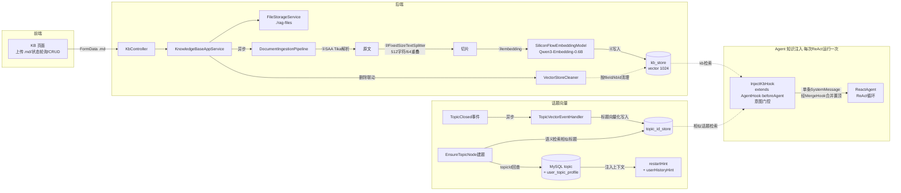

# P2 知识库（RAG）实施设计

> 版本：1.1 ｜ 日期：2026-08-15 ｜ 前置：Phase A-E 已完成（SAA Model 层 / Nacos Prompt / StateGraph 工作流 / ReactAgentFactory / RAG 基础框架）；v1.1 新增 InjectKbHook 设计（6.10）

## 1. 背景与目标

Phase E 已搭好 RAG 骨架（KB CRUD、文件上传、摄入管道、PgVector 检索、LLM 重排），但存在六块缺口：

1. **前端 KB 页面是纯 UI 骨架**，未对接任何 `/api/kb` 端点
2. **Embedding 用 Mock**（hash 伪向量），无真实语义检索能力
3. **切片用 TokenTextSplitter(800/200)**，需要改为 Fixed-size(512/64)
4. **向量删除残留**：metadata 无 fileId，删除文件/知识库时向量数据无法清理
5. **话题重启回溯是标题精确匹配**，需要升级为向量语义检索（topic_id_store）
6. **RagInjectionHook 逐模型调用全量检索**：ModelHook 机制下 ReAct 工具循环内每次模型调用都重复检索、重复注入 SystemMessage，且无场景意图门控（CHAT 闲聊也全量检索）——需以 AgentHook 级 InjectKbHook 取代（见 6.10）

本设计补齐上述缺口，形成完整可用的知识库闭环。

## 2. 已确认的设计决策

| 决策点 | 结论 | 理由 |
|---|---|---|
| Fixed-size 切片单位 | **512 字符 + 64 重叠**（均可配置） | 中文场景直观可控，重叠保证块间语义连续 |
| 向量维度 | **1024** | Qwen3-Embedding-0.6B 原生维度，无 MRL 有损压缩 |
| topic_id_store 写入时机 | **TopicClosed 时** | 标题终态 + conclusion + UserTopicProfile 均已生成，检索命中即可注入最完整上下文 |
| knowledge_base.name | **加 UNIQUE(name)** | 避免同名知识库混淆 |
| Embedding 接入方式 | **自研 SiliconFlowEmbeddingModel（RestClient），继承 AbstractEmbeddingModel** | dimensions 参数链路透明可控，批量/重试自己掌握（详见 6.1 备选说明）；继承官方基类与 OpenAiEmbeddingModel 姿势一致 |
| 文档解析层 | **SAA TikaDocumentParser**（替换 spring-ai TikaDocumentReader） | 1.1.2.2 起 parse() 返回 Spring AI Document，与现有管道类型兼容；项目已全面 SAA 化，生态一致（详见 6.3） |
| Agent 知识注入 | **InjectKbHook（extends AgentHook，beforeAgent 每次 ReAct 运行一次）取代 RagInjectionHook（ModelHook）** | 意图门控检索 kb_store + topic_id_store 双源；修复 ReAct 循环内逐模型调用重复检索/重复注入（详见 6.10） |
| 上传文件类型 | **仅 .md**（扩展名 + contentType 双检） | 需求明确当前仅支持 md |
| 文件存储 | 沿用 `./rag-files`（yyyy/MM/dd + UUID） | 已满足"存在工程目录 rag-files"，元数据保留原始文件名 |

## 3. 总体架构



三条独立链路：

- **知识库链路**：上传 → 切片 → 向量化 → kb_store → 检索（双层过滤 + LLM 重排，已有逻辑不变）
- **话题向量链路**：TopicClosed 写入 → 建题时语义检索 → 回查 MySQL 注入上下文
- **Agent 注入链路**：InjectKbHook 在每次 ReAct 运行前按意图门控检索 kb_store + topic_id_store，单次注入贯穿整个运行（见 6.10）

## 4. MySQL 表评估与变更

### 4.1 knowledge_base（基本合理，1 处变更）

现有字段：`id, name, scope, group_id, status, feature, create_time, update_time`，索引 `PRIMARY / idx_scope / idx_group_id`。

| 字段 | 评价 |
|---|---|
| `scope` + `group_id` | 合理，直接支撑向量检索双层过滤（GLOBAL OR GROUP+groupId），与 kb_store metadata 对齐 |
| `feature` (JSON) | 合理，可扩展 |
| `status` | 定义了 ACTIVE/PROCESSING/FAILED 但代码只写 ACTIVE。处理进度实际由 kb_file.status 承载，KB 级 PROCESSING/FAILED 语义重复。**不改 DDL**，语义收敛为"KB 生命周期状态"（为未来停用/归档保留） |
| 索引 | 已覆盖查询路径，无需调整 |

变更（用户已确认，经 MySQL MCP 执行）：

```sql
ALTER TABLE ring_chat.knowledge_base ADD CONSTRAINT uk_kb_name UNIQUE (name);
```

### 4.2 kb_file（合理，无 DDL 变更）

现有字段：`id, knowledge_base_id, name, path, file_type, file_size, status, chunk_count, error_msg, create_time, update_time`，索引 `PRIMARY / idx_kb_id`。

- 状态机 `UPLOADED→CHUNKED→EMBEDDED→READY/FAILED` + `chunk_count`/`error_msg` 完整支撑前端处理进度展示
- 应用层限制 `file_type` 仅接受 MARKDOWN（非 .md 拒绝）
- 可选优化（本次不做）：文件内容 md5 去重

## 5. 向量表设计（PostgreSQL ring_rag）

复用 Spring AI PgVectorStore 标准模式（已验证 1.1.2 Builder 支持 `vectorTableName(String)`），`initializeSchema=true` 启动自动建表，以下 DDL 仅为参考（实际由应用自动创建）。

### 5.1 kb_store（知识库切片存储）

```sql
CREATE TABLE IF NOT EXISTS kb_store (
    id        UUID PRIMARY KEY DEFAULT gen_random_uuid(),
    content   TEXT,          -- 切片文本
    metadata  JSON,          -- 溯源与过滤信息
    embedding vector(1024)   -- Qwen3-Embedding-0.6B 原生维度
);
CREATE INDEX IF NOT EXISTS kb_store_embedding_hnsw_idx
    ON kb_store USING hnsw (embedding vector_cosine_ops);
```

metadata 结构（相比现状新增 `fileId`/`chunkIndex`，解决删除残留的关键）：

```json
{
  "kbId": 1, "fileId": 12, "fileName": "java-basis.md", "chunkIndex": 3,
  "scope": "GLOBAL", "groupId": null, "docType": "MARKDOWN", "uploadTime": "..."
}
```

清理入口：`DELETE FROM kb_store WHERE metadata->>'fileId'='12'`（PG json 类型上 `->>` 操作符直接可用）。

### 5.2 topic_id_store（话题标题向量）

```sql
CREATE TABLE IF NOT EXISTS topic_id_store (
    id        UUID PRIMARY KEY DEFAULT gen_random_uuid(),
    content   TEXT,          -- topic 标题
    metadata  JSON,
    embedding vector(1024)
);
CREATE INDEX IF NOT EXISTS topic_id_store_embedding_hnsw_idx
    ON topic_id_store USING hnsw (embedding vector_cosine_ops);
```

metadata：`{"topicId": 5, "groupId": 2, "title": "Java内存模型", "closedAt": "..."}`

设计要点：

- **content 只存标题**：标题短且语义浓缩，相似度判断最准；结论从 MySQL `topic.conclusion` 回查，避免向量表冗余
- **写入时机 TopicClosed**：此时标题终态、结论、用户画像齐备
- topic 无删除场景，暂不提供清理入口（未来如需，按 `metadata->>'topicId'` 清理即可）

### 5.3 旧表处理

旧 `vector_store` 表（1536 维 mock 数据）废弃，提供以下 SQL 由用户手动执行：

```sql
DROP TABLE IF EXISTS vector_store;
```

## 6. 后端代码设计

### 6.1 SiliconFlowEmbeddingModel（新增）

位置：`dingRing-infrastructure/src/main/java/com/dingring/infrastructure/rag/embedding/SiliconFlowEmbeddingModel.java`

**继承 `AbstractEmbeddingModel`**（与官方 OpenAiEmbeddingModel 同姿势）：

```java
@Component
@ConditionalOnProperty(name = "dingring.rag.embedding.provider", havingValue = "siliconflow")
public class SiliconFlowEmbeddingModel extends AbstractEmbeddingModel {
    // 只需实现两个抽象方法（1.1.2 接口仅 call + embed(Document) 为抽象方法）：
    //   call(EmbeddingRequest)：POST {base-url}（配置即完整端点 URL，不拼路径）
    //     请求体：{"model": "Qwen/Qwen3-Embedding-0.6B", "input": [...], "dimensions": 1024}
    //     按 batch-size 分批调用；429/503 指数退避重试（最多 3 次）；失败抛异常由管道置 FAILED
    //   embed(Document)：embed(document.getText()) 经 call 单条路径
    // embed(String)/embed(List<String>) 由接口 default 方法自动路由到 call（单条/批量天然统一）
    // override dimensions() 返回 1024 常量：启动期 PgVectorStore 建表调用它，零 API 消耗
    //   （接口 default 的 dimensions() 每次真实调一次 embedding API，必须 override）
}
```

**选型说明（自研 vs 复用 OpenAiEmbeddingModel）**：

- 自研：dimensions 参数链路透明、批量与重试完全可控、便于学习理解（推荐）
- 备选：`OpenAiApi.builder().baseUrl("https://api.siliconflow.cn")` + OpenAiEmbeddingModel 零代码，但 dimensions 在 Spring AI OpenAI 封装中的传递行为随版本有差异，Qwen3 的 MRL 维度是本方案核心参数，风险不可控

MockEmbeddingModel 保留（provider=mock 切回，单测用）。两个实现均激活时的 @Primary 冲突处理：MockEmbeddingModel 的 @Primary 移除，改为在配置类中按 provider 装配 Primary（或互斥 ConditionalOnProperty 已天然互斥，仅需移除 Mock 的 @Primary）。

### 6.2 配置（RagProperties 扩展 + application.yml）

```yaml
dingring:
  rag:
    enabled: true
    embedding:
      provider: siliconflow          # mock 可切回
      siliconflow:
        base-url: https://api.siliconflow.cn/v1/embeddings  # 完整端点，代码直接 POST 不拼路径
        api-key: ${SILICONFLOW_API_KEY:}   # 生产走环境变量，dev 可明文
        model: Qwen/Qwen3-Embedding-0.6B
        dimensions: 1024
        batch-size: 16
        timeout-seconds: 30
    chunk:
      fixed-size: 512     # 字符
      overlap: 64         # 字符
    storage:
      local-path: ./rag-files
    reranker:
      agent-id: 6
```

### 6.3 文档解析层：SAA TikaDocumentParser（替换）

**分层澄清**：PgVectorStore 只存 vector + metadata，与文件格式无关；md 支持由解析层决定。

- 替换 `org.springframework.ai.reader.tika.TikaDocumentReader` → `com.alibaba.cloud.ai.parser.tika.TikaDocumentParser`
- **类型兼容已验证**（反编译 1.1.2.2 字节码）：`parse(InputStream)` 返回 `List<org.springframework.ai.document.Document>`（Spring AI Document，非 SAA 自有类型），与现有 splitter/VectorStore/metadata 管道零适配直接接入
- 选择理由：项目 Phase A 起全面 SAA 化（Model/Prompt/Graph/Agent），解析层保持同生态；版本随 SAA BOM 与 graph-core/agent-framework 对齐；暴露更多定制点（Parser/ContentHandler/Metadata/ParseContext 供应商）
- pom：infrastructure 移除 `spring-ai-tika-document-reader`，新增 `spring-ai-alibaba-starter-document-parser-tika`
- 后续演进备选：SAA `MarkdownDocumentParser`（commonmark AST DocumentVisitor，感知标题层级）——未来"按标题结构切片"的现成方案；本次坚持 Fixed-size 不引入

### 6.4 FixedSizeTextSplitter（新增）

位置：`dingRing-infrastructure/src/main/java/com/dingring/infrastructure/rag/splitter/FixedSizeTextSplitter.java`

- `implements DocumentTransformer`，构造注入 chunkSize/overlap（来自配置）
- 纯字符滑窗：步进 `chunkSize - overlap` 切块，继承原文档 metadata，短尾块保留

### 6.5 DocumentIngestionPipeline（改造）

- 读取：`TikaDocumentReader.get()` → `TikaDocumentParser.parse(inputStream)`
- `TokenTextSplitter(800/200)` → 注入 `FixedSizeTextSplitter`
- `buildMetadata` 增补 `fileId`、`chunkIndex`
- 向量写入指向 `@Qualifier("kbVectorStore")`

### 6.6 PgVectorStoreConfig（改造为双实例）

```java
@Bean @Primary
public PgVectorStore kbVectorStore(vectorJdbcTemplate, embeddingModel) {
    // .vectorTableName("kb_store").dimensions(1024).COSINE.HNSW.initializeSchema(true)
}
@Bean
public PgVectorStore topicVectorStore(vectorJdbcTemplate, embeddingModel) {
    // .vectorTableName("topic_id_store")，同上
}
```

`SaaRagService` 注入 Primary（即 kb 库），无需改动。

### 6.7 VectorStoreCleaner（新增）

位置：`dingRing-infrastructure/src/main/java/com/dingring/infrastructure/rag/VectorStoreCleaner.java`

```java
public void deleteByFileId(Long fileId);  // DELETE FROM kb_store WHERE metadata->>'fileId'=?
public void deleteByKbId(Long kbId);      // DELETE FROM kb_store WHERE metadata->>'kbId'=?
```

接入 `KnowledgeBaseAppService.deleteFile / delete`（清理失败仅告警日志，不阻断删除主流程）。

### 6.8 TopicVectorService（domain 端口 + infra 实现）

```java
// dingRing-domain/src/main/java/com/dingring/domain/service/TopicVectorService.java
public interface TopicVectorService {
    void indexTopic(Topic topic);
    List<SimilarTopic> findSimilarTopics(String title, int topK, double threshold);
    record SimilarTopic(Long topicId, String title, double score) {}
}
```

- `TopicVectorServiceImpl`（infrastructure/rag）：写/检索 topic_id_store
- `TopicVectorEventHandler`（app/event，第 4 个 TopicClosed 消费者）：`@Async @EventListener`，失败仅日志不影响收束主流程
- 消费方：EnsureTopicNode（建题回溯，见 6.9）+ InjectKbHook（DISCUSS/CONCLUDE 每轮注入，见 6.10）

### 6.9 EnsureTopicNode 语义回溯（改造）

替换现有"标题精确匹配"为**语义检索优先、精确匹配兜底**：

1. `findSimilarTopics(topic.getTitle(), 3, 0.75)` → 相似 topicIds
2. 回查 `topicRepository`（conclusion）+ `topicProfileRepository`（画像）
3. 组装增强版 `userHistoryHint`（相似主题结论摘要 + 理解程度/薄弱点 + 进步轨迹）；`restartHint` 升级为"检测到与历史话题「xxx」相关（第 N 次讨论类似主题）"
4. 向量服务异常/无命中 → 回退现有精确匹配逻辑；**任何情况不阻塞建题**

注入机制不变（userHistoryHint 仍走 DiscussNode system prompt，restartHint 仍走 WS TOPIC_CREATED）。

### 6.10 InjectKbHook（新增，取代 RagInjectionHook）

位置：`dingRing-infrastructure/src/main/java/com/dingring/infrastructure/agent/hook/InjectKbHook.java`

**动机（为什么是 AgentHook 而非沿用 ModelHook）**：

现有 `RagInjectionHook extends ModelHook`，钩子位置 BEFORE_MODEL——ReAct 循环内**每次模型调用都触发**：模型→工具→模型的循环里检索执行 N+1 次、注入 N+1 条 SystemMessage（合并 Hook 重复拼接），且无场景意图门控（CHAT 闲聊也全量检索）。`InjectKbHook extends AgentHook`，钩子位置 BEFORE_AGENT——**每次 ReAct 运行前执行一次**，注入的 SystemMessage 存于 state 贯穿本次运行全部模型调用，从机制上消除重复。

**SAA 1.1.2.3 AgentHook API（源码已验证）**：

```java
public abstract class AgentHook implements Hook {
    // 整个 Agent 循环前触发一次（BEFORE_AGENT 位置）——InjectKbHook 只重写此方法
    public CompletableFuture<Map<String, Object>> beforeAgent(OverAllState state, RunnableConfig config);
    public CompletableFuture<Map<String, Object>> afterAgent(OverAllState state, RunnableConfig config);
    // 需实现 Hook.getName()；getOrder() 默认 0，按注册顺序执行
}
```

**场景意图门控矩阵**（intent 由 4 个调用节点写入 context，经 buildAgentInputs 进入 Agent state，读 `StateKeys.INTENT`）：

| Intent | kb_store | topic_id_store | 设计理由 |
|---|---|---|---|
| CHAT | ✗ 跳过 | ✗ 跳过 | 闲聊无需知识注入，省 token 与检索延迟 |
| DISCUSS | ✓ query=触发消息（ragQuery） | ✓ query=topicTitle | 讨论既需领域知识，也需历史相似话题结论延续上下文 |
| CONCLUDE | ✗ 跳过 | ✓ query=topicTitle | 收束是对本话题讨论的总结，无需外部文档；相似历史话题结论可作总结参考 |
| WORK | ✓ query=任务输入（ragQuery） | ✗ 跳过 | 任务执行需要知识库资料，历史话题无关 |
| 缺失（防御） | 有 ragQuery 则检索 | ✗ 跳过 | 兼容旧调用路径（Supervisor Worker clearContext 后 state 为空，自然跳过） |

**与既有注入的分工（内容互补，不重复）**：

| 注入源 | 内容 | 视角 | 时机 |
|---|---|---|---|
| MemoryInjectionHook | 本群过往话题结论（MySQL 直查） | 群内 | 每次模型调用 |
| InjectKbHook·topic 源 | 全库语义相似话题结论（topic_id_store 向量召回，跨群） | 全局语义 | 每次 ReAct 运行 |
| EnsureTopicNode userHistoryHint | 用户学习轨迹（user_topic_profile：薄弱点/理解程度） | 用户适配 | 建题时一次 |
| InjectKbHook·kb 源 | 上传文档知识（kb_store 召回+重排） | 文档知识 | 每次 ReAct 运行 |

**处理流程（beforeAgent）**：

1. 读 state：`intent` / `ragQuery` / `groupId` / `topicId` / `topicTitle`，intent 非 CHAT/CONCLUDE/DISCUSS/WORK 或缺失 → 按防御行处理
2. kb 源（DISCUSS/WORK/防御）：复用 `RagService.retrieve(ragQuery, groupId)`（向量召回 Top-20 + LLM 重排 Top-5，双层过滤逻辑不变）
3. topic 源（DISCUSS/CONCLUDE）：`topicVectorService.findSimilarTopics(topicTitle, 3, 0.75)` → 排除当前 topicId（自匹配）→ `topicRepository` 回查 conclusion → 每条截断 200 字符
4. 组装单条 SystemMessage（两段式），返回 `Map.of("messages", systemMessage)`，由 SAA 按 AppendStrategy 追加，最终经 SystemMessageMergeHook 合并置顶：

```text
知识库检索结果（按相关性排序）：
[1] (相关性: 8.5) ...
历史相似话题结论（供参考，勿直接复述）：
[1] 「Java内存模型」：...
```

**topic 源结果缓存**：topicId → 注入文本段，TTL 10 分钟（ConcurrentHashMap + 时间戳，容量上限 100）。理由：话题存续期内标题不变、相似集结论不变（均为已关闭话题），每轮 DISCUSS 重复检索浪费 embedding 调用 + 向量检索；kb 源 query 每轮随消息变化，不缓存。

**注册与联动改造**：

- `SaaLlmFactory.build`：`.hooks(memoryInjectionHook, profileInjectionHook, groupRosterHook, injectKbHook, systemMessageMergeHook)` —— 替换 ragInjectionHook，merge Hook 仍居末位
- `SupervisorAgentFactory`：Supervisor 与 Worker 同步替换（Worker 被 AgentTool 委派时 clearContext，state 无 intent/ragQuery/topicId，Hook 防御行自然跳过）
- **删除 `RagInjectionHook`（含单测）**
- 4 个调用节点 context 增补 intent：ChatNode→"CHAT"、DiscussNode→"DISCUSS"、WorkNode→"WORK"、ConclusionService→"CONCLUDE"（沿用 `StateKeys.INTENT`）

**容错**：任一检索源异常 → 该源跳过 + LogHelper WARN，双源全失败返回 `Map.of()`，绝不阻塞 Agent 发言。命中矩阵与耗时用 LogHelper 在方法内记录（不用 @Event 切面：OverAllState 含消息对象，fastjson 序列化入参日志有体积与兼容风险）。

### 6.11 上传校验（改造 KnowledgeBaseAppService.upload）

非 `.md`（扩展名 + contentType 双检）抛业务异常"当前仅支持 .md 文件"；`fileType` 固定 MARKDOWN。

## 7. 前端适配设计

### 7.1 api.ts 新增 KbApi

```ts
export const KbApi = {
  list: () => API.get('/api/kb'),
  create: (data: { name: string; scope: 'GLOBAL' | 'GROUP'; groupId?: number }) => API.post('/api/kb', data),
  detail: (id: number) => API.get(`/api/kb/${id}`),
  remove: (id: number) => API.del(`/api/kb/${id}`),
  uploadFile: (id: number, file: File) => { /* FormData, multipart */ },
  listFiles: (id: number) => API.get(`/api/kb/${id}/files`),
  deleteFile: (id: number, fileId: number) => API.del(`/api/kb/${id}/files/${fileId}`),
}
```

### 7.2 KB 页面（pages/KB/index.tsx）改造

- 知识库列表加载 + 新建弹窗（name / scope GLOBAL|GROUP / groupId）
- 文件列表：名称、大小、状态徽章（UPLOADED/CHUNKED/EMBEDDED 处理中样式，READY 成功，FAILED 失败+错误信息）、切片数
- 上传：`<input accept=".md">` + 前端扩展名预校验 + loading
- 处理进度轮询：存在中间态（UPLOADED/CHUNKED/EMBEDDED）文件时每 3s 刷新文件列表，全部终态（READY/FAILED）后停止
- 删除确认（知识库删除提示"将连带删除文件与向量数据"）
- 统计卡片接真实数据：知识库数 / 文件数 / 总切片数 / 已就绪文件数

## 8. 测试设计

| 测试类 | 覆盖点 |
|---|---|
| SiliconFlowEmbeddingModelTest | 请求体（model/input/dimensions）、批量分批、429 退避重试、异常抛出、dimensions() |
| FixedSizeTextSplitterTest | 中英混排、切块边界与重叠、短文本/尾块、空文本、metadata 继承 |
| VectorStoreCleanerTest | SQL 语句与参数正确性（mock JdbcTemplate）、清理失败不抛出 |
| TopicVectorServiceImplTest | indexTopic 写入内容与 metadata、findSimilarTopics 解析与阈值 |
| TopicVectorEventHandlerTest | 事件触发异步写入、失败仅日志 |
| EnsureTopicNodeTest | 语义命中组装 hint、向量异常/无命中回退精确匹配 |
| InjectKbHookTest | 意图矩阵（CHAT 跳过/DISCUSS 双源/CONCLUDE 仅 topic/WORK 仅 kb/缺失防御）、自 topicId 排除、缓存命中与 TTL 过期、单源异常跳过不阻塞、注入文本格式 |
| KnowledgeBaseAppServiceTest | 非 .md 拒绝、删除联动 VectorStoreCleaner |

## 9. 实施阶段

| 阶段 | 内容 | 验证方式 |
|---|---|---|
| F1 | MySQL DDL（uk_kb_name，经用户确认后 MCP 执行）+ pom 依赖调整（SAA tika parser 替换 spring-ai tika reader）+ yml 配置 + RagProperties | 表结构检查、`mvn compile`、启动自动建 PG 表 |
| F2 | SiliconFlowEmbeddingModel（extends AbstractEmbeddingModel）+ 单测 | 单测 + debug 端点实调 |
| F3 | SAA TikaDocumentParser 接入 + FixedSizeTextSplitter + DocumentIngestionPipeline 改造 | 单测 |
| F4 | 双 VectorStore 实例 + VectorStoreCleaner 接入删除链路 | 单测 |
| F5 | TopicVectorService + EventHandler + EnsureTopicNode 语义回溯 + InjectKbHook（含 RagInjectionHook 删除、SaaLlmFactory/SupervisorAgentFactory 注册替换、4 节点 context 增补 intent） | 单测 + 集成验证 beforeAgent 注入贯穿 ReAct 全程不重复 |
| F6 | 上传 md 校验 + 前端 api.ts + KB 页面改造 | 页面手工验收 |
| F7 | Postman + 页面全链路联调 + `mvn test` 全量回归 | 全绿 |

## 10. 风险与边界

| 风险 | 应对 |
|---|---|
| API Key 未配置/失效 | 摄入置 FAILED（errorMsg 记录原因），应用不崩；启动时打配置告警日志 |
| SiliconFlow 429 限流 | 批量 input（batch-size=16）+ 指数退避重试 3 次 |
| 维度 1536→1024 | 只影响新建的 kb_store/topic_id_store；旧 vector_store 表废弃可 DROP，无迁移问题 |
| 处理中重启卡中间态 | 无恢复机制（与现状一致），处理方式为删除文件重传 |
| 标题过短误召回 | 相似度阈值 0.75 兜底；无命中回退精确匹配 |
| 删除时向量清理失败 | 仅告警不阻断（MySQL 元数据已删，残留向量不参与有效检索，可后续对账清理） |
| AgentHook.beforeAgent 返回 Map 的 state 合并语义 | 实现期以单测+集成验证（与 ModelHook 同为 partial state 合并，预期一致）；若不符则回退方案：InjectKbHook 改 ModelHook 但仅首次模型调用检索（state 打标去重），意图矩阵不变 |

## 11. 关联文件清单

**新增**：
- infrastructure/rag/embedding/SiliconFlowEmbeddingModel.java
- infrastructure/rag/splitter/FixedSizeTextSplitter.java
- infrastructure/rag/VectorStoreCleaner.java
- infrastructure/rag/TopicVectorServiceImpl.java
- infrastructure/agent/hook/InjectKbHook.java
- domain/service/TopicVectorService.java
- app/event/TopicVectorEventHandler.java
- 上述对应单测

**改造**：
- dingRing-infrastructure/pom.xml（移除 spring-ai-tika-document-reader，新增 spring-ai-alibaba-starter-document-parser-tika）
- infrastructure/rag/config/PgVectorStoreConfig.java（双实例）
- infrastructure/rag/DocumentIngestionPipeline.java（SAA TikaDocumentParser + splitter + metadata + qualifier）
- infrastructure/rag/embedding/MockEmbeddingModel.java（移除 @Primary）
- infrastructure/llm/SaaLlmFactory.java（Hook 注册：ragInjectionHook → injectKbHook）
- infrastructure/agent/runtime/SupervisorAgentFactory.java（Supervisor/Worker 同步替换）
- app/workflow/node/ChatNode.java / DiscussNode.java / WorkNode.java + app/workflow/ConclusionService.java（context 增补 StateKeys.INTENT）
- app/service/KnowledgeBaseAppService.java（md 校验 + 删除联动清理）
- app/workflow/node/EnsureTopicNode.java（语义回溯）
- start/src/main/resources/application.yml（embedding 完整端点 + chunk 配置）
- frontend/src/api.ts（KbApi）
- frontend/src/pages/KB/index.tsx（全量对接）

**删除**：
- infrastructure/agent/hook/RagInjectionHook.java（含单测；职责由 InjectKbHook 接管）
