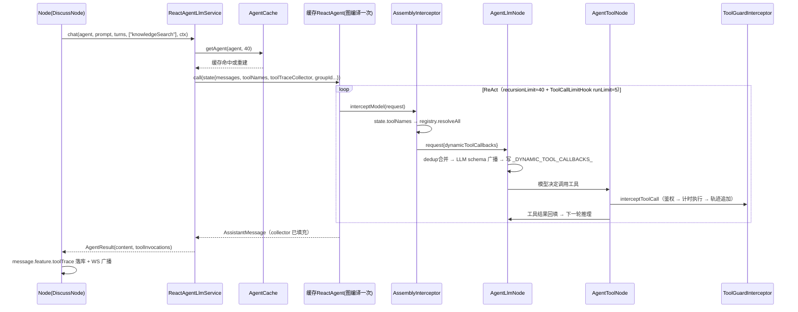

# Tool 机制改造技术方案（SAA 深度整合版）

> **已废弃**：本方案的动态装配四层架构被简化方案取代（用户决策：走 SAA 原生 `methodTools()` 极简路线），见 `2026-08-18-web-search-tool-design.md`。保留本文档作为设计演进记录。

- 日期：2026-08-18
- 状态：已废弃（被简化方案取代）
- 影响模块：dingRing-domain / dingRing-infrastructure / dingRing-app
- 前置依赖：SAA 1.1.2.3（spring-ai-alibaba-agent-framework）、Caffeine（新增依赖）

---

## 1. 背景与问题

### 1.1 现状

项目已有一套"能跑"的 Tool 机制：3 个 Spring AI `@Tool` 工具 Bean（`KnowledgeSearchTool` / `TopicHistoryTool` / `UserProfileQueryTool`）、`LlmService.ToolSet` 四场景枚举、`SaaLlmFactory.resolveTools()` 的 switch 硬编码装配、`SkillToolkitFactory` 的名称注册表（仅 Supervisor 路径使用）。

### 1.2 四个核心问题

| # | 问题 | 证据 |
|---|---|---|
| P1 | **装配双轨硬编码**：场景→工具映射是 switch，Skill 注册表仅 Supervisor 路径生效，两套路径并存；新增工具要改工厂代码 | `SaaLlmFactory.resolveTools()`（L194-201） |
| P2 | **Push/Pull 重复建设**：三个工具与三个注入 Hook 信息完全重复——`UserProfileQueryTool` vs `ProfileInjectionHook`、`TopicHistoryTool` vs `MemoryInjectionHook`、`KnowledgeSearchTool` vs `InjectKbHook`。Hook 在 ReAct 运行前已把信息推入上下文，工具调用率趋近于零 | Hook 均无条件/门控注入 |
| P3 | **不可观测**：`AgentResult.toolCallSummary` 恒为 `List.of()`、`hasToolCalls` 恒 false，均为死字段 | `ReactAgentLlmService` 从未填充 |
| P4 | **per-call 重建开销**：每次 LLM 调用重建 ChatModel（含 HTTP 客户端）并触发 SAA StateGraph 编译，Agent 图无法复用 | `SaaLlmFactory.build()` 无缓存 |

### 1.3 SAA 1.1.2.3 Tool 设施调研结论（字节码验证）

对 `spring-ai-alibaba-agent-framework-1.1.2.3.jar` 反编译验证，SAA 原生提供但项目**未使用**的设施：

| SAA 设施 | 验证过的关键 API | 能力 |
|---|---|---|
| 动态工具注入管道 | `AgentLlmNode`：`deduplicateByName(静态tools, ModelRequest.dynamicToolCallbacks)` 合并 → 写入 `RunnableConfig.context` 的 `_DYNAMIC_TOOL_CALLBACKS_` 键 → `AgentToolNode.resolveFromConfigMetadata()` 执行期按名解析 | **per-call 动态装配的官方管道**：动态工具既进 LLM schema 又可被执行 |
| ModelInterceptor 责任链 | `interceptModel(ModelRequest, ModelCallHandler)`；`ModelRequest.builder(request).dynamicToolCallbacks(...).build()`；`ModelRequest.context` = `OverAllState.data()` 拷贝 + `RunnableConfig.metadata()` | 动态装配的**官方入口**，可读 per-call state |
| ToolInterceptor 责任链 | `interceptToolCall(ToolCallRequest, ToolCallHandler)`；`ToolCallRequest`（toolName/arguments/toolCallId/executionContext→state）；`ToolCallResponse`（result/status/metadata/isError） | 工具执行前后管控点 |
| ToolCallbackResolver | Spring AI 标准接口 `resolve(String)`；`Builder.toolNames(String...)` + `Builder.resolver(...)` 按名延迟解析 | 注册表的标准接口形态 |
| ToolCallLimitHook | `builder().toolName(t).runLimit(n).threadLimit(n).exitBehavior(...)` | 内置 per-tool 调用限流 |
| 其他 | `ToolRetryInterceptor` / `ToolErrorInterceptor` / `ToolSelectionInterceptor`（小模型选工具）/ `StateAwareToolCallback` / `AsyncToolCallback`+`CancellationToken` | 容错/筛选/异步，本次不用但记入演进 |

**关键证伪**：直接往 `RunnableConfig.context` 塞 `_DYNAMIC_TOOL_CALLBACKS_` 不可行——字节码显示 `AgentLlmNode` 在 `dynamicToolCallbacks` 为空时会 `context.remove(_DYNAMIC_TOOL_CALLBACKS_)`，外部预设值必被清除。该键是框架内部出口，唯一正道是经 `ModelInterceptor` 设置 `ModelRequest.dynamicToolCallbacks`。

---

## 2. 目标与非目标

### 2.1 目标

1. 装配收口到 SAA 原生管道：`ModelInterceptor` 动态注入 + `ToolCallbackResolver` 标准注册表，新增工具 = 写一个 `@Tool` Bean，零装配代码
2. 消除 Push/Pull 重复：工具矩阵从 3 个精简到 2 个，CHAT/CONCLUDE 零工具
3. Agent 图一次编译多次复用（Caffeine 缓存，key 含 updateTime 自然失效）
4. 工具调用可管控（双重鉴权 + 限流）可观测（轨迹回传 → `message.feature.toolTrace`）

### 2.2 非目标（明确不做）

- MCP 外部工具接入（Registry 的 resolver 接口已预留，生态成熟后再接）
- `ToolSelectionInterceptor` 小模型筛选（当前仅 2 个业务工具，筛选收益为负；工具 >10 再启用）
- 独立 `tool_invocation` 表（feature.toolTrace 先行，量大再建表）
- 流式工具调用（SAA ReactAgent 无公共流式 API，维持现状回退）

---

## 3. 工具矩阵重划（Push/Pull 边界）

**判据**：模型是否需要"看过初步结果后迭代再查"。不需要 → Push（Hook 注入，便宜确定）；需要 → Pull（Tool，支持 query 改写多轮检索）。

| 场景 | Before（switch 硬编码） | After（Node 显式声明 toolNames） | 依据 |
|---|---|---|---|
| CHAT | userProfileQuery | `[]`（空） | ProfileInjectionHook 全覆盖，无需迭代 |
| DISCUSS | knowledgeSearch + userProfileQuery | `["knowledgeSearch"]` | Push 保底（InjectKbHook）+ Pull 精查（迭代改写 query） |
| CONCLUDE | topicHistory | `[]`（空） | MemoryInjectionHook 注入历史结论已够 |
| WORK | 3 个全挂 | `["knowledgeSearch", "topicHistory"]` | 深度 ReAct 需迭代检索与话题深挖 |

**删除清单**：`ToolSet` 枚举、`UserProfileQueryTool`、`SaaLlmFactory.resolveTools()`、`SkillToolkitFactory`（被 Registry 取代）。
**保留清单**：`KnowledgeSearchTool`、`TopicHistoryTool`、全部 6 个 Hook（Push 侧不动）。
**Supervisor 路径**：`SupervisorAgentFactory.resolveWorkerTools` 改调 `toolRegistry.resolveAll(skill.toolNameList())`，行为不变。

---

## 4. 总体架构

四层机制全部映射 SAA 原生设施，不自建轮子：

```
┌─ 注册层 ─ ToolRegistry（implements Spring AI ToolCallbackResolver）
│            DingRingTool marker 接口 + 构造注入 List<DingRingTool> 自动收集
│            新增工具 = 写一个 @Tool Bean 实现 marker，零注册代码
├─ 装配层 ─ AssemblyHook.getModelInterceptors() → AssemblyInterceptor
│            读 state.toolNames → registry.resolveAll → ModelRequest.dynamicToolCallbacks
│            SAA 自动接管：dedup 合并 → LLM schema 广播 → 执行期 _DYNAMIC_TOOL_CALLBACKS_ 解析
├─ 执行层 ─ AgentCache（Caffeine，key=agentId:updateTime）
│            ReactAgent 图编译一次复用；Builder 不再静态挂 tools
└─ 管控层 ─ ToolGuardHook.getToolInterceptors() → 责任链拦截器
             兜底鉴权（未装配工具拒绝执行）+ 轨迹收集（state collector）
             限流复用 SAA ToolCallLimitHook（runLimit per tool）
```

---

## 5. 组件设计

### 5.1 ToolRegistry（infrastructure/agent/tool/）

```java
/**
 * 统一工具注册表：实现 Spring AI ToolCallbackResolver 标准接口。
 * 为什么实现标准接口：Builder.toolNames()/resolver() 与未来 MCP 生态直接对接；
 * 为什么需要 marker 收集而非 List<Object> 全扫：避免误收非工具 Bean，注册边界显式。
 */
@Component
public class ToolRegistry implements ToolCallbackResolver {

    private final Map<String, ToolCallback> registry = new ConcurrentHashMap<>();

    public ToolRegistry(List<DingRingTool> toolBeans) {
        for (Object bean : toolBeans) {
            for (ToolCallback cb : ToolCallbacks.from(bean)) {
                String name = cb.getToolDefinition().name();
                ToolCallback old = registry.put(name, cb);
                if (old != null) {
                    // 启动快速失败：重名工具会让 LLM schema 与执行解析产生歧义，必须尽早暴露
                    throw new IllegalStateException("工具名冲突: " + name);
                }
            }
        }
    }

    /** Spring AI 标准解析入口 */
    @Override
    public ToolCallback resolve(String toolName) { return registry.get(toolName); }

    /** 批量解析：未知名 WARN 跳过（沿用 SkillToolkitFactory 容错语义，不阻断装配） */
    public List<ToolCallback> resolveAll(Collection<String> names) { ... }
}
```

`KnowledgeSearchTool` / `TopicHistoryTool` 实现 `DingRingTool`（空 marker 接口，`infrastructure/agent/tool/` 内）。

### 5.2 AssemblyHook（动态装配，infrastructure/agent/hook/）

```java
/**
 * 工具动态装配 Hook：SAA 官方动态注入管道的入口。
 * 为什么用 ModelInterceptor 而非静态挂载：工具集随调用方（Node 声明）per-call 变化，
 * 缓存 Agent 的图是共享的，工具只能在每次模型调用前动态注入。
 * 为什么能读到 toolNames：ModelRequest.context = OverAllState.data() 拷贝（字节码已验证）。
 */
@Component
public class AssemblyHook extends ModelHook {

    private final ToolRegistry toolRegistry;

    @Override
    public List<ModelInterceptor> getModelInterceptors() {
        return List.of(new AssemblyInterceptor());
    }

    private class AssemblyInterceptor extends ModelInterceptor {
        @Override
        public ModelResponse interceptModel(ModelRequest request, ModelCallHandler handler) {
            List<String> toolNames = readToolNames(request.getContext());
            if (toolNames == null || toolNames.isEmpty()) {
                // CHAT/CONCLUDE：无工具直达，LLM 请求不含任何工具 schema（省 token）
                return handler.call(request);
            }
            List<ToolCallback> tools = toolRegistry.resolveAll(toolNames);
            return handler.call(ModelRequest.builder(request)
                    .dynamicToolCallbacks(tools)
                    .build());
        }
    }
}
```

**Hook 注册顺序**（`SaaLlmFactory`）：`assemblyHook` 放最前——先完成工具装配，`SystemMessageMergeHook` 保持最后（现有约定不变）。

### 5.3 AgentCache（SaaLlmFactory 改造）

```java
// 缓存 key = agentId + ":" + agent.getUpdateTime().toEpochSecond()
// 为什么用 updateTime 入 key：Agent 实体被编辑 → key 变 → 自然失效重建，无需显式失效联动
private final Cache<String, ReactAgent> agentCache = Caffeine.newBuilder()
        .maximumSize(64)                          // Agent 数量级小，64 足够
        .expireAfterWrite(Duration.ofMinutes(10)) // 兜底淘汰，防止长生命周期累积
        .build();

public ReactAgent getAgent(Agent domainAgent, int recursionLimit) {
    String key = domainAgent.getId() + ":" + domainAgent.getUpdateTime().toEpochSecond();
    return agentCache.get(key, k -> build(domainAgent, recursionLimit));
}
```

`build()` 变化：
- **不再传 `Builder.tools()`**（零静态工具，全走动态装配）
- hooks = `assemblyHook, memoryInjectionHook, profileInjectionHook, groupRosterHook, injectKbHook, systemMessageMergeHook`
- 附加 SAA 内置 `ToolCallLimitHook`：对 knowledgeSearch/topicHistory 各挂一个 `runLimit=5`（防死循环烧 token，与 recursionLimit=40 双保险；经 `Builder.interceptors()` 或 Hook 形式挂载，P3 落地时以实际可用方式为准）

**recursionLimit 取值不变**：DISCUSS/WORK=40（类注释已论证单轮 ≥7 步、工具往返 ≥20 步）。注意：动态装配后模型节点前多了 AssemblyInterceptor，但它跑在拦截器链内不增加图节点数，recursionLimit 语义不受影响。

### 5.4 ToolGuardHook（管控 + 轨迹，infrastructure/agent/hook/）

```java
/**
 * 工具守卫 Hook：所有工具调用的统一管控点（责任链 API，非 before/after 回调）。
 * 鉴权为什么做两道：装配白名单让 LLM 看不到无权工具（减少幻觉）；
 * 拦截兜底防模型编造工具名——不信任模型输出原则的防御性设计。
 */
@Component
public class ToolGuardHook extends ModelHook {

    @Override
    public List<ToolInterceptor> getToolInterceptors() {
        return List.of(new ToolGuardInterceptor());
    }

    private class ToolGuardInterceptor extends ToolInterceptor {
        @Override
        public ToolCallResponse interceptToolCall(ToolCallRequest request, ToolCallHandler handler) {
            // 1. 兜底鉴权：state.toolNames 包含该工具名 → 放行；否则返回 error response（不执行）
            //    模型看到错误消息可自纠（改用已有工具或直接回答）
            // 2. 计时执行：ToolCallResponse resp = handler.call(request);
            // 3. 轨迹收集：从 state 取 "toolTraceCollector"（List<ToolInvocation>）追加记录
            //    (toolName, args摘要≤200字, durationMs, resp.isError())；异常路径也要记录后 re-throw
        }
    }
}
```

与 `WorkProgressBroadcastHook` 并存：后者只服务 Supervisor 委派场景的 WS 进度推送，职责不同不合并。

### 5.5 LlmService 签名变更（domain 层）

```java
public interface LlmService {
    // ToolSet 枚举删除，替换为显式工具名列表——调用方（Node）自己声明需要什么能力
    AgentResult chat(Agent agent, String systemPrompt, List<ChatTurn> messages,
                     List<String> toolNames, Map<String, Object> context);

    /** 单次工具调用轨迹记录 */
    record ToolInvocation(String toolName, String argsSummary, long durationMs, boolean success) {}

    /** AgentResult 改造：删除死字段 toolCallSummary(List<String>)，换结构化轨迹 */
    record AgentResult(String content, boolean hasToolCalls, List<ToolInvocation> toolInvocations) {
        public static AgentResult of(String content) { return new AgentResult(content, false, List.of()); }
    }
}
```

`ReactAgentLlmService` 实现：
- call inputs 写入 `toolNames`（List 拷贝防篡改）与 `toolTraceCollector = new CopyOnWriteArrayList<>()`
- `reactAgent.call()` 返回后 drain collector → `hasToolCalls = !list.isEmpty()` → 填充 `AgentResult`
- `MockLlmService` 同步改签名（mock 返回空轨迹）

### 5.6 各 Node 与消息落库

| 调用方 | toolNames |
|---|---|
| `ChatNode` | `List.of()` |
| `DiscussNode` | `List.of("knowledgeSearch")` |
| `ConcludeNode` | `List.of()` |
| `WorkNode`（降级单 Agent 路径） | `List.of("knowledgeSearch", "topicHistory")` |

Agent 发言落库时把 `toolInvocations` 写入 `message.feature`（key=`toolTrace`，`JsonMapTypeHandler` 现成能力，无需改表）；WS 广播 NEW_MESSAGE 时随 feature 带出，前端可在消息气泡展示"本条回复调用了哪些工具"。

---

## 6. 端到端数据流



---

## 7. 错误处理

| 故障点 | 策略 | 理由 |
|---|---|---|
| registry 解析失败（工具名拼错） | `resolveAll` WARN 跳过，装配剩余工具继续 | 沿用现有容错语义，发言不因配置错误阻塞 |
| LLM 幻觉调未装配工具 | ToolGuard 返回 error response（不执行），模型看到错误自纠 | 第二道防线；不抛异常防图崩溃 |
| 工具执行抛异常 | 轨迹记录（success=false）后 re-throw，由 SAA `ToolExecutionExceptionProcessor` 兜底转错误消息 | 轨迹完整性优先，异常语义交还框架 |
| Agent 实体编辑 | key 含 updateTime，下次调用自然重建 | 避免显式失效联动的过度工程 |
| collector 为 null（非主路径调用） | 拦截器跳过轨迹收集，不影响工具执行 | 轨迹是增强能力，不能反噬主流程 |
| 缓存 TTL 内 Agent 无编辑但 LLM 配置漂移 | 不处理（updateTime 是唯一变更信号） | 与现有 DB 单源语义一致 |

---

## 8. 测试策略

- **单元测试**
  - Registry：重名启动失败；未知名 resolveAll 容错跳过
  - AssemblyInterceptor：toolNames 空 → request 原样直达（断言未设 dynamicToolCallbacks）；非空 → 注入后断言回调列表
  - ToolGuard：未装配工具 → error response 且 handler 未被调用；正常路径 → 轨迹追加（含异常路径 success=false）
- **集成测试**（`dingring.llm.mock=true`）
  - AgentCache：同一 Agent 二次调用返回同一实例
  - CHAT 场景：mock ChatModel 断言请求 options 无工具 schema
- **手动验证**：前端发 DISCUSS 消息 → 查 `message.feature.toolTrace` 与日志轨迹；人为在 Node 声明拼错的工具名 → WARN 日志且发言正常

---

## 9. 实施顺序

| 阶段 | 内容 | 验证点 |
|---|---|---|
| P1 注册层 | `DingRingTool` marker + `ToolRegistry`；删 `SkillToolkitFactory`；`SupervisorAgentFactory` 改调 registry；`KnowledgeSearchTool`/`TopicHistoryTool` 实现 marker | 启动日志打印注册表内容；Supervisor 路径回归 |
| P2 装配层+缓存 | `AssemblyHook`；`SaaLlmFactory` 加 AgentCache、去 switch、Hook 链插入 assemblyHook；`LlmService` 签名改造；`ReactAgentLlmService`/`MockLlmService`/4 个 Node 跟进 | mock 集成测试；DISCUSS 真实调用走通 |
| P3 管控层 | `ToolGuardHook`；`ToolCallLimitHook` 接入（先集成测试探明 ExitBehavior，不可用则退化为自实现计数拦截器）；toolTrace 落库+广播 | 轨迹可见；限流生效 |
| P4 清理 | 删 `ToolSet`/`UserProfileQueryTool`/`AgentResult` 旧字段 | 全量回归 + 编译零引用 |

---

## 10. 风险与边界

| 风险 | 评估 | 缓解 |
|---|---|---|
| `ModelRequest.context` 携带 state 全量拷贝 | 现有 state 值均为小参数（groupId/ragQuery/toolNames/collector 引用），拷贝的是引用非深拷贝 | P2 落地后实测一次模型调用延迟 |
| SAA `ToolCallLimitHook` 未在项目验证过（ExitBehavior 枚举行为未知） | 中——字节码只确认了 Builder 签名 | P3 先写集成测试探明；不可用则自实现计数拦截器（ToolInterceptor API 已验证，兜底成本低） |
| Hook 链顺序（assemblyHook 最前）与 SAA 内部 collectAndMergeToolInterceptors 的合并顺序 | 低——Hook 按 getOrder 稳定排序、同序保持注册顺序（现有注释已论证） | P2 加断言测试：动态工具出现在 LLM 请求中 |
| Caffeine 为新依赖 | 低——标准库，父 POM 加 version 或走 BOM | — |

---

## 11. 备选方案与否决理由

| 方案 | 描述 | 否决理由 |
|---|---|---|
| B：全量静态挂载 + `ToolSelectionInterceptor` 小模型筛选 | 构建时挂全量工具，SAA 内置拦截器用小模型按用户消息挑子集 | 每次模型调用前多一次 LLM 往返（延迟+成本）；当前仅 2 个工具筛选无收益。工具 >10 时重新评估 |
| C：per-call 直接塞 `_DYNAMIC_TOOL_CALLBACKS_` | 绕过 ModelInterceptor 直接操作 config | **已证伪**：AgentLlmNode 在 dynamicToolCallbacks 为空时 remove 该键，外部预设必被清除 |
| 维持 per-call rebuild + 注册表收口 | 最小改动 | SAA 动态管道仍闲置，ChatModel/图编译每调用重建的开销仍在；与本次"深度结合 SAA"目标不符 |

---

## 12. 演进路径（本次不做，记录触发条件）

- **MCP 接入**：`ToolRegistry` 已实现 `ToolCallbackResolver`，MCP client 同步的远程工具注册进同一 Registry 即可全链路复用（触发：需要外部工具生态）
- **ToolSelectionInterceptor**：工具数 >10 时启用，控制 schema token 与选择精度
- **独立 tool_invocation 表**：toolTrace 量大或需跨消息分析时从 feature 迁出
- **异步工具**：`AsyncToolCallback` + `CancellationToken`（触发：出现长耗时工具如外部爬取）
