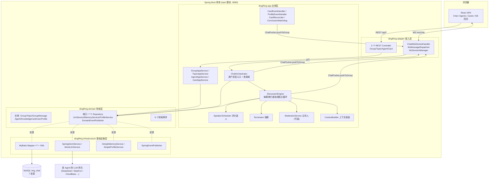

# 01 项目总览

## 系统是什么

DingRing 是一个**多 Agent AI 群聊学习系统**：

1. 用户创建一个群，拉入若干个 AI Agent（每个 Agent 有花名、人设、独立的 LLM 端点配置）
2. 用户在群里像正常聊天一样发消息，引擎自动判定意图（闲聊 CHAT / 讨论 DISCUSS / 收束 CONCLUDE）
3. 判定为讨论时**追溯式自动建题**，多个 Agent 按评分调度轮流发言、互相接力，通过 `[[PASS]]`（让麦）/ `[[CONCLUDE]]`（提议收束）协作
4. 讨论收束时由总结 Agent 生成 **STAR 框架结论**，随后异步提取 **Q&A 知识卡片**供复习
5. 系统持续从用户发言提炼**用户画像**、从历史结论积累**群记忆**，注入后续讨论上下文

## 技术栈

| 层 | 技术 |
|---|---|
| 后端 | Java 21（虚拟线程）、Spring Boot 3.4.7、MyBatis、Spring AI（OpenAI 协议适配） |
| 数据库 | MySQL 8（生产 `ring_chat` 库）/ H2（schema.sql 兼容） |
| 前端 | React 19、Vite 8、TypeScript、react-router-dom 7、marked + DOMPurify |
| 通信 | REST（`/api/*`）+ 原生 WebSocket（`/ws/chat?groupId=`） |
| 构建 | Maven 多模块；前端构建产物直接输出到 `start/src/main/resources/static` 由 Spring Boot 同源托管 |

## 总体架构图



## 模块清单

| Maven 模块 | 职责 | 依赖方向 |
|---|---|---|
| `dingRing-common` | ApiResponse / ErrorCode / BizException / WsConstants 等通用件 | 无依赖 |
| `dingRing-domain` | 实体、枚举、仓储与服务端口、领域事件（纯 POJO，无 Spring Web） | → common |
| `dingRing-app` | 编排引擎、应用服务、DTO、事件监听器、后台任务 | → domain, common |
| `dingRing-infrastructure` | MyBatis 持久化、Spring AI LLM 适配、记忆/画像、事件发布 | → domain, common |
| `dingRing-adapter` | REST Controller、WebSocket 接入 | → app, common |
| `start` | 启动类、application.yml、schema.sql、前端静态资源 | → 全部 |

## 快速开始

```bash
# 1. 后端构建（JDK 21）
export JAVA_HOME=<jdk21路径>
mvn package -DskipTests

# 2. 前端构建（产物自动进 start/src/main/resources/static）
cd frontend && npm install && npm run build

# 3. 启动（默认连生产 MySQL，见 application.yml）
java -jar start/target/start-0.1.0.jar
# 可选：--dingring.llm.mock=true 使用 Mock LLM 离线演示

# 4. 访问 http://localhost:8080
```

前端开发模式：`cd frontend && npm run dev`（Vite :5173，`/api` 与 `/ws` 代理到 :8080）。

## 关键设计决策

| 决策 | 说明 |
|---|---|
| **每群单线程虚拟线程执行器** | 群内所有任务（讨论循环、结论生成）串行，天然免锁；跨群并行 |
| **追溯式建题** | 无手动建题入口，引擎按意图路由（HIGH 置信立即 / LOW 连续 2 次）自动建题并回填闲聊消息 |
| **乐观锁主题状态机** | `topic.version` 保护 `IN_PROGRESS→CONCLUDING→CLOSED` 流转，防并发收束 |
| **群逻辑删除** | `chat_group.deleted=1`，历史消息/主题/卡片保留；引擎查不到群自动退出讨论 |
| **降级链哲学** | Moderator 判定失败→回退评分调度；Agent 调用失败→接力下一候选；流式失败→ABORT 丢弃 |
| **动态 LLM Client** | 每次调用按 Agent 的 baseUrl/apiKey/modelName 现场构建 OpenAiChatModel，一群可混用多家模型 |
