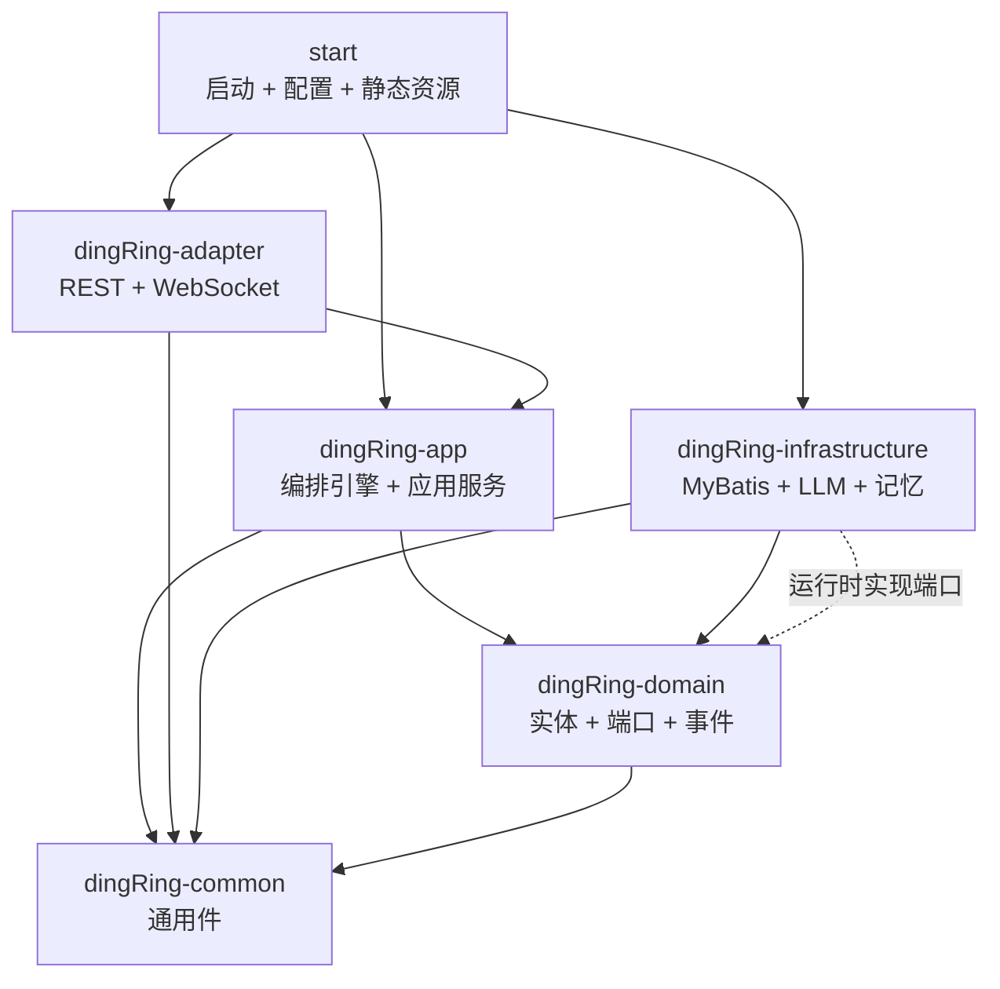

# 02 架构与模块

## 六模块 DDD 分层

项目遵循**依赖倒置**的六边形/DDD 分层：领域层（domain）定义端口接口，基础设施层（infrastructure）实现端口，应用层（app）编排用例，接入层（adapter）暴露协议。领域层不依赖任何框架。

> **要点**：`app` 只依赖 `domain` 的端口接口，不依赖 `infrastructure`；Spring 在运行时把 `infrastructure` 的实现注入端口。`domain` 只依赖 `common`，可独立单测。

## 各模块包结构

### dingRing-common
| 包 | 内容 |
|---|---|
| `exception` | `BizException`、`ParamException`、`ErrorCode`、`GlobalExceptionHandler` |
| `response` | `ApiResponse<T>`、`PageResult<T>` |
| `constant` | `WsConstants`（WS 消息 type 常量） |

### dingRing-domain
| 包 | 内容 |
|---|---|
| `group` | `Group`、`GroupMember`、`GroupMessage`、`MemberRole`、`MemberType`、`SenderType`、`MessageType` + 各 `*Repository` 端口 |
| `discussion` | `Topic`、`TopicStatus`、`KnowledgeCard` + `TopicRepository`/`CardRepository` |
| `agent` | `Agent` + `AgentRepository` |
| `user` | `User`、`UserProfile` + `UserRepository`/`UserProfileRepository` |
| `knowledgebase` | `KnowledgeBase`、`File`（v1 预留，暂未实现后端能力） |
| `event` | 9 个领域事件 + `DomainEvent` 基类 |
| `service` | 服务端口：`DomainEventPublisher`、`LlmService`、`MemoryService`、`ProfileService` |

### dingRing-app
| 包 | 内容 |
|---|---|
| `orchestrator` | `ChatOrchestrator`、`DiscussionEngine`、`SpeakerScheduler`、`Terminator`、`ModeratorService`、`ContextBuilder`、`MessageRouter`、`StreamMarkerGuard` |
| `service` | `GroupAppService`、`TopicAppService`、`AgentAppService`、`CardAppService`、`MessageAssembler` |
| `event` | `CardEventHandler`、`ProfileEventHandler`（`@EventListener`） |
| `task` | `CardReconciler`、`ConclusionWatchdog`（`@Scheduled`） |
| `dto` | `dto/request`、`dto/response` |
| `port` | `ChatPusher`（出站推送端口，adapter 实现） |

### dingRing-infrastructure
| 包 | 内容 |
|---|---|
| `persistence/mapper` | 7 个 MyBatis Mapper 接口 |
| `persistence/repository` | 7 个 `*RepositoryImpl`（实现 domain 端口） |
| `persistence/typehandler` | `GroupMemberListTypeHandler`、`JsonMapTypeHandler` |
| `llm` | `SpringAiLlmService`、`MockLlmService` |
| `memory` | `SimpleMemoryService`、`SimpleProfileService` |
| `event` | `SpringEventPublisher` |

### dingRing-adapter
| 包 | 内容 |
|---|---|
| `rest` | `GroupController`、`TopicController`、`AgentController`、`CardController` |
| `websocket` | `ChatWebSocketHandler`、`WsMessageDispatcher`、`WsSessionManager`、`WebSocketConfig` |

## 配置项全量（application.yml）

> 全仓**仅有一个** `application.yml`，无 profile 文件。

### 数据源与框架
| 配置 | 值 | 说明 |
|---|---|---|
| `server.port` | `8080` | |
| `spring.datasource.url` | `jdbc:mysql://101.33.227.80:3306/ring_chat` | utf8 / Asia/Shanghai / 关 SSL |
| `spring.sql.init.mode` | `never` | 表结构通过 MySQL 手动管理，schema.sql 仅作参考 |
| `mybatis.mapper-locations` | `classpath*:mapper/*.xml` | 开启下划线转驼峰 |

### 自定义 `dingring.*` 前缀
| 配置项 | 默认值 | 作用 |
|---|---|---|
| `llm.mock` | `false` | true=用 MockLlmService 离线演示 |
| `llm.connect-timeout-seconds` | `10` | LLM 连接超时 |
| `llm.read-timeout-seconds` | `120` | LLM 读/块间超时 |
| `llm.default-max-tokens` | `16384` | Agent 未显式配置 `feature.maxTokens` 时的业务发言输出预算 |
| `moderator.enabled` | `false` | 主持人模式开关（关=走评分调度） |
| `moderator.model` | `""` | 空=复用群首个成员 Agent 的模型 |
| `moderator.context-window` | `30` | 主持人决策上下文条数 |
| `streaming.enabled` | `true` | Agent 发言流式推送开关 |
| `orchestrator.context-window` | `200` | 讨论发言上下文条数 |
| `orchestrator.max-rounds` | `100` | 熔断轮次（Agent 发言总数上限） |
| `orchestrator.auto-replies` | `2` | 闲聊态 Agent 自动接续条数 |
| `orchestrator.pace-min-ms` / `pace-max-ms` | `5000` / `15000` | 自主推进节奏随机区间 |
| `orchestrator.converge-pass-count` | `2` | 连续 PASS 收敛阈值 |
| `orchestrator.chat-context-window` | `20` | 闲聊上下文条数 |
| `orchestrator.profile-extract-threshold` | `15` | 闲聊缓冲达此数触发画像提炼 |
| `orchestrator.backfill-limit` | `15` | 建题时回填闲聊消息上限 |
| `orchestrator.concluding-timeout-minutes` | `5` | Watchdog 判定 CONCLUDING 卡死阈值 |
| `orchestrator.card-reconcile-window-days` | `7` | 卡片对账扫描窗口 |

### 日志
- 级别 `com.dingring=info`；文件 `logs/dingring.log`；按日 + 序号滚动；单文件 50MB / 保留 30 天 / 总量 1GB。

## 全局配置类

全仓 main 代码带 `@Configuration` 的类**仅有 `WebSocketConfig`**（注册 WS 端点 + 允许所有 Origin）。

- 无独立 CORS 配置、无 Jackson 定制、无线程池 Bean（并发靠虚拟线程 `Executors.newSingleThreadExecutor` 逐群创建）。
- 启动类 `DingRingApplication`：`@SpringBootApplication` + `@EnableScheduling` + `@MapperScan("com.dingring.infrastructure.persistence.mapper")`；**无 `@EnableAsync`**（异步全靠手动虚拟线程）。
