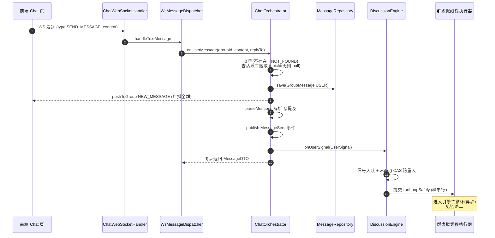
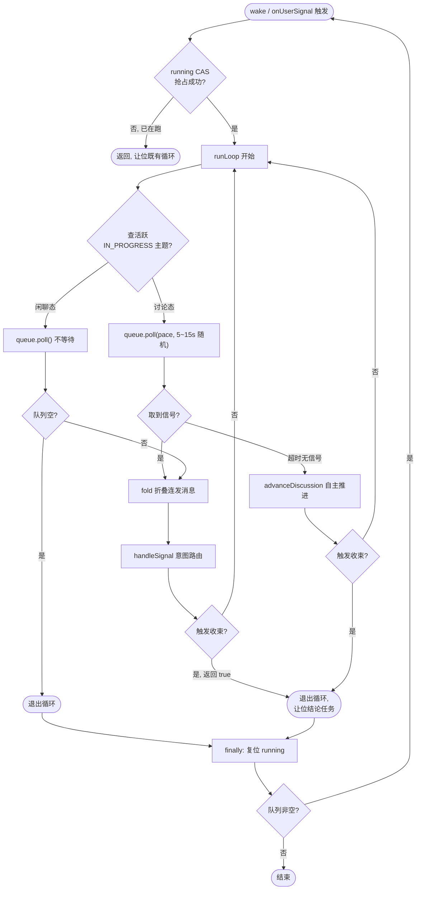
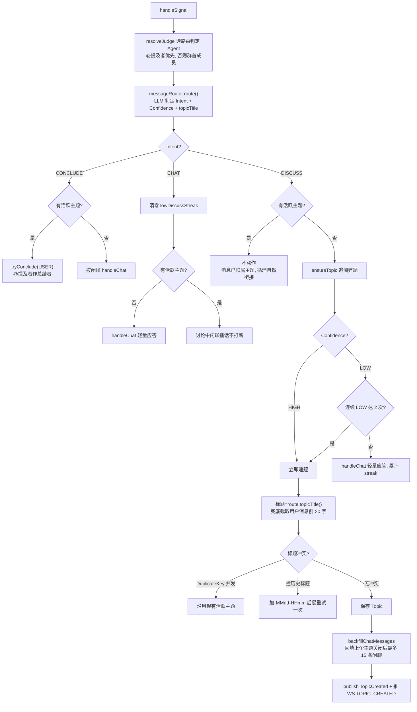
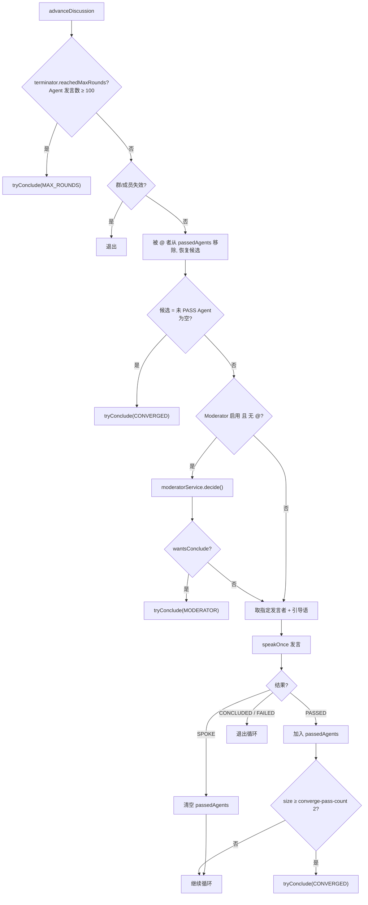
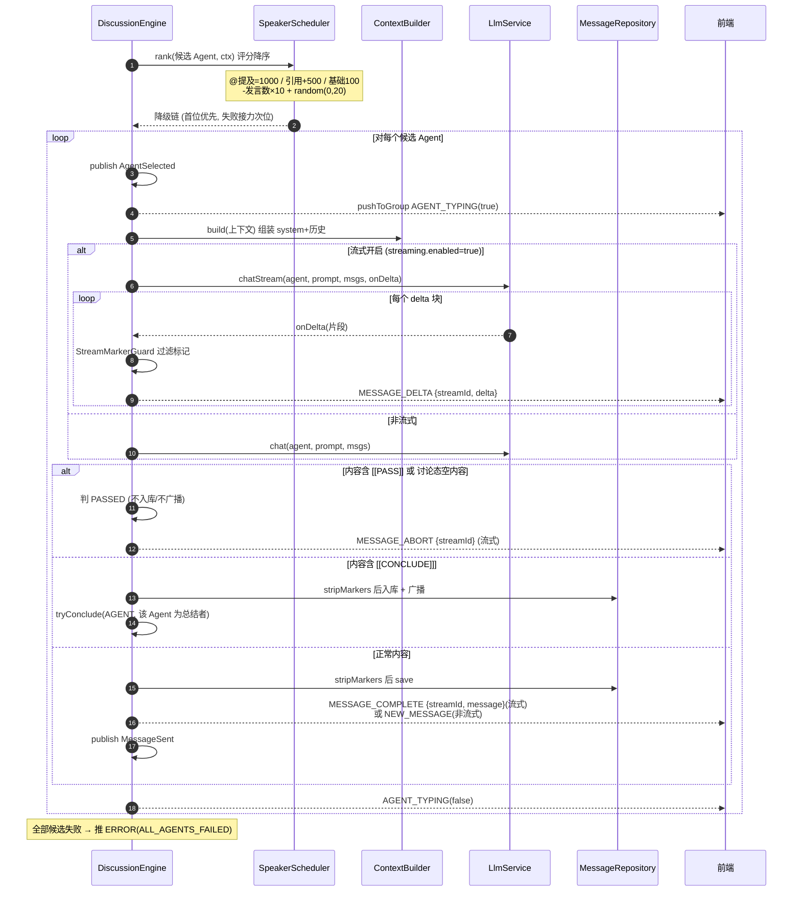
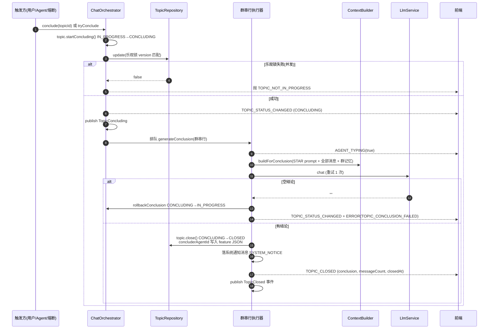
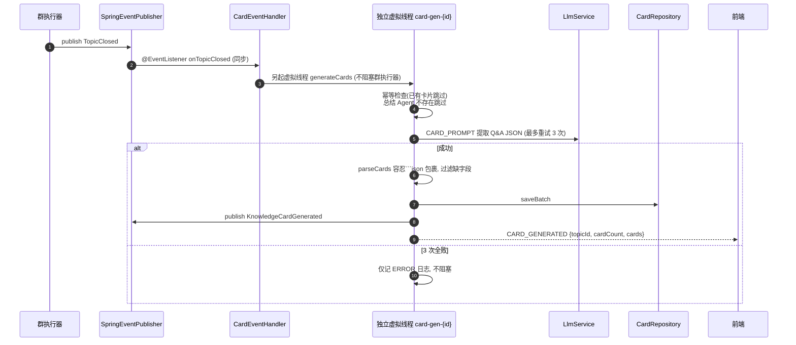
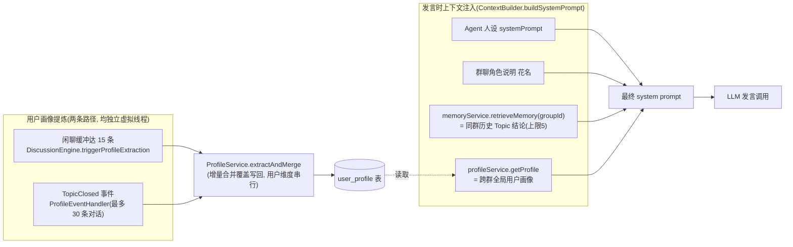
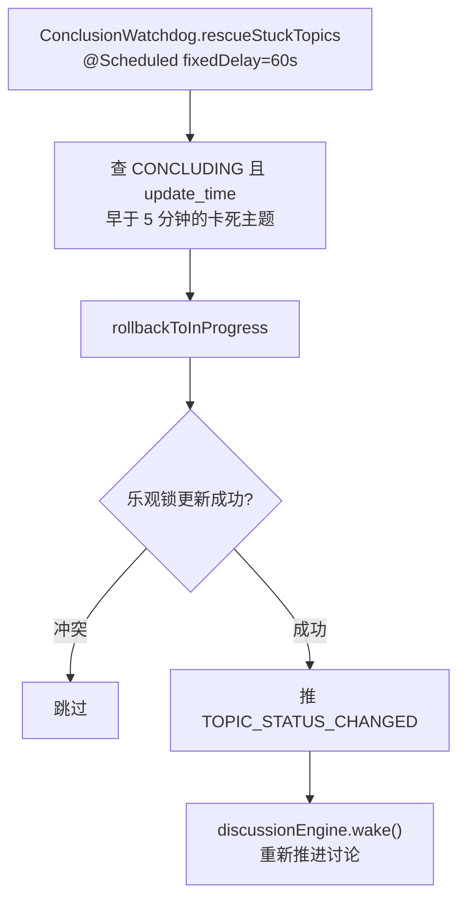

# 03 核心链路图 ⭐

本篇是 wiki 的核心，用时序图 / 流程图详解每条关键链路。所有节点均对应真实类与方法。

---

## 链路一：用户消息全链路（总览）

从用户在前端发一条消息，到 Agent 群展开讨论的完整旅程。

**关键点**：
- `onUserMessage` 同步只做「落库 + 广播 + 投信号」，**意图路由与 Agent 发言全在引擎异步线程**完成。
- 消息落库后**立即**广播 `NEW_MESSAGE`，前端瞬时回显。
- 若群无活跃主题，`topicId=null`（消息暂不归属主题，但仍触发调度，后续建题时回填）。

---

## 链路二：引擎主循环 `runLoop`

引擎的心脏。每群一个单线程虚拟线程执行器，保证群内任务串行。

**为什么收束后要退出循环**：结论生成任务 `generateConclusion` 也排在同一个群串行执行器上。若循环不退出，就会与结论任务**死锁**（同一单线程互等）。因此 `tryConclude` 触发后返回 `true`，让循环让位。

**线程模型**：
- 每群执行器：`Executors.newSingleThreadExecutor` + 虚拟线程工厂，线程名 `group-{id}-`。
- 画像提炼、卡片生成各自另起独立虚拟线程，不占用群执行器。
- `runLoopSafely` 的 `finally` 复位 `running` 后，若队列仍有信号则重新 `wake`（防丢唤醒）。

---

## 链路三：意图路由与追溯建题 `handleSignal`

---

## 链路四：讨论态推进 `advanceDiscussion`

超时无用户信号时，引擎自主驱动 Agent 发言。

**收束触发来源 `triggeredBy` 全集**：`USER`（用户结束/CONCLUDE 意图）、`AGENT`（Agent 自报 `[[CONCLUDE]]`）、`MAX_ROUNDS`（熔断）、`CONVERGED`（连续 PASS 收敛）、`MODERATOR`（主持人判定）、`RECONCILE`（对账重放）。

---

## 链路五：一次 Agent 发言 `speakOnce`（含流式）

**降级链哲学**：`chatWithRetry` 单 Agent 失败重试 1 次（流式重试换新 streamId）；仍失败则发布 `AgentFailed` 并接力评分次高的 Agent；全员失败才推 `ALL_AGENTS_FAILED`。

---

## 链路六：收束与结论生成

**总结者选定**：用户 @提及 或 Agent 自身 `[[CONCLUDE]]` 指定的 Agent 优先；否则 `SpeakerScheduler` 评分最高的成员 Agent 兜底。**无「专家 Agent」概念**，任何成员均可总结。

---

## 链路七：知识卡片提取（事件驱动）

**兜底对账**：`CardReconciler`（`@Scheduled` fixedDelay=10 分钟）扫近 7 天内 CLOSED、有结论但无卡片的主题，构造 `TopicClosed(triggeredBy=RECONCILE)` 重放 `generateCards` 幂等补生成。

---

## 链路八：画像与记忆注入

> 结论生成上下文 `buildForConclusion` 注入**群记忆但不注入用户画像**。Agent 无独立记忆，记忆 = 群维度 Topic 结论 + 用户维度全局画像。

---

## 链路九：卡死主题自愈（Watchdog）

