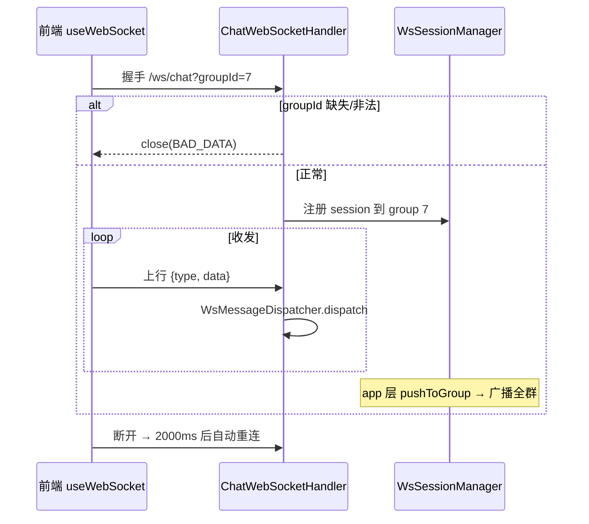
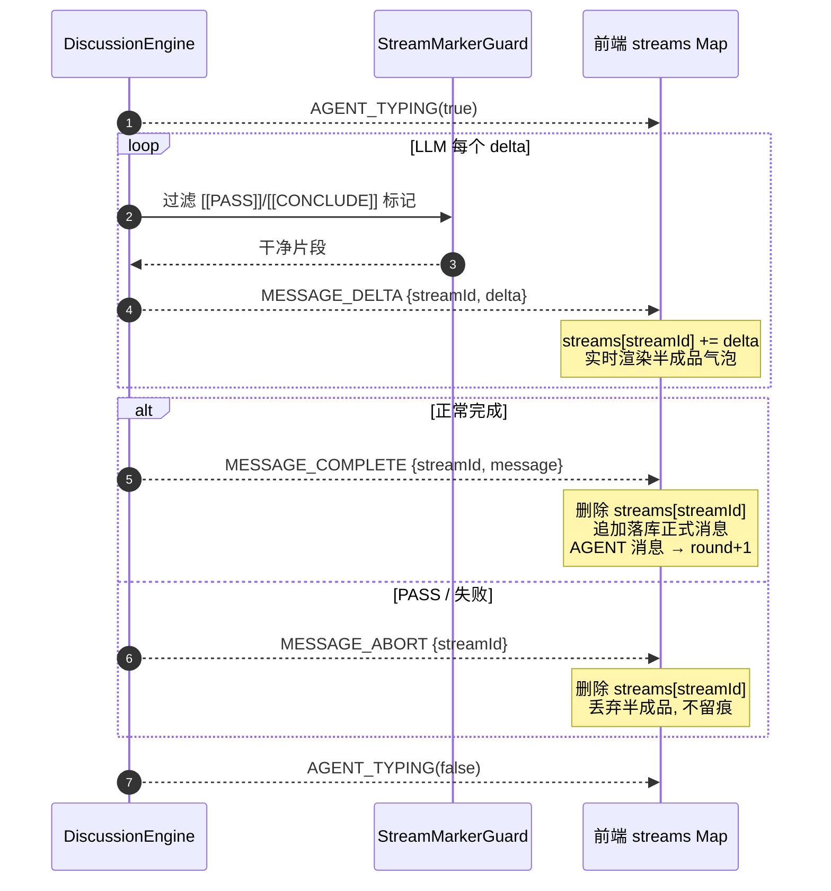

# 05 WebSocket 协议

## 连接与会话

- **连接地址**：`ws(s)://{host}/ws/chat?groupId={id}`（前端按页面协议自动选 `ws`/`wss`）。
- **握手**：`ChatWebSocketHandler` 从 query 解析 `groupId`，缺失/非法则以 `BAD_DATA` 状态关闭（理由「缺少 groupId 参数」）；成功则存入 session attributes 并注册到 `WsSessionManager`。
- **会话管理**：`WsSessionManager` 维护 `groupId → 在线连接集合`（`ConcurrentHashMap` + `CopyOnWriteArraySet`），发送时对同一 session 加锁串行化。
- **无心跳**：处理器不含 ping/pong 逻辑。前端 `useWebSocket` 在 `onclose` 后 **2000ms 定时重连**（组件卸载置 `closed` 标志停止重连）。
- **出站编码**：所有下行统一序列化为 `{ "type": ..., "data": {...} }`。

## 上行消息（C→S）

`WsMessageDispatcher` 按 `type` 路由，未知类型回推 `ERROR(PARAM_INVALID)`：

| type | data 字段 | 处理 |
|---|---|---|
| `SEND_MESSAGE` | `content` | `ChatOrchestrator.onUserMessage`（replyTo 为空） |
| `REPLY_MESSAGE` | `content`, `replyToMessageId` | 同上，带引用消息 ID |
| `CONCLUDE_TOPIC` | `topicId` | `TopicAppService.conclude` 结束讨论 |

异常回推：`BizException` → 其 errorCode；其他 → `INTERNAL_ERROR`。`ERROR` payload 为 `{ success:false, errorCode, message }`。

## 下行消息（S→C）全量

共 10 种。下表列出每种 type 的 payload 字段与推送来源：

| type | payload 字段 | 推送来源（类.方法） |
|---|---|---|
| `NEW_MESSAGE` | 完整 `MessageDTO` | `ChatOrchestrator.onUserMessage` / `saveSystemNotice`；`DiscussionEngine`（非流式发言） |
| `AGENT_TYPING` | `groupId, agentId, agentName, isTyping` | `DiscussionEngine.pushTyping`；`ChatOrchestrator`（结论生成前后） |
| `MESSAGE_DELTA` | `streamId, agentId, agentName, delta` | `DiscussionEngine.StreamEmitter.onDelta`（流式逐块） |
| `MESSAGE_COMPLETE` | `streamId, message(MessageDTO)` | `DiscussionEngine`（流式发言完成，携落库正式消息） |
| `MESSAGE_ABORT` | `streamId` | `DiscussionEngine.StreamEmitter.abort`（PASS/失败丢弃半成品） |
| `TOPIC_CREATED` | `groupId, topicId, title, status, round(0), maxRounds` | `DiscussionEngine`（追溯建题） |
| `TOPIC_STATUS_CHANGED` | `groupId, topicId, title, status, previousStatus` | `ChatOrchestrator.pushTopicStatus`；`ConclusionWatchdog` |
| `TOPIC_CLOSED` | `groupId, topicId, title, conclusion, messageCount, closedAt` | `ChatOrchestrator`（结论生成完成） |
| `CARD_GENERATED` | `topicId, cardCount, cards[{id,question,category}]` | `CardEventHandler` |
| `ERROR` | `success(false), errorCode, message` | `DiscussionEngine`（ALL_AGENTS_FAILED）；`ChatOrchestrator.rollbackConclusion`；Dispatcher |

## 流式发言推送时序

流式（`streaming.enabled=true`）是最复杂的下行链路：

> **注意**：流式路径**只推 MESSAGE_COMPLETE，不再推 NEW_MESSAGE**；非流式路径反之推 NEW_MESSAGE。前端两条 case 都会在 AGENT 消息命中当前主题时把 `round + 1`（与后端熔断口径一致）。

## `ChatPusher` 端口

app 层出站端口 `ChatPusher` 仅有 `pushToGroup(groupId, type, data)` 一个方法（**无 pushToUser**），adapter 层 `WsSessionManager` 实现，向该群全部在线 session 广播。定向单连接（如握手错误）走 `pushToSession`，不经端口。
