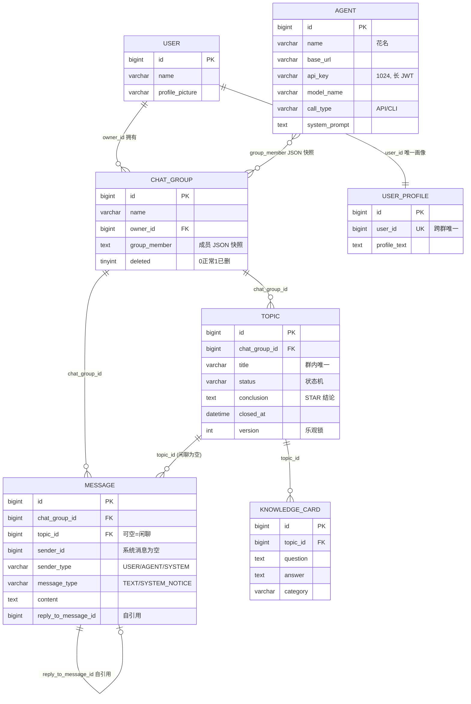
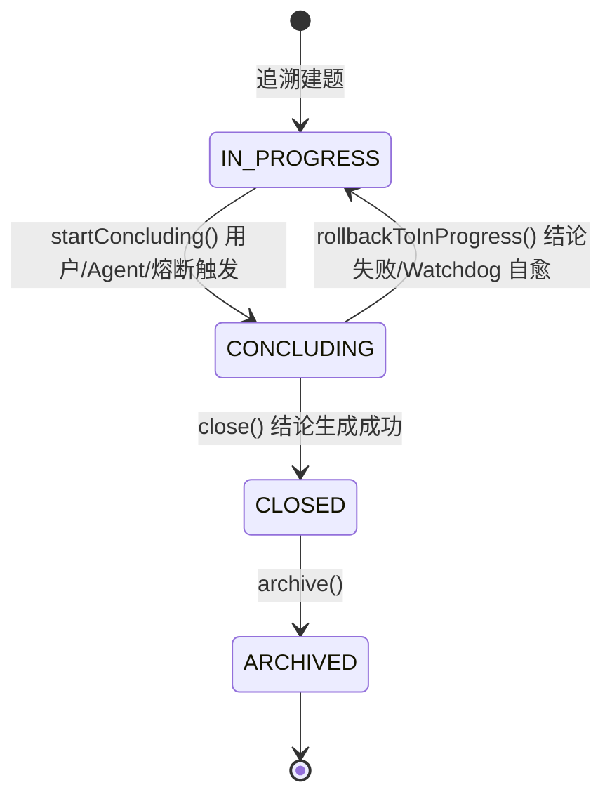

# 06 数据模型

> 数据源：MySQL `ring_chat` 库。`schema.sql` 为 H2/MySQL 兼容 DDL，生产表结构手动管理，此文档以 `schema.sql` 为准。所有表均含 `feature TEXT`（JSON 扩展字段）与 `create_time`/`update_time`。

## ER 图

## 表结构

### `user` — 用户（单用户模式，种子 id=1）
`id` PK · `name` · `profile_picture` · `feature` · 时间戳

### `agent` — AI 成员
`id` PK · `name`（花名）· `profile_picture` · `description` · `base_url` · `api_key`（**VARCHAR(1024)**，兼容长 JWT）· `model_name` · `call_type`（默认 API）· `system_prompt` · `feature` · 时间戳

### `chat_group` — 群
`id` PK · `name` · `owner_id` · `group_member`（成员 JSON 快照）· `knowledge_base_config` · `feature` · **`deleted`（TINYINT，0 正常 / 1 已删，逻辑删除）** · 时间戳

### `topic` — 主题
`id` PK · `chat_group_id` · `title` · `status`（默认 IN_PROGRESS）· `conclusion` · `closed_at` · **`version`（乐观锁）** · `feature`（存 `concludedByAgentId`）· 时间戳
- 唯一键 `uk_topic_group_title (chat_group_id, title)`
- 索引 `idx_topic_group_status (chat_group_id, status)`

### `message` — 消息（用户/Agent/系统统一）
`id` PK · `chat_group_id` · `topic_id`（**可空=闲聊**）· `sender_id`（系统消息为空）· `sender_type` · `message_type`（默认 TEXT）· `content` · `reply_to_message_id`（引用）· `feature` · 时间戳
- 索引 `idx_message_group (chat_group_id, id)`、`idx_message_topic (topic_id, id)`

### `knowledge_card` — 知识卡片
`id` PK · `topic_id` · `question` · `answer` · `category` · `feature` · 时间戳
- 索引 `idx_card_topic (topic_id)`、`idx_card_category (category)`

### `user_profile` — 用户画像（跨群全局）
`id` PK · `user_id` · `profile_text`（纯文本覆盖写回）· `feature` · 时间戳
- 唯一键 `uk_profile_user (user_id)`（upsert）

## 实体 / 仓储 / Mapper 对应

| 领域实体 | 表 | Repository 端口 | RepositoryImpl | Mapper |
|---|---|---|---|---|
| `Group` | chat_group | `GroupRepository` | `GroupRepositoryImpl` | `GroupMapper` |
| `Topic` | topic | `TopicRepository` | `TopicRepositoryImpl` | `TopicMapper` |
| `GroupMessage` | message | `MessageRepository` | `MessageRepositoryImpl` | `MessageMapper` |
| `KnowledgeCard` | knowledge_card | `CardRepository` | `CardRepositoryImpl` | `CardMapper` |
| `Agent` | agent | `AgentRepository` | `AgentRepositoryImpl` | `AgentMapper` |
| `User` | user | `UserRepository` | `UserRepositoryImpl` | `UserMapper` |
| `UserProfile` | user_profile | `UserProfileRepository` | `UserProfileRepositoryImpl` | `UserProfileMapper` |

### TypeHandler
- `GroupMemberListTypeHandler`：`chat_group.group_member` ↔ `List<GroupMember>`
- `JsonMapTypeHandler`：通用 `feature` JSON ↔ `Map<String,Object>`

## 主题状态机

- 状态流转由 `TopicStatus.canTransitTo` 校验，非法流转抛异常。
- 每次状态变更经 `topicRepository.update`（乐观锁 `updateWithVersion`，version 匹配才生效并自增）。
- `concludedByAgentId` 不占列，序列化进 `feature` JSON。

## 关键持久化语义

| 操作 | SQL 语义 |
|---|---|
| 群查询 `findById`/`findAll` | 附加 `WHERE deleted = 0`，`findAll` 按 `update_time DESC` |
| 群删除 `deleteById` | **`UPDATE chat_group SET deleted=1`**（逻辑删除，非物理 DELETE） |
| 卡片删除 `deleteById` | **`DELETE FROM knowledge_card`**（物理删除，返回删除行数） |
| Agent 删除 `deleteById` | 物理 DELETE |
| 主题更新 `updateWithVersion` | `WHERE id=? AND version=?`，SET `version=version+1` |
| 画像 `upsert` | `ON DUPLICATE KEY UPDATE profile_text` |
| 闲聊消息回填 `updateTopicId` | `foreach` 批量把闲聊消息归属到新建主题 |
