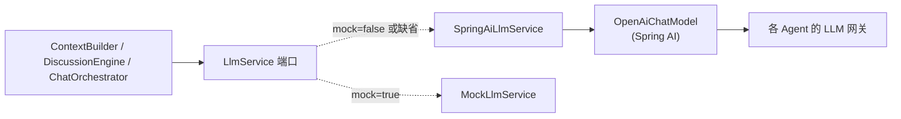
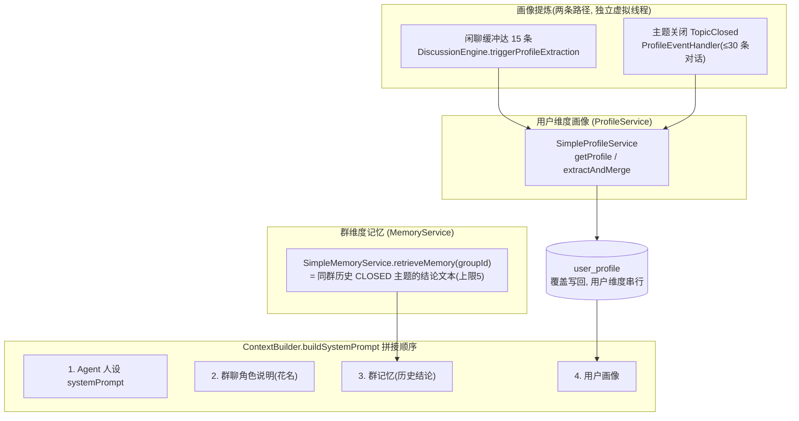

# 07 LLM 集成与记忆

## LlmService 端口

领域层定义端口 `LlmService`（`dingRing-domain/service`），应用层只依赖它：

```java
interface LlmService {
    String chat(Agent agent, String systemPrompt, List<ChatTurn> messages);
    String chatStream(Agent agent, String systemPrompt, List<ChatTurn> messages, Consumer<String> onDelta);
    record ChatTurn(...) // 单轮对话
}
```

两个实现由 `dingring.llm.mock` 开关切换（`@ConditionalOnProperty`）：



## SpringAiLlmService（真实网关）

**装配**：`@ConditionalOnProperty(name="dingring.llm.mock", havingValue="false", matchIfMissing=true)`——默认生效。

**动态建 Client（核心）**：`buildChatModel(agent, options)` **每次调用**按 Agent 领域实体与单次调用选项现场构建 `OpenAiChatModel`。模型参数优先级为 `CallOptions` > Agent `feature` 配置 > 全局默认，因此同一群内不同 Agent 可混用 DeepSeek、StepFun、CloudBase 等不同厂商模型。

- 同步 `chat`：`chatModel.call(Prompt)`，取 `output.getText()`。
- 流式 `chatStream`：`chatModel.stream(Prompt).timeout(readTimeout).toIterable()` 逐块 `onDelta.accept(delta)`；块间超时复用读超时，网关挂起时 Flux 报错退出而非永久卡死引擎线程。
- 超时：连接超时 `connect-timeout-seconds`（默认 10），读/块间超时 `read-timeout-seconds`（默认 120）。
- 失败包装为 `BizException(LLM_API_ERROR)`；完整输出记入日志便于排查静默无回复。

### resolveUrl：网关路径兼容（重要坑）

Spring AI 默认在 `baseUrl` 后拼 `/v1/chat/completions`，导致带路径前缀的网关（如 `https://api.stepfun.com/step_plan/v1`、`https://xxx.tcloudbasegateway.com/v1/ai/cloudbase`）被拼成**双重版本号而 404**。`resolveUrl` 规则：

| baseUrl 形态 | 解析结果 completionsPath |
|---|---|
| 无路径（`https://api.deepseek.com`） | `/v1/chat/completions`（OpenAI 默认） |
| 含路径前缀 | 以该路径为前缀 + `/chat/completions` |
| 已以 `/chat/completions` 结尾 | 原样使用 |

> 流式走 WebClient + JDK HttpClient 连接器（无 reactor-netty 依赖）。

## MockLlmService（离线演示）

**装配**：`@ConditionalOnProperty(name="dingring.llm.mock", havingValue="true")`。按 systemPrompt 内容分流：含「STAR」→模拟结论；含「知识卡片」→模拟卡片 JSON；否则随机模板发言。`chatStream` 按中文句读切块，30~120ms 随机延时逐块回调，模拟打字流。

## 记忆与画像

系统有两类「记忆」，均通过领域端口注入发言上下文：



### 画像提炼细节
- **路径 1**：闲聊消息缓冲累计达 `profile-extract-threshold`（默认 15）条，`DiscussionEngine` 另起虚拟线程提炼后清零缓冲；提炼者 = 群首个 Agent；固定 `DEFAULT_USER_ID=1`。
- **路径 2**：`TopicClosed` 事件触发 `ProfileEventHandler`（虚拟线程），提炼者 = 总结者优先否则群首成员，最多输入 30 条对话；讨论无用户发言则跳过。
- 二者共用 `ProfileService.extractAndMerge`：LLM 读取近期对话 + 既有画像 → 增量合并覆盖写回；按用户维度用 `ConcurrentHashMap` 锁对象串行化；失败仅记日志不影响主流程。

### 注入范围
- **发言上下文** `buildSystemPrompt`：注入 Agent 人设 + 角色说明 + 群记忆 + 用户画像。
- **结论上下文** `buildForConclusion`：注入群记忆但**不注入用户画像**（STAR 框架 prompt + 全部主题消息）。
- Agent **无独立记忆机制**——记忆完全 = 群维度历史结论 + 用户维度全局画像。

## Agent 的 LLM 参数

`Agent` 实体的 `feature` JSON 承载可调参数：
- `temperature()`：未配置时使用 Agent 层默认值 1.0
- `maxTokens()`：未配置时使用 Agent 层默认值 4096；通过 `SaaModelFactory` 构建业务发言模型时，未显式配置则使用 `dingring.llm.default-max-tokens`（默认 16384），以支持较长的 SVG/文档结果
- 单次调用可通过 `LlmService.CallOptions` 覆盖温度、输出 token 上限、读超时与 JSON 模式

参数优先级：`CallOptions` > `feature` > `dingring.llm.default-max-tokens`（超时使用 `dingring.llm.read-timeout-seconds`）。
