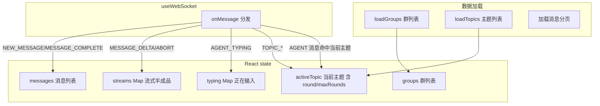

# 08 前端架构

## 技术与结构

React 19 + Vite 8 + TypeScript 单页应用。构建产物 `outDir` 指向 `../start/src/main/resources/static`，由 Spring Boot 同源托管（生产无需代理）。

```
frontend/src/
├── App.tsx           路由表 + 页面切换动画
├── api.ts            REST 封装（get/post/put/del，自动解包 ApiResponse）
├── types.ts          与后端 DTO 一一对应的 TS 接口
├── main.tsx          入口
├── hooks/
│   ├── useWebSocket.ts   WS 连接/重连/收发
│   └── useTheme.ts       dark/light 主题持久化
├── components/       Avatar / GroupSettings / Logo / Modal / Sidebar / Toast
└── pages/
    ├── Chat/         群聊主页面（核心，923 行）
    ├── Agents/       Agent 管理
    ├── Cards/        知识卡片
    └── KB/           RAG 文档库（v1 占位骨架）
```

## 路由表（App.tsx）

| 路径 | 页面 | 加载方式 |
|---|---|---|
| `/` | `ChatPage` | 直接导入（首屏） |
| `/agents` | `AgentsPage` | lazy 懒加载 |
| `/cards` | `CardsPage` | lazy 懒加载 |
| `/kb` | `KBPage` | lazy 懒加载 |
| `*` | 重定向 `/` | — |

`PageTransition` 以 `location.pathname` 为 key 触发主内容区 remount，实现「Editorial Reveal」翻页动画。

## api.ts

无 base 前缀，全部相对路径。`request<T>` 封装 `fetch`：JSON Content-Type → 自动解包 `ApiResponse<T>.data`；非 JSON 抛「网络异常」；`success=false` 抛携带 `errorCode` 的 Error。导出 `API.get/post/put/del`。

## useWebSocket hook

| 行为 | 说明 |
|---|---|
| 连接地址 | `${wss/ws}://${location.host}/ws/chat?groupId=${groupId}` |
| groupId=null | 主动断开 |
| 重连 | `onclose` 后 2000ms 定时重连；组件卸载置 `closed` 标志停止 |
| 消息分发 | 单个 `handlerRef`，`onMessage(handler)` 注册 |
| 发送 | `send(payload)` 返回布尔（连接未就绪返回 false） |

## 组件职责

| 组件 | 职责 |
|---|---|
| `Avatar` | 名字首字符 + 名字哈希映射 8 色头像 |
| `GroupSettings` | 群成员管理抽屉；PUT 群成员；`dirtyCount` 检测改动；约束至少 1 个 Agent |
| `Logo` | 品牌 Logo 兼主题切换按钮（日/月形态） |
| `Modal` | Editorial 风格通用弹窗；Esc 关闭；eyebrow/subtitle/footer 插槽 |
| `Sidebar` | 左侧栏骨架：品牌 + 搜索 + 四项导航 + children + footer |
| `Toast` | 模块级全局 toast 函数 + 容器组件，2400ms 自动退场 |

## Chat 页状态流



### WS 下行 switch(type) 全部 case（Chat/index.tsx）

| case | state 更新 |
|---|---|
| `NEW_MESSAGE` | 追加 messages；AGENT 消息且命中当前主题 → `round+1`；非贴底 → `unseenCount+1`；更新群列表预览/时间 |
| `AGENT_TYPING` | typing Map 按 `isTyping` 增删 `agentId→agentName` |
| `MESSAGE_DELTA` | streams Map 按 `streamId` 累积拼接 delta（流式核心） |
| `MESSAGE_COMPLETE` | 删除 streams 半成品 → 追加正式消息；AGENT → `round+1`；更新预览 |
| `MESSAGE_ABORT` | 删除 streams 对应 streamId（丢弃半成品） |
| `TOPIC_CREATED` | 设置 activeTopic（round 缺省 0、maxRounds 缺省 20）；刷新主题列表；toast |
| `TOPIC_STATUS_CHANGED` | 命中当前主题则更新 status；刷新主题列表 |
| `TOPIC_CLOSED` | activeTopic 置空；刷新主题/群列表；toast |
| `CARD_GENERATED` | toast 显示生成卡片数 |
| `ERROR` | toast 错误信息 |

### 交互能力
- 左侧群列表：最后消息预览/时间、新建群、搜索、**hover 删除群**（确认 → `DELETE /api/groups/{id}` → 本地移除，删当前群则清空右侧并自动切群）。
- 中部消息流：贴底滚动、未读悬浮按钮（`unseenCount`）、Ctrl+F 聊天内搜索、@mention 浮层键盘导航。
- 右侧主题面板：当前主题状态 + **「轮次 round/maxRounds」**；CONCLUDING 显示「已结束」及重新开始按钮。
- 发送：WS `SEND_MESSAGE`/`REPLY_MESSAGE`；结束讨论 `POST conclude`；重新开始 `POST restart`；查看结论 `GET conclusion + cards` 弹窗。

### 流式渲染
`streams` 为 `streamId→累积文本` 的 Map。每个条目渲染成 `id=-1` 的临时「半成品气泡」复用 `MessageItem`（打字中效果）；`MESSAGE_COMPLETE` 到达删除半成品、以后端落库正式消息替换（保证与 DB 一致）；`MESSAGE_ABORT` 直接丢弃。

### Markdown 渲染
`utils.ts` 的 `renderMarkdown`：marked（gfm+breaks）→ DOMPurify 消毒 + 链接补新窗口安全属性 → 仅文本节点做 @提及高亮。`MessageItem`（memo 化）：SYSTEM 含【讨论结论】走 markdown，否则纯文本居中；USER 靠右；非本人消息显示引用回复。

## Agents 页
Agent 列表 + 搜索 + 三联统计（总数/供应商数（按 baseUrl host 去重）/模型数）；新建 POST、编辑先 `GET /api/agents/{id}` 回填（含 apiKey，带骨架屏）；表单：花名/模型名/调用方式(API/CLI)/人设/Base URL/API Key(必填)/系统提示词。

## Cards 页
分类筛选（`GET categories` + `?category=`）；关键词搜索（问题/答案/主题标题）；三联统计（卡片/主题/分类数）；复习模式（`GET review?category&order`，顺序/随机；空格翻面、←→切换、Esc 退出）；**删除卡片**（确认 → `DELETE /api/cards/{id}` → 本地移除 + 刷新分类，详情弹窗同步关闭）。

## KB 页
RAG 文档库**占位骨架**（v1 无后端能力）：documents 恒空；上传按钮仅 toast「即将上线」；展示 4 项 Roadmap（上传/切片/向量化/RAG 检索）；本地 `KbDocument` 状态机 `UPLOADED→CHUNKED→EMBEDDED→READY/FAILED` 与后端 `File` 实体对齐。

## 构建

| 命令 | 作用 |
|---|---|
| `npm run dev` | Vite :5173，`/api`→:8080、`/ws`→:8080(ws) 代理 |
| `npm run build` | `tsc -b` + `vite build`，产物进 `start/static`（`emptyOutDir`） |
| `npm run lint` | oxlint |
| `npm run preview` | 预览产物 |

`tsconfig.app.json`：target es2023、moduleResolution bundler、jsx react-jsx、noEmit、verbatimModuleSyntax、noUnusedLocals/Parameters、noFallthroughCasesInSwitch。
