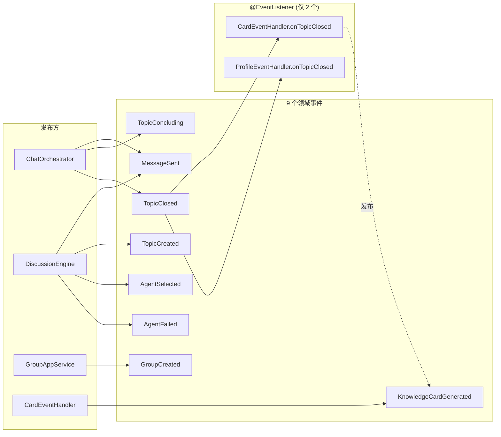
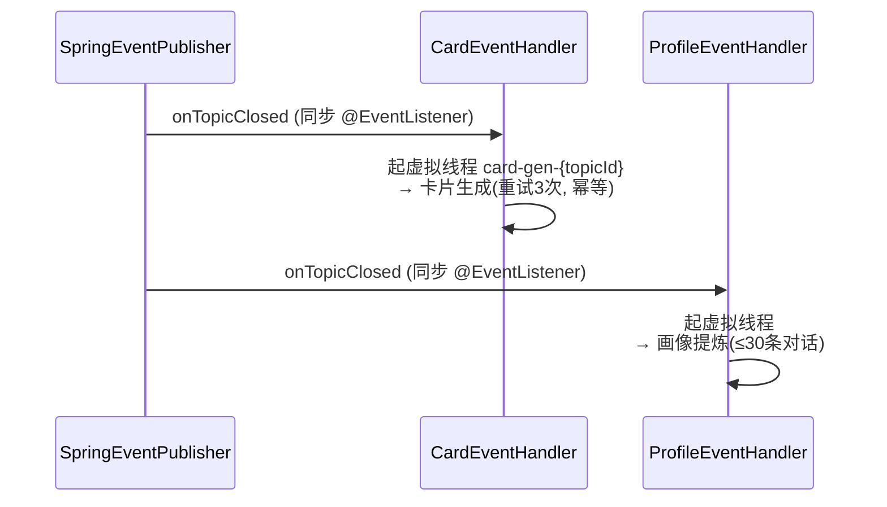
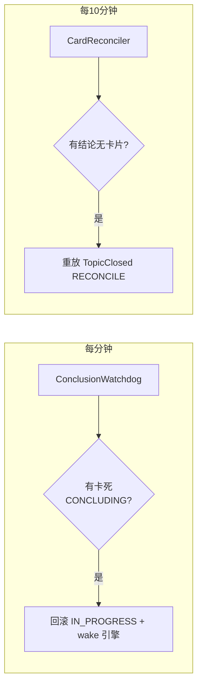

# 09 领域事件与后台任务

## 事件体系

领域层通过端口 `DomainEventPublisher.publish(event)` 发布事件，基础设施层 `SpringEventPublisher` 用 Spring `ApplicationEventPublisher`（**进程内**事件总线）实现。所有事件继承 `DomainEvent`（含 `timestamp`、`eventType()`）。

## 事件清单

| 事件 | 字段 | 发布点 | 监听者 |
|---|---|---|---|
| `MessageSent` | messageId, groupId, topicId, senderId, senderType, content, replyToMessageId, mentionedAgentIds | onUserMessage / speakOnce | 无（预留） |
| `TopicCreated` | topicId, groupId, title | ensureTopic 建题 | 无（预留） |
| `TopicConcluding` | topicId, groupId, title | conclude 进入收束 | 无（预留） |
| `TopicClosed` | topicId, groupId, title, conclusion, messageCount, triggeredBy, concluderAgentId | 结论生成完成 | **CardEventHandler + ProfileEventHandler** |
| `AgentSelected` | groupId, topicId, agentId, agentName, reason(MENTIONED/REPLIED/FREE_SCHEDULE), score | speakOnce 选人 | 无（预留） |
| `AgentFailed` | groupId, topicId, agentId, agentName, errorMessage, fallbackAgentId, fallbackAgentName | 发言失败降级 | 无（预留） |
| `GroupCreated` | groupId, groupName | 创建群 | 无（预留） |
| `KnowledgeCardGenerated` | topicId, groupId, cards（含 `cardCount()`） | 卡片生成成功 | 无（预留） |

> `TopicClosed` 是**唯一有进程内监听者**的事件，其余 7 个仅发布（供日志/未来扩展）。

## `TopicClosed` 的两个监听器

两者均是「同步监听 → 内部转独立虚拟线程」= 实际异步，不阻塞群执行器。

## 后台任务（@Scheduled，全仓仅 2 个）

启动类带 `@EnableScheduling`。

### CardReconciler — 卡片对账补偿
| 项 | 值 |
|---|---|
| 调度 | `fixedDelay=600000ms`（**10 分钟**）、`initialDelay=120000ms` |
| 职责 | 扫近 `card-reconcile-window-days`（默认 7）天内 CLOSED、有结论但无卡片且有总结 Agent 记录的主题 |
| 动作 | 构造 `TopicClosed(triggeredBy=RECONCILE)` 重放 `cardEventHandler.generateCards` 幂等补生成；单主题异常仅记日志继续 |

### ConclusionWatchdog — 卡死主题自愈
| 项 | 值 |
|---|---|
| 调度 | `fixedDelay=60000ms`（1 分钟）、`initialDelay=60000ms` |
| 职责 | 查 CONCLUDING 且 `update_time` 早于 `concluding-timeout-minutes`（默认 5）分钟的卡死主题 |
| 动作 | `rollbackToInProgress` + 乐观锁更新（冲突跳过）+ 推 `TOPIC_STATUS_CHANGED` + `discussionEngine.wake()` 重新推进 |

## 事件驱动的设计意图

- **解耦主流程与副产物**：结论生成（主流程）只管 close + 发 `TopicClosed`；卡片提取、画像提炼作为「副产物」监听事件异步进行，失败不影响结论。
- **幂等 + 对账兜底**：卡片生成幂等（已有则跳过），配合 `CardReconciler` 定时对账，保证「结论成功但卡片因 LLM 失败漏生成」最终补齐。
- **自愈**：`ConclusionWatchdog` 兜住「结论生成中进程崩溃 / LLM 卡死」导致主题永久停在 CONCLUDING 的情况。
