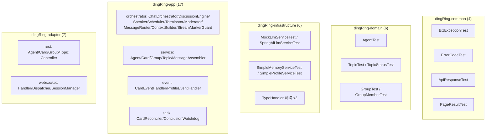
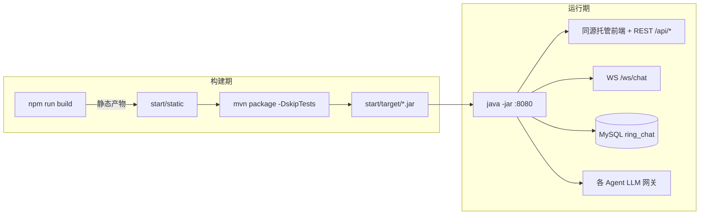

# 10 测试与构建

## 测试布局

后端测试按模块分层组织，每个模块 `src/test/java` 与其 `src/main` 结构对齐，共 **40 个测试类、294 个用例全绿**。前端 v1 暂无自动化测试。

### 各模块测试职责

| 模块 | 测试类数 | 覆盖重点 |
|---|---|---|
| `dingRing-common` | 4 | 异常体系、`ApiResponse`/`PageResult` 包装语义 |
| `dingRing-domain` | 6 | 实体不变量、`TopicStatus` 状态机合法迁移、乐观锁字段 |
| `dingRing-infrastructure` | 6 | LLM 双实现（真实 `resolveUrl` 路径兼容 / Mock 分流）、记忆与画像、JSON TypeHandler |
| `dingRing-app` | 17 | 引擎编排核心：调度评分、终止判定、收束、意图路由、上下文拼装、事件监听、后台补偿任务 |
| `dingRing-adapter` | 7 | REST Controller 契约、WS 消息分发与会话管理 |

> 引擎相关（`orchestrator` 包）是测试最密集处，覆盖 `SpeakerScheduler` 评分、`Terminator` 熔断/收敛、`StreamMarkerGuard` 流式标记剥离等易错逻辑。

## 构建命令

### 环境前提

- **JDK 21**（项目使用虚拟线程）。本机 `JAVA_HOME` 指向 `~/Library/Java/JavaVirtualMachines/jbr-21.0.11/Contents/Home`。
- **Node** 用于前端构建（Vite 8）。
- MySQL `ring_chat`（`101.33.227.80:3306`）——运行时依赖，构建/单测不需要。

### 后端

| 命令 | 作用 |
|---|---|
| `mvn package -DskipTests` | 全量打包（产出 `start/target/*.jar` 可执行 fat jar） |
| `mvn test` | 全量运行 294 个用例 |
| `mvn install -q -DskipTests -pl dingRing-common,dingRing-domain,dingRing-infrastructure` | **单独跑 app/adapter 模块测试前的必要步骤**——先把下游模块装进本地仓库，否则 `-pl` 单模块测试因缺依赖失败 |

> 多模块聚合由根 `pom.xml` 管理；`start` 模块聚合 adapter + infrastructure + app，是唯一含 `spring-boot-maven-plugin` 的可执行模块。

### 前端

| 命令 | 作用 |
|---|---|
| `npm run dev` | Vite dev server :5173，`/api`→:8080、`/ws`→:8080(ws) 代理 |
| `npm run build` | `tsc -b` + `vite build`，**产物直接输出到 `start/src/main/resources/static`**（`emptyOutDir`），随后端一起打包 |
| `npm run lint` | oxlint 静态检查 |

前端与后端**同源部署**：`npm run build` 后再 `mvn package`，前端静态资源被打进 fat jar，运行时由 Spring Boot 在 `:8080` 一并托管，无需独立部署或反向代理。

## 部署与运行模式

### 运行开关

| 场景 | 启动参数 |
|---|---|
| 正常运行（默认） | `java -jar start/target/*.jar` —— `dingring.llm.mock` 缺省即 `false`，走真实 LLM 网关 |
| **离线演示 / 无网络** | 追加 `--dingring.llm.mock=true` —— 使用 `MockLlmService`，无需任何 LLM API Key 即可完整体验讨论/收束/卡片流程 |

- 单进程 Spring Boot 单体应用，监听 `:8080`，前后端同源。
- `@EnableScheduling` 已开启，`CardReconciler`（10 分钟）与 `ConclusionWatchdog`（1 分钟）随应用自动运行。
- 数据库表结构见 [06 数据模型](06-数据模型.md)；`schema.sql` 为参考，生产表结构通过 MySQL MCP 手动管理。

## 沙箱注意事项（本地开发）

- 连接远程 MySQL、监听本地端口、跑起服务这类需要突破沙箱写/网络限制的操作，需以提升权限方式执行。
- 单测默认使用内存桩（Mockito / 假仓储），不触网、不连库，可在沙箱内直接运行。
