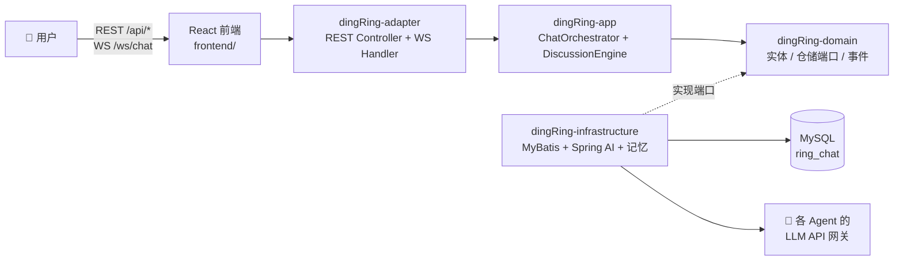

# DingRingJ Wiki

> DingRing —— 多 Agent AI 群聊学习系统。用户在群里像聊天一样抛出话题，多个 AI Agent（花名同学）自主展开讨论、互相接力/让麦，最终由总结者产出 STAR 结论并沉淀为可复习的知识卡片。

## 目录

| 篇章 | 内容 |
|---|---|
| [01 项目总览](01-项目总览.md) | 系统能力、技术栈、总体架构图、快速开始 |
| [02 架构与模块](02-架构与模块.md) | 六模块 DDD 分层、模块依赖图、包结构、全部配置项 |
| [03 核心链路图](03-核心链路图.md) | ⭐ 用户消息全链路、引擎主循环、建题/发言/收束/卡片各链路时序图与流程图 |
| [04 REST API 参考](04-REST-API参考.md) | 全部 REST 端点、DTO、异常映射 |
| [05 WebSocket 协议](05-WebSocket协议.md) | 上/下行消息类型、流式推送时序、会话管理 |
| [06 数据模型](06-数据模型.md) | ER 图、7 张表结构、实体/仓储/Mapper 对应关系 |
| [07 LLM 集成与记忆](07-LLM集成与记忆.md) | LlmService 端口、Spring AI 网关适配、Mock、记忆与画像 |
| [08 前端架构](08-前端架构.md) | 页面路由、WebSocket hook、状态流、构建产物 |
| [09 领域事件与后台任务](09-领域事件与后台任务.md) | 事件体系图、监听器、Watchdog/Reconciler 补偿任务 |
| [10 测试与构建](10-测试与构建.md) | 测试布局、构建命令、部署模式 |

## 一图速览

## 核心概念速查

| 概念 | 说明 |
|---|---|
| **群 (Group)** | 1 个用户（单用户模式，`DEFAULT_USER_ID=1`）+ N 个 Agent 成员；删除为逻辑删除（`deleted=1`），历史数据保留 |
| **主题 (Topic)** | 一次讨论。一个群同时只有一个 `IN_PROGRESS` 主题；由引擎**追溯式自动建题**（无手动入口）。状态机：`IN_PROGRESS → CONCLUDING → CLOSED → ARCHIVED`，乐观锁 `version` 保护 |
| **轮次 (Round)** | 主题内 Agent 发言条数（`Terminator.currentRound`），达 `max-rounds`（默认 100）熔断收束 |
| **`[[PASS]]` / `[[CONCLUDE]]`** | Agent 协作协议标记：让麦 / 提议收束。不同 Agent 连续 PASS 达 2 次 → 自然收敛 |
| **结论 (Conclusion)** | 收束时由总结 Agent 按 STAR 框架生成，写回 `topic.conclusion` |
| **知识卡片 (KnowledgeCard)** | 主题关闭后由 LLM 从结论异步提取的 Q&A，支持分类筛选与翻面复习；删除为物理删除 |
| **画像 (UserProfile)** | 从用户发言中 LLM 提炼的全局画像，注入后续讨论上下文 |
