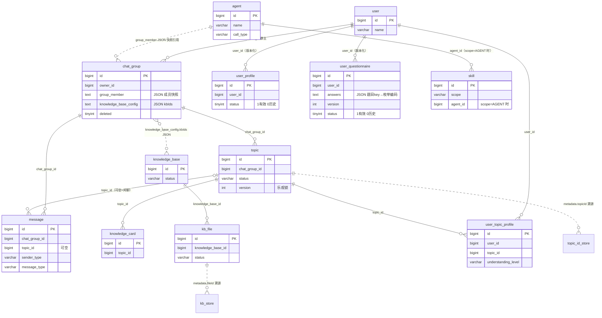
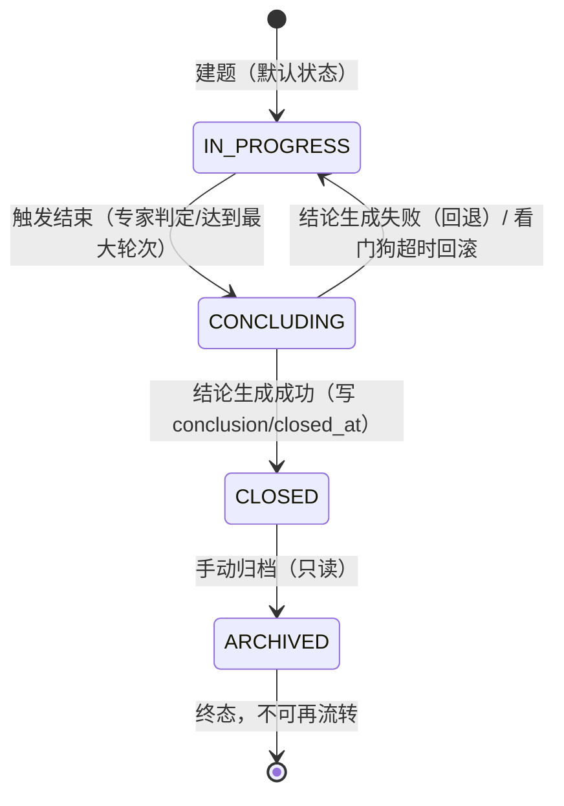
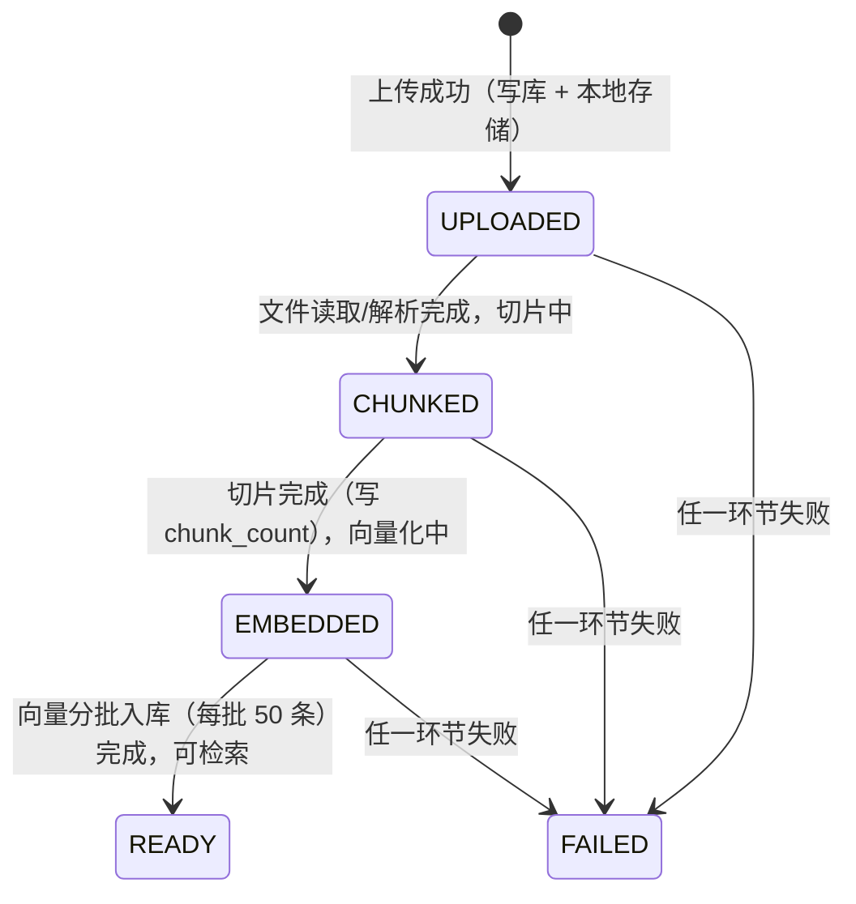

# 数据模型

[← 返回 Wiki 导航](./README.md)

> 本文面向后端开发与运维排查，逐表说明 DingRingJ（多 Agent AI 群聊学习系统）的数据模型。
> 事实来源（以此为准，列名/类型/枚举值与源码完全一致）：
>
> - MySQL 建表语句：`start/src/main/resources/schema.sql`（种子数据：`start/src/main/resources/data.sql`）
> - 状态枚举：`dingRing-domain/src/main/java/com/dingring/domain/` 下各包（`TopicStatus` / `SenderType` / `MessageType` / `MessageTag` / `MemberRole` / `MemberType` 等）
> - 向量表配置：`dingRing-infrastructure/src/main/java/com/dingring/infrastructure/rag/config/PgVectorStoreConfig.java`、`VectorDataSourceConfig.java`
> - 数据源配置：`start/src/main/resources/application.yml`

---

## 1. 数据源总览

系统使用**双数据库**架构：MySQL 存业务数据，PostgreSQL（pgvector 扩展）存向量数据。

| 数据源 | 库名 | 访问方式 | 职责 |
| --- | --- | --- | --- |
| MySQL 主库 | `ring_chat` | Spring `spring.datasource`（@Primary）+ MyBatis，连接池 `DingRingHikariPool` | 全部业务表：用户、Agent、群、主题、消息、知识卡片、知识库元信息、文件元信息、用户画像、技能 |
| PostgreSQL 第二数据源 | `ring_rag` | `VectorDataSourceConfig` 手动创建 `vectorDataSource` / `vectorJdbcTemplate`（连接池 `DingRingPgVectorPool`），**不经 MyBatis** | 仅存向量数据：`kb_store`（知识库文档切片向量）、`topic_id_store`（话题标题向量） |

关键说明：

1. **`spring.sql.init.mode=never`**：`application.yml` 中显式配置为 `never`，即 `schema.sql` / `data.sql` **不会在应用启动时自动执行**。生产环境表结构通过 MySQL MCP 手动管理；这两个文件仅作为新环境初始化参考与 H2 演示模式（H2 MODE=MySQL）的建表脚本。
2. **PgVectorStore 手动构建**：`application.yml` 排除了 `PgVectorStoreAutoConfiguration`（否则自动配置会错误地用 MySQL 主数据源执行 pgvector SQL 导致启动失败），由 `PgVectorStoreConfig` 基于第二数据源创建**两个** `PgVectorStore` 实例：
   - `kbVectorStore`（@Primary，表 `kb_store`）：知识库文档切片向量；
   - `topicVectorStore`（表 `topic_id_store`）：话题标题向量（语义回溯）。
   两者共用 `vectorJdbcTemplate` 与同一 `EmbeddingModel`（SiliconFlow `Qwen/Qwen3-Embedding-0.6B`，1024 维），距离类型均为余弦（COSINE_DISTANCE），`initializeSchema=true` 时应用启动自动建表 + HNSW 索引。
3. **RAG 总开关 `dingring.rag.enabled`**：为 `false` 时不加载向量库数据源 / PgVectorStore / RAG Hook，群聊主流程不受影响（RAG 是增强不是依赖）。
4. **无物理外键**：`schema.sql` 中所有表间关系均为逻辑关联（无 `FOREIGN KEY`），由应用层维护一致性，排查时注意孤儿数据的可能性。
5. **通用约定**：主键统一 `BIGINT AUTO_INCREMENT`；几乎每张表都有 `feature TEXT` 扩展 JSON 列（MyBatis 侧由 `JsonMapTypeHandler` 映射为 `Map<String,Object>`）与 `create_time` / `update_time DATETIME NOT NULL DEFAULT CURRENT_TIMESTAMP`。

### 表清单总览

| # | 表 | 所在库 | 用途 | 状态/枚举列 |
| --- | --- | --- | --- | --- |
| 1 | `user` | ring_chat | 用户（单用户模式） | — |
| 2 | `agent` | ring_chat | AI 成员（花名/人设/模型配置） | `call_type`：API/CLI |
| 3 | `chat_group` | ring_chat | 群（成员快照存 JSON） | `deleted`：0/1 |
| 4 | `topic` | ring_chat | 讨论主题（状态机 + 乐观锁） | `status`：IN_PROGRESS/CONCLUDING/CLOSED/ARCHIVED |
| 5 | `message` | ring_chat | 群消息（用户/Agent/系统统一存储） | `sender_type`、`message_type`、feature 内 `tag` |
| 6 | `knowledge_card` | ring_chat | 知识卡片（Q&A） | — |
| 7 | `knowledge_base` | ring_chat | 知识库（元信息） | `status`：ACTIVE/PROCESSING/FAILED |
| 8 | `kb_file` | ring_chat | 知识库文件（元信息） | `status`：UPLOADED/CHUNKED/EMBEDDED/READY/FAILED |
| 9 | `user_profile` | ring_chat | 用户全局画像（版本化） | `status`：1 有效 / 0 历史 |
| 10 | `user_topic_profile` | ring_chat | 话题级用户画像（追加式） | `understanding_level`：BEGINNER/INTERMEDIATE/ADVANCED |
| 11 | `skill` | ring_chat | 技能（工具组 + 附加提示词） | `scope`：GLOBAL/AGENT；`status`：ACTIVE/INACTIVE |
| 12 | `user_questionnaire` | ring_chat | 用户问卷答案（画像主数据，版本化） | `status`：1 有效 / 0 历史；`version` 每次重填 +1 |
| 13 | `kb_store` | ring_rag | 知识库文档切片向量（自动建表） | — |
| 14 | `topic_id_store` | ring_rag | 话题标题向量（自动建表） | — |

### 表间关系 ER 图



> 实线 `||--o{` 表示同库内的逻辑一对多；虚线 `}o..o{` / `||..o{` 表示跨 JSON 字段或跨库的弱关联（无物理外键）。

---

## 2. MySQL 主库 ring_chat 表详解

### 2.1 `user` — 用户表

**用途**：登录用户。当前为**单用户模式**，种子数据（`data.sql`）固定 `id=1`（用户名"我"）。

| 列 | 类型 | 约束/默认 | 说明 |
| --- | --- | --- | --- |
| `id` | BIGINT | PK, AUTO_INCREMENT | 主键 |
| `name` | VARCHAR(64) | NOT NULL | 用户名 |
| `profile_picture` | VARCHAR(512) | NULL | 头像 URL |
| `feature` | TEXT | NULL | 扩展字段(JSON) |
| `create_time` / `update_time` | DATETIME | NOT NULL DEFAULT CURRENT_TIMESTAMP | 创建/更新时间 |

**索引与约束**：仅主键。

---

### 2.2 `agent` — Agent 表（AI 成员）

**用途**：AI 群成员的"人设卡"：花名、头像、简介、LLM 端点（Base URL / API Key / 模型名）与系统提示词。种子数据预置 4 个 Agent：老王、小林、阿源、苏教授。

| 列 | 类型 | 约束/默认 | 说明 |
| --- | --- | --- | --- |
| `id` | BIGINT | PK, AUTO_INCREMENT | 主键 |
| `name` | VARCHAR(64) | NOT NULL | 花名 |
| `profile_picture` | VARCHAR(512) | NULL | 头像 URL |
| `description` | VARCHAR(255) | NULL | 一句话简介 |
| `base_url` | VARCHAR(255) | NULL | LLM API Base URL |
| `api_key` | VARCHAR(1024) | NULL | LLM API Key（部分网关用长 JWT，故 >255） |
| `model_name` | VARCHAR(64) | NULL | 模型名 |
| `call_type` | VARCHAR(32) | NOT NULL DEFAULT 'API' | 调用方式：**API / CLI** |
| `system_prompt` | TEXT | NULL | 人设提示词 |
| `feature` | TEXT | NULL | 扩展字段(JSON)：`temperature`、`maxTokens`、`routeJudge` 等 |
| `create_time` / `update_time` | DATETIME | NOT NULL DEFAULT CURRENT_TIMESTAMP | 创建/更新时间 |

**索引与约束**：仅主键。

**排查要点**：
- `feature.routeJudge=true` 的 Agent 是专职意图路由判定器，不参与群讨论，Agent 管理列表/加群选择器会过滤掉。
- `feature.maxTokens` 未配置时全局默认 100000（`dingring.llm.default-max-tokens`）。
- 演示模式（H2）下 API Key 为 mock 值，生产 Key 存于此表，注意脱敏。

---

### 2.3 `chat_group` — 群表

**用途**：群聊容器。成员不建关联表，而是以 JSON 快照存在 `group_member` 列；群与知识库的绑定同样以 JSON 存于 `knowledge_base_config`。

| 列 | 类型 | 约束/默认 | 说明 |
| --- | --- | --- | --- |
| `id` | BIGINT | PK, AUTO_INCREMENT | 主键 |
| `name` | VARCHAR(128) | NOT NULL | 群名 |
| `owner_id` | BIGINT | NOT NULL | 群主用户 ID |
| `group_member` | TEXT | NULL | 成员列表(JSON)：`[{"id":10,"type":"AGENT","role":"MEMBER"}]` |
| `knowledge_base_config` | TEXT | NULL | 知识库配置(JSON)：`{"kbIds":[1,2]}` |
| `feature` | TEXT | NULL | 扩展字段(JSON) |
| `deleted` | TINYINT | NOT NULL DEFAULT 0 | 逻辑删除：0 正常 / 1 已删 |
| `create_time` / `update_time` | DATETIME | NOT NULL DEFAULT CURRENT_TIMESTAMP | 创建/更新时间 |

**索引与约束**：仅主键（无 owner_id 索引，按群主查群为全表扫描，单用户模式下无影响）。

**成员快照 JSON 结构**（`GroupMember`：`{"id","type","role"}`）：
- `type`（`MemberType` 枚举）：`USER` / `AGENT`——用 type 区分 ID 归属哪张表（`user.id` 与 `agent.id` 可能重复）；
- `role`（`MemberRole` 枚举）：`OWNER` / `MEMBER`——**所有 Agent 成员地位平等（MEMBER）**，任意 Agent 均可参与讨论与总结，不区分专家角色。

**与知识库的关联方式**：`knowledge_base_config` JSON 中以 key `kbIds`（`Group.KB_IDS_KEY`）存放绑定的知识库 ID 列表，是写入与读取的单一来源；`Group.boundKbIds()` 读取（JSON 数字经 `Number.longValue()` 归一为 Long）。RAG 检索只注入绑定库的内容。**knowledge_base 表本身不持有任何群/作用域字段，关联完全由群侧表达。**

---

### 2.4 `topic` — 主题表 ⭐（核心状态机）

**用途**：群内讨论主题。一个主题对应一段结构化讨论的生命周期，由状态机驱动；关闭后由总结者（STAR 框架）生成结论，并异步提取知识卡片、写入话题画像与话题标题向量。

| 列 | 类型 | 约束/默认 | 说明 |
| --- | --- | --- | --- |
| `id` | BIGINT | PK, AUTO_INCREMENT | 主键 |
| `chat_group_id` | BIGINT | NOT NULL | 所属群 ID |
| `title` | VARCHAR(255) | NOT NULL | 主题标题（同群内不重复） |
| `status` | VARCHAR(32) | NOT NULL DEFAULT 'IN_PROGRESS' | 状态：IN_PROGRESS / CONCLUDING / CLOSED / ARCHIVED |
| `conclusion` | TEXT | NULL | 总结者 STAR 结论（Markdown） |
| `closed_at` | DATETIME | NULL | 关闭时间 |
| `version` | INT | NOT NULL DEFAULT 0 | **乐观锁版本号** |
| `feature` | TEXT | NULL | 扩展字段(JSON)：含 `concludedByAgentId`（总结 Agent ID） |
| `create_time` / `update_time` | DATETIME | NOT NULL DEFAULT CURRENT_TIMESTAMP | 创建/更新时间 |

**索引与约束**：
- `uk_topic_group_title` **UNIQUE (chat_group_id, title)** —— 同群标题唯一（建题防重的数据库兜底）；
- `idx_topic_group_status (chat_group_id, status)` —— 按群 + 状态查主题（含活跃主题查询）。

#### status 状态机（`TopicStatus` 枚举，流转校验 `canTransitTo`）



| 当前状态 | 允许流转到 | 触发条件 |
| --- | --- | --- |
| IN_PROGRESS（讨论进行中，接收消息） | CONCLUDING | 用户/系统触发结束（专家判定收敛、达到 `dingring.orchestrator.max-rounds` 最大轮次等） |
| CONCLUDING（已触发结束，AI 生成结论中） | CLOSED（结论成功）；IN_PROGRESS（结论失败回退） | 结论生成成功写 `conclusion`/`closed_at`；失败回退继续讨论 |
| CLOSED（结论已生成，讨论关闭） | ARCHIVED | 手动归档 |
| ARCHIVED（归档，只读） | 无（终态） | — |

非法流转由 `Topic.transitTo()` 抛出 `BizException`（`ErrorCode.TOPIC_NOT_IN_PROGRESS`）拦截。

**与状态相关的辅助机制（排查时注意）**：
- **看门狗回滚**：`CONCLUDING` 状态超过 `dingring.orchestrator.concluding-timeout-minutes`（默认 5 分钟）视为卡死，由看门狗按 `update_time`（`findConcludingBefore`）扫出并回滚为 IN_PROGRESS——因此 `update_time` 会随每次乐观锁更新刷新。
- **卡片对账**：`findClosedSince` 按 `closed_at` 回溯对账窗口（默认 7 天）内已关闭主题的知识卡片。

#### version 乐观锁

主题更新统一走 `TopicMapper.updateWithVersion`：

```sql
UPDATE topic
SET ..., version = version + 1, update_time = #{updateTime}
WHERE id = #{id} AND version = #{version}
```

version 不匹配则更新 0 行，防止并发下状态机被交叉覆盖（如看门狗回滚与结论成功并发）。

#### "每群至多一个活跃主题"的保证方式

该约束**没有数据库层唯一索引兜底**（MySQL 不支持部分唯一索引，DDL 中 `(chat_group_id, status)` 仅是普通索引），由以下三层配合保证：

1. **领域不变式**：`Topic` 聚合根声明"一个群同时只有一个 IN_PROGRESS 的 Topic（version 乐观锁防并发创建）"；
2. **群内串行执行**：每群对话引擎（`DiscussionEngine`）采用信号队列 + 虚拟线程串行执行器，同一群的消息处理（含建题）天然串行；
3. **建题防冲突**：`EnsureTopicNode` 建题时若命中 `uk_topic_group_title` 唯一约束抛出 `DuplicateKeyException`——群内已有活跃主题则沿用现有主题；仅与**历史**主题标题撞车则加 `MMdd-HHmm` 时间后缀重试一次，仍冲突则放弃建题。

活跃主题的统一查询口径：`findActiveByGroupId` = `WHERE chat_group_id = ? AND status = 'IN_PROGRESS' LIMIT 1`。排查时若发现同群多条 IN_PROGRESS 记录，说明出现了脏数据（如绕过串行执行器手工改库），需人工修正。

---

### 2.5 `message` — 消息表

**用途**：群内所有消息统一存储（用户消息、Agent 发言、系统通知）。`topic_id` 由后端入库时自动填充：查群的活跃 Topic，有则归属，无则为 NULL（闲聊）。

| 列 | 类型 | 约束/默认 | 说明 |
| --- | --- | --- | --- |
| `id` | BIGINT | PK, AUTO_INCREMENT | 主键 |
| `chat_group_id` | BIGINT | NOT NULL | 所属群 ID |
| `topic_id` | BIGINT | NULL | 所属主题 ID（**闲聊为空**） |
| `sender_id` | BIGINT | NULL | 发送者 ID（**系统消息为空**；用户消息 = user.id，Agent 消息 = agent.id，靠 sender_type 区分） |
| `sender_type` | VARCHAR(16) | NOT NULL | 发送者类型：**USER / AGENT / SYSTEM**（`SenderType` 枚举） |
| `message_type` | VARCHAR(16) | NOT NULL DEFAULT 'TEXT' | 消息类型：**TEXT / IMAGE / FILE / SYSTEM_NOTICE**（`MessageType` 枚举） |
| `content` | TEXT | NOT NULL | 消息内容 |
| `reply_to_message_id` | BIGINT | NULL | 引用回复的消息 ID |
| `feature` | TEXT | NULL | 扩展字段(JSON)：**tag / viewpoint 标签亦存于此** |
| `create_time` / `update_time` | DATETIME | NOT NULL DEFAULT CURRENT_TIMESTAMP | 创建/更新时间 |

**索引与约束**：
- `idx_message_group (chat_group_id, id)` -- 群内消息翻页/拉取；
- `idx_message_topic (topic_id, id)` -- 主题内消息拉取。
- 消息表**无更新乐观锁**，feature 回写走 `updateFeature`（按 id 全量覆盖 feature JSON）。

#### tag 与 viewpoint 存 feature JSON 的设计（无独立列）

消息标签与观点摘要**不设独立列**，统一存于 `feature` JSON：

```json
{"tag": "VIEWPOINT", "viewpoint": "（30 字以内的观点摘要）"}
```

- 键名常量：`GroupMessage.FEATURE_TAG = "tag"`、`FEATURE_VIEWPOINT = "viewpoint"`，由 `getTag()` / `getViewpoint()` 便捷读写。
- `tag` 取值（`MessageTag` 枚举，简化版三类）：
  - `KEY`：用户消息，原始内容保留；
  - `NOISE`：明显噪音（纯标点/emoji/极短内容或无实质观点的 Agent 发言），上下文构建时排除；
  - `VIEWPOINT`：有实质观点的 Agent 发言，经 LLM 生成观点摘要（`viewpoint`）。
  - NULL = 尚未打标签。
- **观点列表查询**：因 JSON 存于 TEXT 列，`MessageMapper.findViewpointsByTopicId` 用 LIKE 匹配（依赖 Jackson 序列化键值紧邻）：

```sql
WHERE topic_id = #{topicId}
  AND (feature LIKE '%"tag":"KEY"%' OR feature LIKE '%"tag":"VIEWPOINT"%')
```

**排查要点**：手工改 feature JSON 时务必保持 `"tag":"XXX"` 紧邻格式（键值间无空格），否则 LIKE 匹配失效；`updateTopicId` 用于追溯建题时批量回填闲聊消息的 topic_id。

---

### 2.6 `knowledge_card` — 知识卡片表

**用途**：主题 CLOSED 后由结论异步提取的 Q&A 知识卡片，一个 Topic 对应多张卡片。

| 列 | 类型 | 约束/默认 | 说明 |
| --- | --- | --- | --- |
| `id` | BIGINT | PK, AUTO_INCREMENT | 主键 |
| `topic_id` | BIGINT | NOT NULL | 来源主题 ID |
| `question` | TEXT | NOT NULL | 问题 |
| `answer` | TEXT | NOT NULL | 答案 |
| `category` | VARCHAR(64) | NULL | LLM 识别的分类 |
| `feature` | TEXT | NULL | 扩展字段(JSON) |
| `create_time` / `update_time` | DATETIME | NOT NULL DEFAULT CURRENT_TIMESTAMP | 创建/更新时间 |

**索引与约束**：`idx_card_topic (topic_id)`；`idx_card_category (category)`。

**排查要点**：卡片生成是异步过程，主题刚 CLOSED 时可能短暂无卡片；对账任务按 `topic.closed_at` 回溯窗口（默认 7 天）补偿缺失卡片。

---

### 2.7 `knowledge_base` — 知识库表

**用途**：知识库元信息（库名/用途说明/状态）。**文件切片内容存 PostgreSQL 向量库，本表不存内容；群与库的关联由 `chat_group.knowledge_base_config` 表达，本表不持有 scope/groupId 作用域字段。**

| 列 | 类型 | 约束/默认 | 说明 |
| --- | --- | --- | --- |
| `id` | BIGINT | PK, AUTO_INCREMENT | 主键 |
| `name` | VARCHAR(128) | NOT NULL | 库名 |
| `description` | VARCHAR(200) | NULL | 用途说明（建库时填写） |
| `status` | VARCHAR(16) | NOT NULL DEFAULT 'ACTIVE' | 状态：**ACTIVE / PROCESSING / FAILED** |
| `feature` | TEXT | NULL | 扩展字段(JSON) |
| `create_time` / `update_time` | DATETIME | NOT NULL DEFAULT CURRENT_TIMESTAMP | 创建/更新时间 |

**索引与约束**：`uk_kb_name` **UNIQUE (name)** —— 库名全局唯一。

**status 取值**（`KnowledgeBase` 实体常量）：`ACTIVE`（正常可用）/ `PROCESSING`（处理中）/ `FAILED`（失败）。无严格状态机，为库级处理状态标记。

**与群的关联**：见 2.3 节——群侧 `knowledge_base_config.kbIds` JSON 数组，多对多弱关联。

---

### 2.8 `kb_file` — 知识库文件表

**用途**：上传文件的**元信息**（只存元信息，切片内容存 PostgreSQL `kb_store` 向量表）。文件本体存本地磁盘（`dingring.rag.storage.local-path`，默认 `./rag-files`），`path` 记录本地存储路径。

| 列 | 类型 | 约束/默认 | 说明 |
| --- | --- | --- | --- |
| `id` | BIGINT | PK, AUTO_INCREMENT | 主键 |
| `knowledge_base_id` | BIGINT | NOT NULL | 所属知识库 ID |
| `name` | VARCHAR(255) | NOT NULL | 文件名 |
| `path` | VARCHAR(512) | NOT NULL | 本地存储路径 |
| `file_type` | VARCHAR(16) | NULL | 文件类型：**PDF / MARKDOWN / TXT** |
| `file_size` | BIGINT | NULL | 文件大小（字节） |
| `status` | VARCHAR(16) | NOT NULL DEFAULT 'UPLOADED' | 状态：**UPLOADED / CHUNKED / EMBEDDED / READY / FAILED** |
| `chunk_count` | INT | NULL | 切片数 |
| `error_msg` | TEXT | NULL | 失败原因（status=FAILED 时） |
| `create_time` / `update_time` | DATETIME | NOT NULL DEFAULT CURRENT_TIMESTAMP | 创建/更新时间 |

**索引与约束**：`idx_kb_id (knowledge_base_id)`。

#### status 状态流转（`DocumentIngestionPipeline` 异步摄入管道）



| 状态 | 含义 | 排查提示 |
| --- | --- | --- |
| UPLOADED | 已上传，尚未处理 | 摄入是 `@Async` 异步执行，短暂停留正常；长时间停留检查异步线程池 |
| CHUNKED | 切片中 | md 文件走 Markdown 解析器（按标题结构切分），其他走 Tika 兜底；统一再过 512/64 字符滑窗 |
| EMBEDDED | 向量化中 | 依赖 SiliconFlow Embedding API，网络/限流问题会卡在此步 |
| READY | 就绪（可检索） | `chunk_count` = 向量库中该文件的向量行数 |
| FAILED | 失败 | 看 `error_msg`（记录具体异常信息） |

**排查要点**：
- 删除文件/知识库时按向量表 `metadata.fileId` / `metadata.kbId` 清理向量（见 4.1 节），**只删 MySQL 行会残留向量**；
- 向量 metadata 由 `buildMetadata` 写入：`kbId`、`fileName`、`docType`、`uploadTime`，每条向量再加 `fileId`、`chunkIndex`。

---

### 2.9 `user_profile` — 用户全局画像表（版本化）

**用途**：从闲聊中提炼的跨群全局画像（表达习惯/情绪基调/决策偏好/思考方式），注入所有群的 Agent system prompt。**版本化写回：每次提炼后标记旧记录为失效（status→0），插入新记录（status=1），保留历史轨迹。**

| 列 | 类型 | 约束/默认 | 说明 |
| --- | --- | --- | --- |
| `id` | BIGINT | PK, AUTO_INCREMENT | 主键 |
| `user_id` | BIGINT | NOT NULL | 用户 ID |
| `profile_text` | TEXT | NULL | 画像要点（纯文本，LLM 增量合并维护） |
| `feature` | TEXT | NULL | 扩展字段(JSON) |
| `status` | TINYINT(1) | NOT NULL DEFAULT 1 | **1=有效，0=失效（历史版本）** |
| `create_time` / `update_time` | DATETIME | NOT NULL DEFAULT CURRENT_TIMESTAMP | 创建/更新时间 |

**索引与约束**：`idx_user_status (user_id, status)`——注意是**普通索引而非唯一约束**（版本化设计下同一 user_id 存在多条记录：一条有效 + N 条历史）。

**版本化写回 SQL 语义**（`UserProfileMapper`）：

```sql
-- 读：只取当前有效版本
SELECT ... FROM user_profile WHERE user_id = ? AND status = 1;
-- 写回：先失效旧版本，再插入新版本
UPDATE user_profile SET status = 0, update_time = NOW() WHERE user_id = ? AND status = 1;
INSERT INTO user_profile (user_id, profile_text, feature, status, ...) VALUES (..., 1, ...);
```

**排查要点**：
- 若一个 user_id 出现多条 status=1，说明写回未走"先失效再插入"顺序（如并发提炼）；画像提炼有用户维度串行锁（`SimpleProfileService`）防多群同时触发互相覆盖。
- 闲聊累计达 `dingring.orchestrator.profile-extract-threshold`（默认 15 条）触发一次提炼。

---

### 2.10 `user_topic_profile` — 话题级用户画像表（追加式）

**用途**：用户在特定话题下的能力表现画像（与全局画像互补：全局画像描述跨话题长期特征，话题级画像描述具体话题下的理解程度与薄弱点）。**每次 TopicClosed 追加一条记录（追加式，不更新旧行），多条记录 = 用户在该话题的进步轨迹；话题重启时按 topic_title 回溯历史注入 Agent 上下文。**

| 列 | 类型 | 约束/默认 | 说明 |
| --- | --- | --- | --- |
| `id` | BIGINT | PK, AUTO_INCREMENT | 主键 |
| `user_id` | BIGINT | NOT NULL | 用户 ID |
| `topic_id` | BIGINT | NOT NULL | 话题 ID |
| `group_id` | BIGINT | NOT NULL | 群 ID |
| `topic_title` | VARCHAR(200) | NULL | 话题标题（按标题回溯历史） |
| `understanding_level` | VARCHAR(20) | NULL | 理解程度：**BEGINNER / INTERMEDIATE / ADVANCED** |
| `weak_points` | TEXT | NULL | 薄弱点（具体到行为，非笼统评价） |
| `strong_points` | TEXT | NULL | 亮点 |
| `suggested_focus` | TEXT | NULL | 建议提升方向（可操作的建议） |
| `create_time` / `update_time` | DATETIME | NOT NULL DEFAULT CURRENT_TIMESTAMP | 创建/更新时间 |

**索引与约束**：`idx_upt_user_title (user_id, topic_title, create_time)`。**不加唯一约束**：同一话题标题允许多条记录（不同 topic_id——同群同标题跨次讨论），按 user_id + topic_title 回溯历史。

**排查要点**：该表只有 INSERT 语义（追加）；统计用户某话题讨论次数 = `COUNT(*) WHERE user_id=? AND topic_title=?`。话题重启回溯优先走向量语义检索（topic_id_store），无命中回退标题精确匹配本表。

---

### 2.11 `skill` — SKILL 表（技能）

**用途**：技能 = 工具组 + 附加系统提示词，Agent 可挂载多个技能组合能力。种子数据启动时由 `skill-config.json` 幂等写入（`dingring.skill.enabled=true` 时），`uk_name` 唯一约束兜底防重复。

| 列 | 类型 | 约束/默认 | 说明 |
| --- | --- | --- | --- |
| `id` | BIGINT | PK, AUTO_INCREMENT | 主键 |
| `name` | VARCHAR(64) | NOT NULL | 技能名称（唯一标识，如 `rag-search`） |
| `description` | VARCHAR(255) | NULL | 技能描述（注入提示词） |
| `tool_names` | VARCHAR(512) | NULL | 工具集标识（逗号分隔，如 `knowledge_search,user_profile`） |
| `system_prompt` | TEXT | NULL | 附加系统提示词（挂载到 Agent 的 systemPrompt 之后） |
| `scope` | VARCHAR(16) | NOT NULL DEFAULT 'GLOBAL' | 作用域：**GLOBAL / AGENT** |
| `agent_id` | BIGINT | NULL | scope=AGENT 时绑定 Agent ID |
| `status` | VARCHAR(16) | NOT NULL DEFAULT 'ACTIVE' | 状态：**ACTIVE / INACTIVE** |
| `create_time` / `update_time` | DATETIME | NOT NULL DEFAULT CURRENT_TIMESTAMP | 创建/更新时间 |

**索引与约束**：`uk_name` **UNIQUE (name)**；`idx_agent (agent_id)`。

**排查要点**：`scope=AGENT` 时 `agent_id` 必填，`GLOBAL` 时忽略；停用技能置 `status=INACTIVE` 而非删除。

---

## 3. 种子数据（data.sql）

`data.sql` 仅含演示种子（H2 演示模式每次启动执行；MySQL 环境通过 MCP 手动插入）：

- `user`：固定 `id=1`（单用户模式）；
- `agent`：预置 4 个演示 Agent（id 1~4：老王/小林/阿源/苏教授），均使用 Mock LLM（`api_key='mock-key'`），无需真实 Key。

> 生产环境启用 `spring.sql.init.mode=never`，以上种子不会自动写入 ring_chat。

---

## 4. PostgreSQL 向量库 ring_rag 表

两个向量表均由 Spring AI `PgVectorStore`（1.1.2）在应用启动时**自动创建**（`initializeSchema=true`，首次启动建表 + HNSW 索引；同时确保 `uuid-ossp`、`hstore` 扩展存在），**不在 schema.sql 中管理**。建表 DDL 模板（`%s` = 表名，`%d` = 维度 1024）：

```sql
CREATE TABLE IF NOT EXISTS kb_store (
    id        uuid DEFAULT uuid_generate_v4() PRIMARY KEY,
    content   text,
    metadata  json,
    embedding vector(1024)
);
CREATE INDEX IF NOT EXISTS kb_store_index ON kb_store USING HNSW (embedding vector_cosine_ops);
```

`topic_id_store` 结构完全相同（索引名 `topic_id_store_index`）。两表共用一个数据库与连接池（`DingRingPgVectorPool`），但业务上相互独立。

### 4.1 `kb_store` — 知识库文档切片向量表（kbVectorStore，@Primary）

**用途**：知识库文档切片的向量存储，RAG 检索的数据源。按类型注入 `VectorStore` 的既有代码（SaaRagService / DocumentIngestionPipeline 等）默认指向本表。

| 列 | 类型 | 说明 |
| --- | --- | --- |
| `id` | uuid（DEFAULT uuid_generate_v4()，PK） | 切片向量行 ID |
| `content` | text | 切片文本内容（512 字符滑窗，重叠 64） |
| `metadata` | json | 溯源元数据（见下） |
| `embedding` | vector(1024) | 切片向量（Qwen3-Embedding-0.6B，1024 维） |

**metadata JSON 结构**（`DocumentIngestionPipeline.buildMetadata`）：

| 键 | 说明 |
| --- | --- |
| `kbId` | 所属知识库 ID（检索过滤 + 删库清理的关键） |
| `fileId` | 来源文件 ID（删文件清理向量的关键） |
| `chunkIndex` | 切片序号 |
| `fileName` | 来源文件名 |
| `docType` | 文件类型（PDF/MARKDOWN/TXT） |
| `uploadTime` | 上传时间 |

**索引**：`kb_store_index`（HNSW，`embedding vector_cosine_ops`，余弦距离）。相似度检索 SQL 模板：`SELECT *, embedding <=> ? AS distance FROM kb_store WHERE embedding <=> ? < ? ORDER BY distance LIMIT ?`。

**排查要点**：
- 检索只命中群绑定库：过滤条件按 `metadata->>'kbId'` ∈ `chat_group.knowledge_base_config.kbIds`；
- 文件向量化完成数应等于 MySQL `kb_file.chunk_count`，两处对不上说明摄入中途失败；
- 删除文件/知识库必须同步按 `metadata.fileId` / `metadata.kbId` 清理本表，否则产生"幽灵检索结果"。

### 4.2 `topic_id_store` — 话题标题向量表（topicVectorStore）

**用途**：话题标题向量（语义回溯）。`TopicClosed` 时把已关闭话题的**标题**写入本表（`content` = 标题，metadata 携带 `topicId` / `groupId` / `title`）；建题/讨论时按标题语义召回相似历史话题（`TopicVectorServiceImpl`，score = 1 - 余弦距离，低于阈值不返回；无命中或异常回退 `user_topic_profile.topic_title` 精确匹配）。

| 列 | 类型 | 说明 |
| --- | --- | --- |
| `id` | uuid（DEFAULT uuid_generate_v4()，PK） | 向量行 ID |
| `content` | text | 话题标题 |
| `metadata` | json | `topicId` / `groupId` / `title` |
| `embedding` | vector(1024) | 标题向量 |

**索引**：`topic_id_store_index`（HNSW，余弦距离，同上）。

---

## 5. 状态机与枚举汇总清单

| 表/字段 | 枚举值 | 流转规则 | 源码依据 |
| --- | --- | --- | --- |
| `topic.status` | IN_PROGRESS → CONCLUDING → CLOSED → ARCHIVED；CONCLUDING → IN_PROGRESS（失败回退/看门狗超时） | `TopicStatus.canTransitTo`：IN_PROGRESS→仅 CONCLUDING；CONCLUDING→CLOSED 或 IN_PROGRESS；CLOSED→仅 ARCHIVED；ARCHIVED 终态 | `TopicStatus` 枚举 |
| `message.sender_type` | USER / AGENT / SYSTEM | 无流转，静态分类 | `SenderType` 枚举 |
| `message.message_type` | TEXT / IMAGE / FILE / SYSTEM_NOTICE | 无流转，静态分类（默认 TEXT） | `MessageType` 枚举 |
| `message.feature.tag` | KEY / NOISE / VIEWPOINT（NULL=未打标） | 消息入库后由 LLM 打标回写；NOISE 在上下文构建时排除 | `MessageTag` 枚举 |
| `kb_file.status` | UPLOADED → CHUNKED → EMBEDDED → READY；任一环节 → FAILED | 摄入管道异步推进；FAILED 记 `error_msg` | `File` 实体常量 + `DocumentIngestionPipeline` |
| `knowledge_base.status` | ACTIVE / PROCESSING / FAILED | 库级处理状态标记，无严格状态机 | `KnowledgeBase` 实体常量 |
| `user_profile.status` | 1=有效 / 0=失效（历史版本） | 版本化写回：旧记录置 0，新记录插入 1；读只取 1 | `UserProfile` 实体常量 + `UserProfileMapper` |
| `user_topic_profile.understanding_level` | BEGINNER / INTERMEDIATE / ADVANCED | TopicClosed 时评估写入，静态分级 | `UserTopicProfile` 实体注释 |
| `skill.scope` | GLOBAL / AGENT | 静态分类；AGENT 时需 `agent_id` | `Skill` 实体常量 |
| `skill.status` | ACTIVE / INACTIVE | 启用/停用开关 | `Skill` 实体常量 |
| `chat_group.group_member[].type` | USER / AGENT | 静态分类（JSON 快照内） | `MemberType` 枚举 |
| `chat_group.group_member[].role` | OWNER / MEMBER | 静态分类；Agent 一律 MEMBER | `MemberRole` 枚举 |
| `agent.call_type` | API / CLI | 静态分类（默认 API） | schema.sql 注释 |
| `kb_file.file_type` | PDF / MARKDOWN / TXT | 静态分类 | `File` 实体常量 |

---

## 6. 运维排查速查 SQL（MySQL ring_chat）

```sql
-- 查某群当前活跃主题（应用统一口径：status='IN_PROGRESS' LIMIT 1）
SELECT id, title, status, version, create_time, update_time
FROM topic WHERE chat_group_id = ? AND status = 'IN_PROGRESS';

-- 排查卡在 CONCLUDING 的主题（应用看门狗默认 5 分钟回滚，长时间停留说明看门狗未生效）
SELECT id, chat_group_id, title, update_time
FROM topic WHERE status = 'CONCLUDING' ORDER BY update_time ASC;

-- 排查同群多条活跃主题的脏数据（正常应每组至多 1 行）
SELECT chat_group_id, COUNT(*) FROM topic WHERE status = 'IN_PROGRESS'
GROUP BY chat_group_id HAVING COUNT(*) > 1;

-- 查某主题的观点消息（KEY/VIEWPOINT，与 MessageMapper.findViewpointsByTopicId 同口径）
SELECT id, sender_type, content, feature
FROM message WHERE topic_id = ?
  AND (feature LIKE '%"tag":"KEY"%' OR feature LIKE '%"tag":"VIEWPOINT"%');

-- 查闲聊消息（未归属主题）
SELECT id, content, create_time FROM message WHERE chat_group_id = ? AND topic_id IS NULL;

-- 查摄入失败的文件及原因
SELECT id, knowledge_base_id, name, status, chunk_count, error_msg, update_time
FROM kb_file WHERE status = 'FAILED';

-- 查某用户当前有效画像（只取 status=1）
SELECT * FROM user_profile WHERE user_id = ? AND status = 1;

-- 查某用户某话题的历史轨迹（追加式，多条=多次讨论）
SELECT topic_id, understanding_level, weak_points, create_time
FROM user_topic_profile WHERE user_id = ? AND topic_title = ? ORDER BY create_time;
```

PostgreSQL ring_rag 侧（向量与元信息核对）：

```sql
-- 核对某文件向量行数是否与 kb_file.chunk_count 一致
SELECT COUNT(*) FROM kb_store WHERE metadata->>'fileId' = '<fileId>';

-- 查某知识库全部向量（删库清理前确认范围）
SELECT id, metadata->>'fileName', metadata->>'chunkIndex' FROM kb_store
WHERE metadata->>'kbId' = '<kbId>';

-- 查相似历史话题向量（向量字面量需显式转换为 vector 类型）
SELECT metadata->>'topicId', metadata->>'title', embedding <=> '[0.1,0.2,...]'::vector AS distance
FROM topic_id_store ORDER BY distance LIMIT 10;
```

---

## 附录：与文档相关的源码索引

| 主题 | 文件 |
| --- | --- |
| 建表 DDL / 种子数据 | `start/src/main/resources/schema.sql`、`start/src/main/resources/data.sql` |
| 数据源 / 连接池 / 开关 | `start/src/main/resources/application.yml` |
| 向量库数据源与 PgVectorStore | `dingRing-infrastructure/.../rag/config/VectorDataSourceConfig.java`、`PgVectorStoreConfig.java` |
| 摄入管道（kb_file 状态流转） | `dingRing-infrastructure/.../rag/DocumentIngestionPipeline.java` |
| 主题状态机与乐观锁 | `dingRing-domain/.../discussion/TopicStatus.java`、`Topic.java`、`dingRing-infrastructure/.../mapper/TopicMapper.xml` |
| 消息 tag/viewpoint | `dingRing-domain/.../group/GroupMessage.java`、`MessageTag.java`、`dingRing-infrastructure/.../mapper/MessageMapper.xml` |
| 群成员/知识库绑定 JSON | `dingRing-domain/.../group/Group.java`、`GroupMember.java` |
| 画像版本化/追加式 | `dingRing-domain/.../user/UserProfile.java`、`UserTopicProfile.java`、`UserProfileMapper.xml` |
